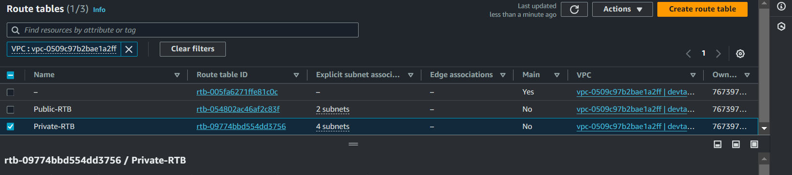
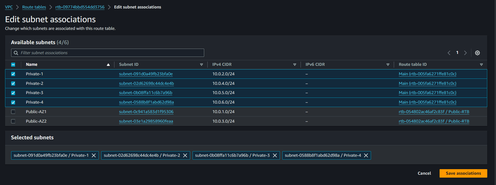
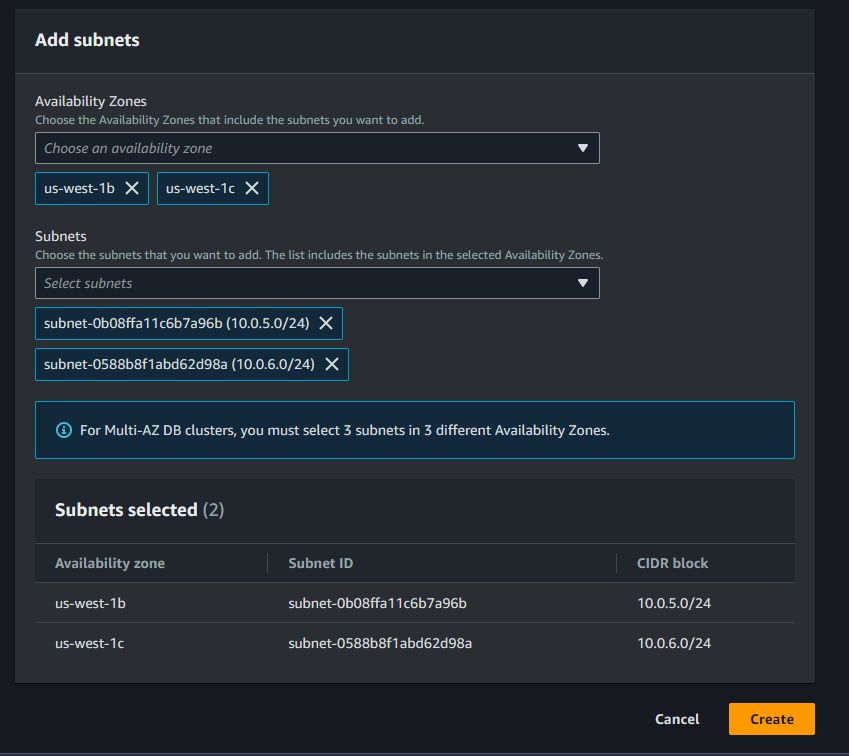
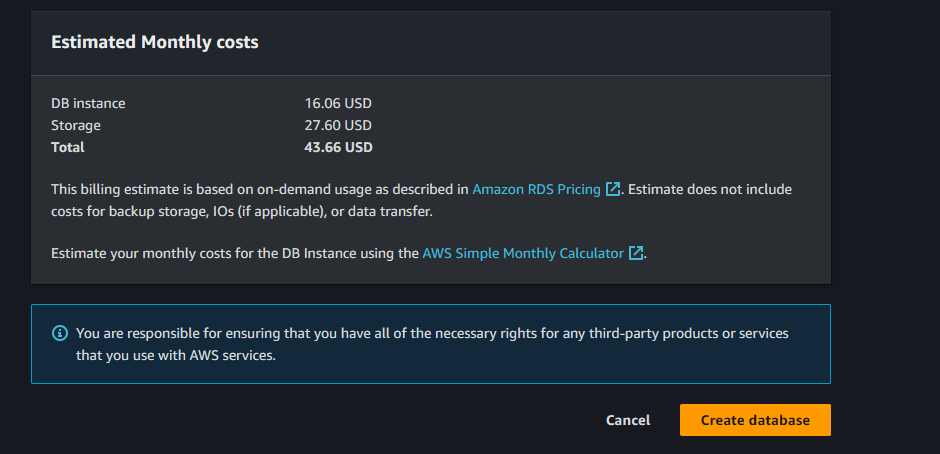
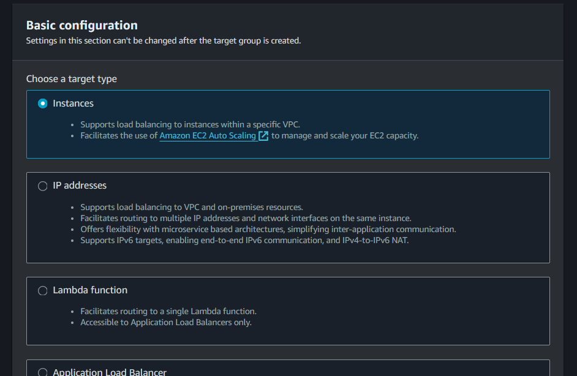

# AWS CLOUD SOLUTION FOR 2 COMPANY WEBSITES USING A REVERSE PROXY TECHNOLOGY

## Starting Your AWS Cloud Project

### Requirements Before You Begin

1. **Configure Your AWS Account and Organization Unit:**

   - **Create an AWS Master Account (Root Account):**
     - Sign up for AWS with a primary email to create your root account.
   
   - **Create a Sub-Account and Name it `DevOps`:**
     - Under the root account, create a sub-account named "DevOps". Note that you will need a different email address to set up this sub-account.
      
   
   - **Create an AWS Organization Unit (OU) Named `Dev`:**
     - In the root account, navigate to the AWS Organizations service and create an Organizational Unit (OU) named "Dev". This will be where all resources related to development are managed.
      
   
   - **Move the DevOps Account into the Dev OU:**
     - Once the Dev OU is created, move the DevOps sub-account into the Dev OU to ensure proper resource and policy management.
      
       **Output 1:**
       

       **Output 2:**
       

       **Output 3:**
       
   
   - **Log In to the Newly Created AWS DevOps Account:**
     - Use the email associated with the DevOps sub-account to log in.
      

2. **Register a Free Domain Name for Your Fictitious Company:**

   - Use the `Cloud DNS` domain registrar to register a free domain name for your company, in this case i choose `Devtank`.
    

3. **Create a Hosted Zone in AWS Route 53 and Map it to Your Free Domain:**

   - Navigate to Route 53 in the AWS Management Console.
   - Create a new hosted zone using the domain name you registered from Cloud DNS.
    
     **Output 1:**
     

     **Output 2:**
     

### Setting Up a Virtual Private Network (VPC)

1. **Create a VPC:**
   - Go to the VPC service in the AWS Management Console.
   - Click on "Create VPC" and set up a VPC for your project.
    

2. **Create Subnets:**
   - Create subnets as per your architecture requirements, ensuring you have both public and private subnets.
    

3. **Create Route Tables and Associate Them:**

   - **Public Subnets:**
     - Create a route table specifically for public subnets.
      

     - Associate this route table with the public subnets.
      

   - **Private Subnets:**
     - Create another route table for private subnets.
      

     - Associate it with the private subnets.
      

4. **Create an Internet Gateway:**
   - Attach an Internet Gateway to your VPC to allow internet access for your public subnets.
    

5. **Configure Public Route Tables for Internet Access:**
   - Edit the route in the public route table to associate it with the Internet Gateway. This allows public subnets to be accessible from the Internet.
    

6. **Create Elastic IPs:**
   - Go to the Elastic IPs section and create 3 Elastic IP addresses.

7. **Set Up a NAT Gateway:**
   - Create a NAT Gateway in one of the public subnets and assign one of the Elastic IPs to it. The NAT Gateway will enable internet access for instances in the private subnets.
     

    - Configure Private Route Tables for Internet Access
     

8. **Create Security Groups:**

   - **Nginx Servers:**
     - Create a security group for Nginx servers. Which will allow access only from the Application Load Balancer (ALB).
      

   - **Bastion Servers:**
     - Create a security group for Bastion servers, allowing SSH access only from your workstation’s public IP address.
      

   - **External & Internal Application Load Balancer (ALB):**
     - Set up a security group for the External ALB to allow traffic from the internet.
      
 
     - Set up a security group for Internal ALB to allow traffic from only Nginx.
      

   - **Web Servers:**
     - Create a security group for web servers to allow access only from the Internal ALB.
      

   - **Data Layer:**
     - Create a security group for the data layer, allowing access to RDS only from web servers and to EFS mount points from both Nginx and web servers.
      

### AWS Key Management Service (KMS) Setup

1. **Create a Customer Managed Key (CMK):**
   - Navigate to the AWS KMS service.
   - Choose to create a new symmetric encryption CMK.
   - Provide an alias (e.g., `my-app-key`) for the CMK.
   - Set the key usage permissions by selecting AWS services and IAM users/roles that are allowed to use the key.

2. **Configure Key Policies:**
   - Set key policies to define who can administer and use the CMK.
   - Include policies for IAM users, roles, and AWS services that need to encrypt or decrypt data.
     
     **Output 1:**
     

     **Output 2:**
     

     **Output 3:**
     

     **Output 4:**
     

     **Output 5:**
     

     **Output 6:**
     

### AWS Certificate Manager (ACM) Setup

1. **Request a Public Certificate:**
   - Navigate to the AWS Certificate Manager service.
   - Request a new public SSL/TLS certificate for your domain (e.g., `*.yourdomain.com`).
   - Choose DNS validation as the validation method.

2. **Validate Your Domain Ownership:**
   - ACM will provide a CNAME record that you need to add to your DNS provider (e.g., Route 53) to prove domain ownership.
   - Once the CNAME record has been created successfully in the Route 53 hosted zone, we will need to configure the CNAME record in the `Cloudns.net` domain. This step will validate and issue the certificate.
     
     **Output 1:**
     

     **Output 2:**
     

     **Output 3:**
     

     **Output 4:**
     

     **Output 5:**
     

     **Output 6:**
     

     **Output 7:**
     

     **Output 8:**
     

### Set Up Amazon Elastic File System (EFS)

1. **Create an EFS for Shared File Storage:**
   - Navigate to the Amazon EFS service and create a new file system.
   - Configure it to be accessible by both Nginx and web server instances.

2. **Set Up Mount Targets in Each Subnet:**
   - Ensure you create mount targets for EFS in each subnet that houses an EC2 instance.

3. **Create EFS Access Points:**
   - This will specify where the webservers will mount with, thus creating 2 mount points for `Tooling` and `Wordpress` servers each.
     
     **Output 1:**
     

     **Output 2:**
     

     **Output 3:**
     

     **Output 4:**
     

     **Output 5:**
     

     **Output 6:**
     

     **Output 7:**
     

### Set Up Amazon Relational Database Service (RDS)

> Note: First create a subnet group in the private subnets as required in the project architechture for your RDS before going ahead to create an RDS instance.

1. **Create an RDS Instance:**
   - Use AWS RDS service to set up a MySQL database.
   - Ensure the database is deployed in the private subnets within your VPC.

2. **Configure RDS Security and Networking:**
   - Set the appropriate security group to allow access only from web server instances.
     
     **Output 1:**
     

     **Output 2:**
     

     **Output 3:**
     

     **Output 4:**
     

     **Output 5:**
     

     **Output 6:**
     

     **Output 7:**
     

     **Output 8:**
     

     **Output 9:**
     

     **Output 10:**
     

     **Output 11:**
     

     **Output 12:**
     

### Configure Application Load Balancers (ALB)

> Note: Before creating the ALBs, we have to create the target groups first, you can find guidelines on how to do this in the `Setting Up Compute Resources Section`.


1. **Create an Internet-Facing ALB:**
   - Configure the ALB to listen on the HTTPS protocol (TCP port 443).
   - Choose the appropriate VPC, AZ, and subnets for the ALB.
   - Select the TLS certificate from ACM.
   - Assign the correct security group to the ALB.
   - Configure the ALB with the Nginx target group.
     
     **Output 1:**
     

     **Output 2:**
     

     **Output 3:**
     

     **Output 4:**
     

     **Output 5:**
     

2. **Create an Internal ALB for Web Servers:**
   - Set the ALB to listen on HTTPS (TCP port 443).
   - Choose the appropriate VPC, AZ, and subnets for the ALB.
   - Select the TLS certificate from ACM.
   - Assign the correct security group to the ALB.
   - Use the appropriate target group for routing traffic to the web servers, in this case we have the `Wordpress` target group and `Tooling` target group.
    
     **Output:**
     
   
   > Note: The default target group configured on the listener while creating the internal load balancer is to forward traffic to `Wordpress` on port 443. Hence, we need to create a rule to route traffic to `Tooling` as well.

   - Choose the load balancer where you want to add the rule.
   - Listeners Tab:
     - Click on the Listeners tab.
     - Select the listener (HTTPS:443) and click `Manage listener`.
   - Click on Add rule.
   - Configure the Rule:
     - Give the rule a name and click next.
     - Add a condition by selecting `Host header`.
     - Enter the hostnames for which you want to route traffic. (e.g. `tooling.com` and `www.tooling.com`).
     - Choose the appropriate target group for the hostname.
       
       **Output 1:**
       

       **Output 2:**
       

       **Output 3:**
       

       **Output 4:**
       

       **Output 5:**
       

### Setting Up Compute Resources

You will need to set up and configure several compute resources within your VPC. The key components related to compute resources are:

- **EC2 Instances**
- **Launch Templates**
- **Target Groups**
- **Auto Scaling Groups**
- **TLS Certificates**
- **Application Load Balancers (ALB)**

#### Setting Up Compute Resources for Nginx

1. **Create EC2 Instances for Nginx:**
   - Launch a RedHat Linux EC2 instance in two different Availability Zones (AZ) within your selected AWS region (preferably the region closest to your customers).
   - Use a T3 family instance type (e.g., t3.small).

2. **Install Necessary Software on EC2 Instances:**
   - Ensure the following software is installed:
     - Python, chrony, net-tools, vim, wget, telnet, epel-release, htop.
     - Below is the script to get the Nginx AMI ready.
 
        ```bash
        sudo yum install -y https://dl.fedoraproject.org/pub/epel/epel-release-latest-9.noarch.rpm
        sudo yum install -y dnf-utils http://rpms.remirepo.net/enterprise/remi-release-9.rpm
        sudo yum install wget vim python3 telnet htop git mysql net-tools chrony -y
        sudo systemctl start chronyd
        sudo systemctl enable chronyd
        sudo systemctl status chronyd
       
        # Set SELinux policies so that our servers can function properly on all the redhat instance
        sudo setsebool -P httpd_can_network_connect=1
        sudo setsebool -P httpd_can_network_connect_db=1
        sudo setsebool -P httpd_execmem=1
        sudo setsebool -P httpd_use_nfs 1

        # Install Amazon EFS utils for mounting the targets on the Elastic file system
        git clone https://github.com/aws/efs-utils
        cd efs-utils

        sudo yum install -y make
        sudo yum install -y rpm-build
        sudo yum install openssl-devel -y
        sudo yum install cargo -y
        sudo make rpm
        sudo yum install -y  ./build/amazon-efs-utils*rpm

        # Set up self-signed certificate for the nginx instance
        sudo mkdir /etc/ssl/private
        sudo chmod 700 /etc/ssl/private
        sudo openssl req -x509 -nodes -days 365 -newkey rsa:2048 -keyout /etc/ssl/private/devtank.key -out /etc/ssl/certs/devtank.crt
        sudo openssl dhparam -out /etc/ssl/certs/dhparam.pem 2048
        ```

3. **Create an AMI from the Configured EC2 Instance:**
   - Create an Amazon Machine Image (AMI) from the EC2 instance after installing the required software.
     
     **Output 1:**
     

     **Output 2:**
     

4. **Prepare a Launch Template for Nginx:**
   - Use the created AMI to set up a launch template for Nginx.
   - Ensure that the instances launched from this template are placed in public subnets and assigned the appropriate security group.
   - Add user data to update the yum package repository and install Nginx upon instance launch.
     
     **Output 1:**
     

     **Output 2:**
     

     **Output 3:**
     

     **Output 4:**
     

     **User-Data:**
     - Link to the User-Data can be found in this [link](https://github.com/alagbaski/devtank_user_data_config/tree/main).

5. **Create Target Group for Nginx:**
   - Set the target type as "Instances".
   - Use the HTTPS protocol on the secure TLS port (443).
   - Set the health check path to `/healthstatus` and register the Nginx instances as targets.
     
     **Output 1:**
     

     **Output 2:**
     

     **Output 3:**
     

     **Nginx Health Status:**
     

6. **Configure Auto Scaling for Nginx:**
   - Select the right launch template and VPC.
   - Choose both public subnets for deployment.
   - Enable the ALB for the Auto Scaling Group (ASG) and select the created target group.
   - Set health checks for both EC2 instances and the ALB.
   - Define desired capacity (2), minimum capacity (2), and maximum capacity (4).
   - Set scaling policies to scale out if CPU utilization reaches 90%.
   - Set up an SNS topic to receive scaling notifications.
     
     **Output 1:**
     

     **Output 2:**
     

     **Output 3:**
     

     **Output 4:**
     

     **Output 5:**
     

#### Setting Up Compute Resources for Bastion Hosts

1. **Create EC2 Instances for Bastion Hosts:**
   - Launch an RHEL EC2 instance in each AZ where Nginx servers were created.

2. **Install Required Software on Bastion Instances:**
   - Install the following software:
     - Python, chrony, net-tools, vim, wget, telnet, epel-release, htop.
     - Below is the script to get the Bastion AMI ready.
      
       ```bash
       sudo yum install -y https://dl.fedoraproject.org/pub/epel/epel-release-latest-9.noarch.rpm
       sudo yum install -y dnf-utils http://rpms.remirepo.net/enterprise/remi-release-9.rpm
       sudo yum install wget vim python3 telnet htop git mysql net-tools chrony -y
       sudo systemctl start chronyd
       sudo systemctl enable chronyd
       sudo systemctl status chronyd
       ```

3. **Associate Elastic IPs with Bastion Instances:**
   - Associate an Elastic IP with each Bastion EC2 instance.

4. **Create an AMI from the Bastion Instance:**
   - After setting up the required software, create an AMI from the Bastion instance.

5. **Prepare a Launch Template for Bastion Hosts:**
   - Use the created AMI to set up a launch template for Bastion hosts.
   - Launch instances in public subnets and assign the appropriate security group.
   - Configure user data to update the yum package repository and install Ansible and Git.
     
     **User-Data:**
     - Link to the User-Data can be found in this [link](https://github.com/alagbaski/devtank_user_data_config/tree/main).

#### Provision EC2 Instances for Web Servers

1. **Create EC2 Instances for Web Servers:**
   - Launch an RHEL EC2 instance each for WordPress and Tooling websites in each AZ.

2. **Install Necessary Software on Web Server Instances:**
   - Install the following software:
     - Python, chrony, net-tools, vim, wget, telnet, epel-release, htop, php.
     - Below is the script used in creating the Web Servers AMI.
       
       ```bash
       sudo yum install -y https://dl.fedoraproject.org/pub/epel/epel-release-latest-9.noarch.rpm
       sudo yum install -y dnf-utils http://rpms.remirepo.net/enterprise/remi-release-9.rpm
       sudo yum install wget vim python3 telnet htop git mysql net-tools chrony -y
       sudo systemctl start chronyd
       sudo systemctl enable chronyd
       sudo systemctl status chronyd
       
       # Set SELinux policies so that our servers can function properly on all the redhat instance
       sudo setsebool -P httpd_can_network_connect=1
       sudo setsebool -P httpd_can_network_connect_db=1
       sudo setsebool -P httpd_execmem=1
       sudo setsebool -P httpd_use_nfs 1

       # Install Amazon EFS utils for mounting the targets on the Elastic file system
       git clone https://github.com/aws/efs-utils
       cd efs-utils

       sudo yum install -y make
       sudo yum install -y rpm-build
       sudo yum install openssl-devel -y
       sudo yum install cargo -y
       sudo make rpm
       sudo yum install -y  ./build/amazon-efs-utils*rpm

       # Set up self-signed certificate for the webserver instance
       sudo yum install -y mod_ssl
       sudo openssl req -newkey rsa:2048 -nodes -keyout /etc/pki/tls/private/devtank.key -x509 -days 365 -out /etc/pki/tls/certs/devtank.crt
       ```
       ```bash
       # Edit the ssl.conf to confirm with the key and crt file created.
       sudo vim /etc/httpd/conf.d/ssl.conf
       ```
       

3. **Create an AMI from the Web Server Instance:**
   - After installing the necessary software, create an AMI from the web server instance, just like we did for Nginx and Bastion.

4. **Prepare Launch Templates for Web Servers:**
   - Use the created AMI to set up separate launch templates for WordPress and Tooling web servers.
   - Ensure instances are launched in private subnets and assign the appropriate security group.
   - Configure user data to update the yum package repository and install `WordPress` (only for WordPress launch template). Also for Tooling configure the user data to clone the `Tooling` code repository and carry out the necessary configurations to deploy the Tooling website.
   
   > Link to both user data can be found in this [link](https://github.com/alagbaski/devtank_user_data_config/tree/main).

5. **Configure Target Groups for Web Servers:**
   - Set the target type as "Instances".
   - Use the HTTPS protocol on the secure TLS port (443).
   - Set the health check path to `/healthstatus` and register the Web Server instances as targets.
     
     **Wordpress Health Status:**
     

     **Tooling Health Status:**
     

6. **Configure Auto Scaling for Web Servers:**
   - Select the right launch template and VPC.
   - Choose both private subnets for deployment.
   - Enable the ALB for the Auto Scaling Group (ASG) and select the created target group.
   - Set health checks for both EC2 instances and the ALB.
   - Define desired capacity (2), minimum capacity (2), and maximum capacity (4).
   - Set scaling policies to scale out if CPU utilization reaches 90%.
   - Set up an SNS topic to receive scaling notifications.

### Configure DNS with Route 53

- **Create DNS Records for Services:**

    Earlier in this project we registered a free domain with `Cloudns` and configured a hosted zone in `Route53`. But that is not all that needs to be done as far as DNS configuration is concerned.

    We need to ensure that the main domain for the `WordPress` website can be reached, and the subdomain for `Tooling` website can also be reached using a browser.
     
     - Create an alias record for the root domain and direct its traffic to the ALB DNS name.
     - Create an alias record for `wordpress.devtank.cloudns.be` and `tooling.devtank.cloudns.be` and direct its traffic to the ALB DNS name.
     
    **Output 1:**
    

    **Output 2:**
    

### Test your websites
- Now let us access our `wordpress` & `tooling` website via a browser using our DNS name.
  
  **Accessing WordPress:**
  

  **Accessing Tooling:**
  


## Summary

By following the steps outlined above, you will have set up a robust, scalable, and highly available cloud infrastructure on AWS. This setup includes networking, compute resources, security groups, load balancing, TLS certificates, file storage, and databases. Make sure to test the setup thoroughly and monitor performance and security regularly.
