# Ansible Configuration Management Project

This document provides a step-by-step guide to setting up and using Ansible for configuration management on an EC2 instance, including installing and configuring Ansible, creating playbooks, and automating server configuration tasks.

## Step 1: Install and Configure Ansible on EC2 Instance

- **Update the `Name` tag on your `Jenkins` EC2 instance to `Jenkins-Ansible`.**
   - This server will be used to run playbooks
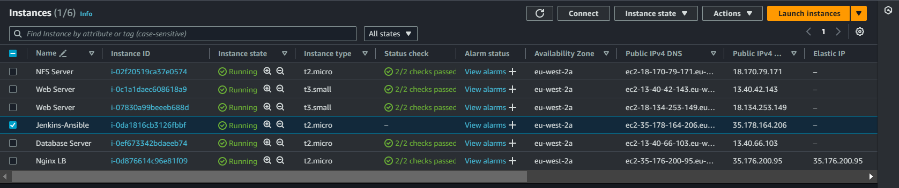


- **Create a new GitHub repository named `ansible-config-mgt`.**
   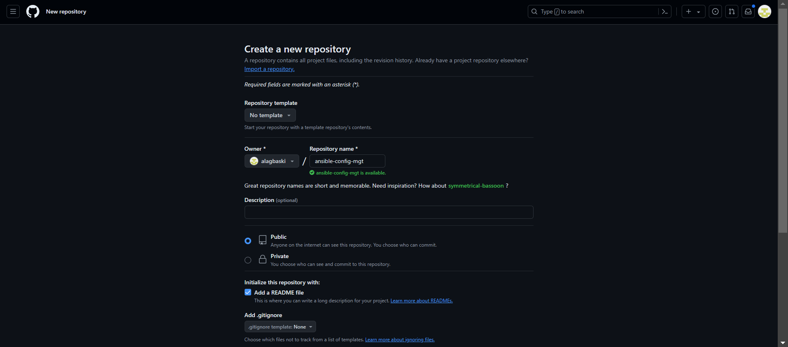

- **Install Ansible:**
   ```sh
   sudo apt update && sudo apt upgrade -y
   sudo apt install ansible -y
   ```
- Verify Ansible installation:
    ```sh
    ansible --version
    ```
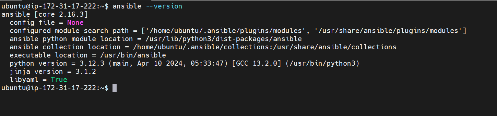

- **Configure Jenkins build job:**
  - Create a new freestyle project `ansible` in Jenkins and point it to your `ansible-config-mgt` repository.
  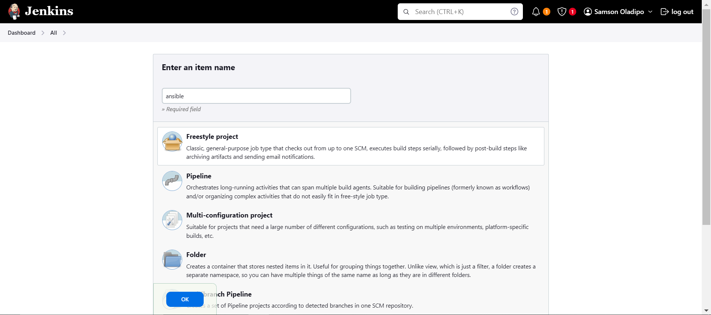

- Configure a webhook in GitHub to trigger the `ansible` build.
  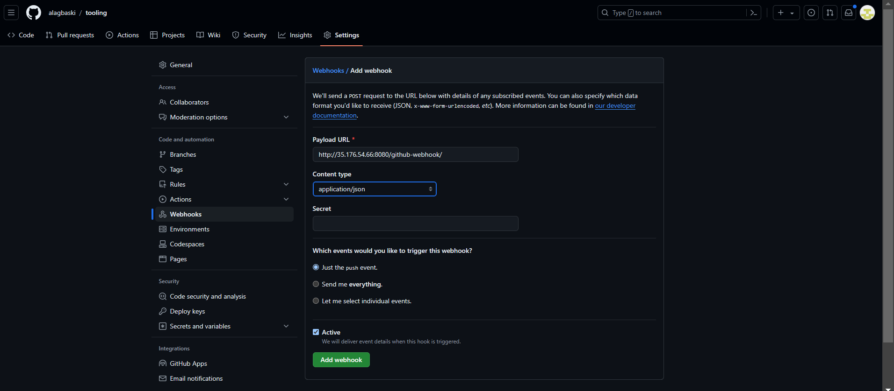

- Configure SCM and Build Triggers
 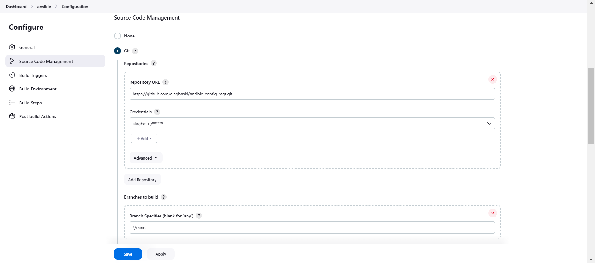
 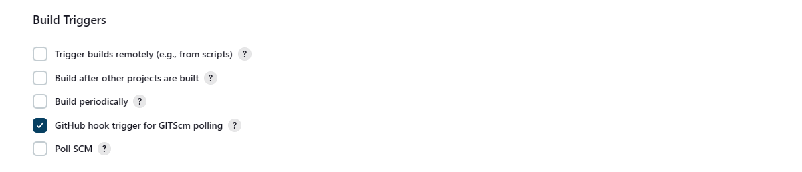

- Configure a post-build job to save all files.
 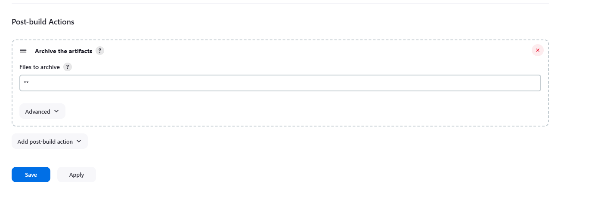

- **Test the setup:**
- Make changes to the `README.md` file in the `main` branch.

- Ensure builds start automatically and Jenkins saves the files in:
  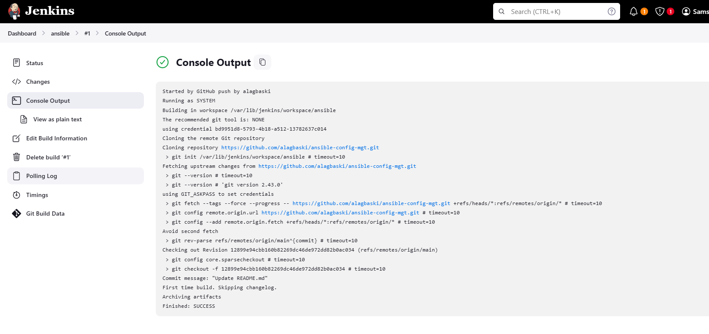
    ```sh
    ls /var/lib/jenkins/jobs/ansible/builds/1/archive/
    ```
    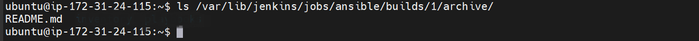

## Step 2: Prepare Your Development Environment Using Visual Studio Code
- Install Visual Studio Code (VSC) On the Local Machine. To do so click this .

- Configure VSC to connect to your GitHub repository.
    ```sh
    git config --global user.email "ruthwelber@gmail.com"
    git config --global user.name "Kofo"
    ```

- Clone the ansible-config-mgt repository to your Jenkins-Ansible instance:
    ```sh
    git clone <ansible-config-mgt-repo-link>
    ```
  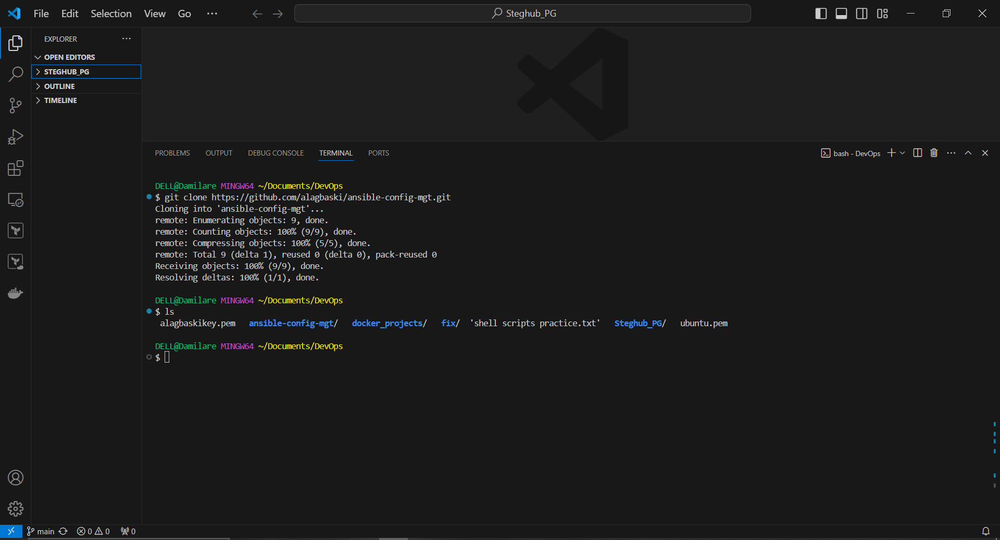

## Step 3: Begin Ansible Development
- **Create a new branch in your GitHub repository for development.**

  - Checkout the new branch on your local machine.
   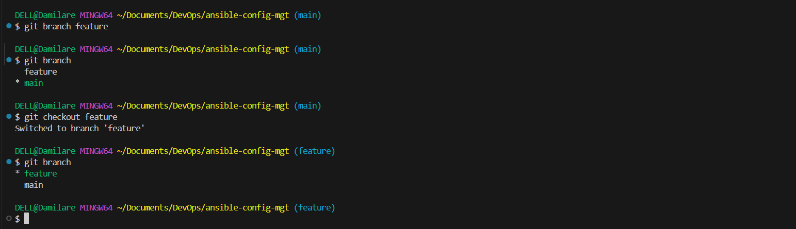

- **Create a directory structure:**

    - `playbooks` directory to store playbooks.
    - `inventory` directory to organize hosts.

- **Create your first playbook:**

    - `playbooks/common.yml`


- **Create inventory files for each environment:**

    - `inventory/dev`, `inventory/staging`, `inventory/uat`, and `inventory/prod`.
  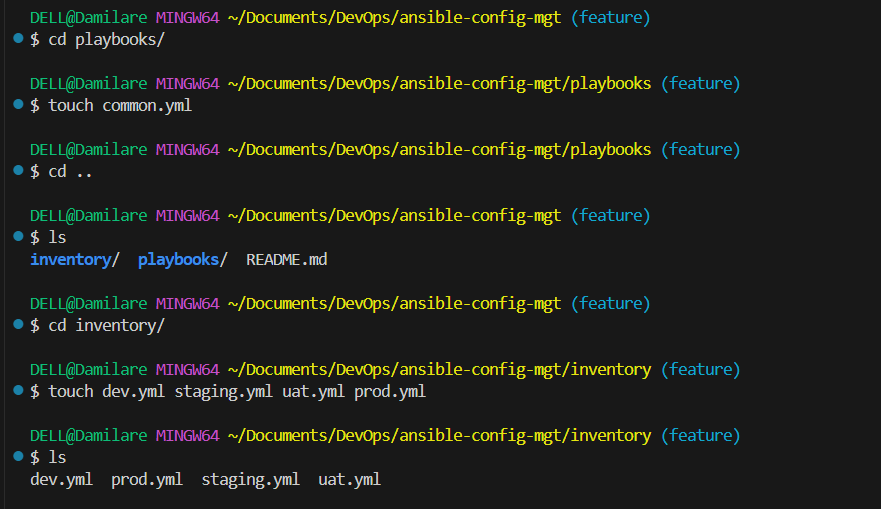 

- **Create the `ansible.cfg` file:**
    ```sh
    nano ansible.cfg
    ```

  - Add the following configuration:
    ```ini
    [defaults]
    host_key_checking = False
    ```

## Step 4: Set Up an Ansible Inventory
- **Update your inventory/dev file:**
    ```sh
    [nfs]
    <nfs-server-private-ip> ansible_ssh_user=ec2-user

    [webservers]
    <web-server1-private-ip> ansible_ssh_user=ec2-user
    <web-server2-private-ip> ansible_ssh_user=ec2-user

    [db]
    <database-private-ip> ansible_ssh_user=ubuntu

    [lb]
    <lb-private-ip> ansible_ssh_user=ubuntu
    ```

## Step 5: Create a Common Playbook
- **Edit `playbooks/common.yml` to include the following tasks:**
    ```yml
    ---
    -	name: update web and nfs servers
	    hosts: webservers, nfs
	    become: yes
	    tasks:
		    - name: ensure wireshark is at the latest version
			    yum:
				    name: wireshark
				    state: latest


    -	name: update LB and db servers
	    hosts: lb, db
	    become: yes
	    tasks:
		    - name: Update apt repo
			    apt:
				    update_cache: yes

		    - name: ensure wireshark is at the latest version
			    apt:
				    name: wireshark
				    state: latest
    ```
Feel free to add additional tasks such as `creating a directory`, `changing the timezone`, or `running shell scripts`.

- **Here is the full `common.yml` playbook with all the additional tasks included:**
    ```yml
    ---
    - name: update web and nfs servers
      hosts: webservers, nfs
      become: yes
      tasks:
        - name: ensure wireshark is at the latest version
          yum:
            name: wireshark
            state: latest

        - name: create a directory
          file:
            path: /path/to/directory
            state: directory
            mode: '0755'

        - name: add a file into the directory
          copy:
            content: "This is a sample file content"
            dest: /path/to/directory/samplefile.txt
            mode: '0644'

        - name: set timezone to UTC
          timezone:
            name: UTC

        - name: run a shell script
          shell: |
            #!/bin/bash
            echo "This is a shell script"
            echo "Executed on $(date)" >> /path/to/directory/script_output.txt

    - name: update LB and db servers
      hosts: lb, db
      become: yes
      tasks:
        - name: Update apt repo
          apt:
            update_cache: yes

        - name: ensure wireshark is at the latest version
          apt:
            name: wireshark
            state: latest

        - name: create a directory
          file:
            path: /path/to/directory
            state: directory
            mode: '0755'

        - name: add a file into the directory
          copy:
            content: "This is a sample file content"
            dest: /path/to/directory/samplefile.txt
            mode: '0644'

        - name: set timezone to UTC
          timezone:
            name: UTC

        - name: run a shell script
          shell: |
            #!/bin/bash
            echo "This is a shell script"
            echo "Executed on $(date)" >> /path/to/directory/script_output.txt
    ```

## Step 6: Update GIT with the Latest Code
- **Commit your code chnages to GitHub:**
    ```sh
    git status
    git add .
    git commit -m "commit message"
    git push origin <branch-name>
    ```
  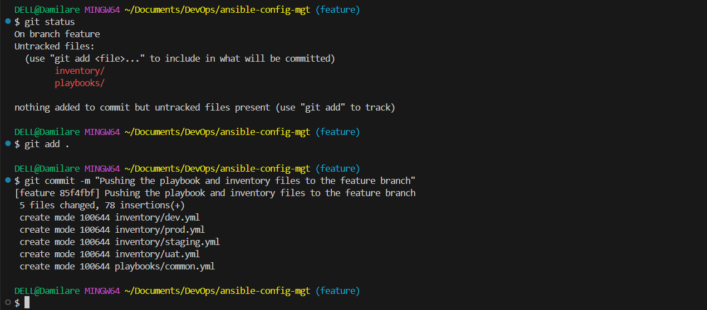
  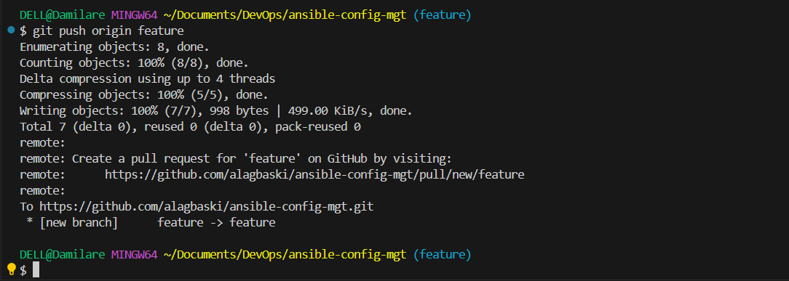

- **Create a pull request and review the changes.**
  - Open your GitHub repository.
   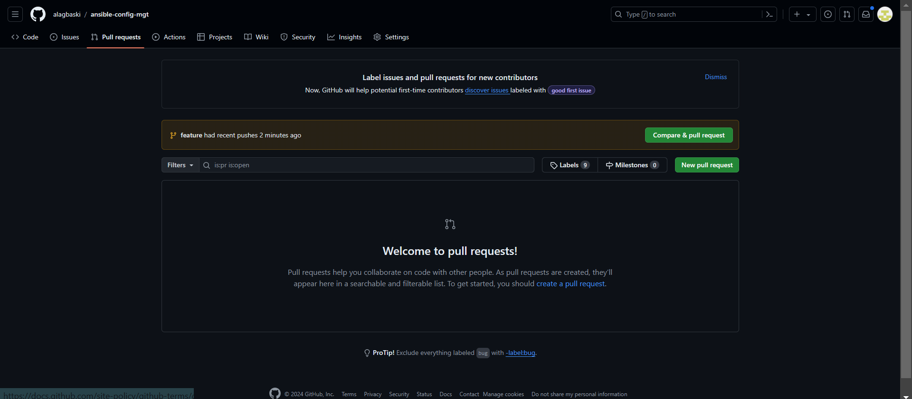
  - Create a pull request for the `feature` branch.
   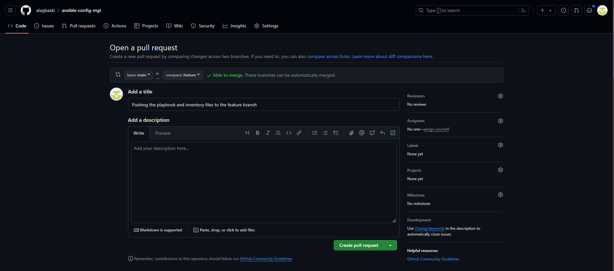
  - Act as a reviewer and merge the code if everything is satisfactory.
   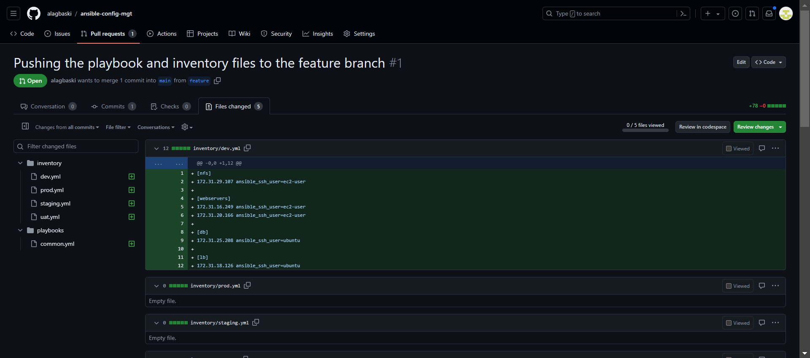
   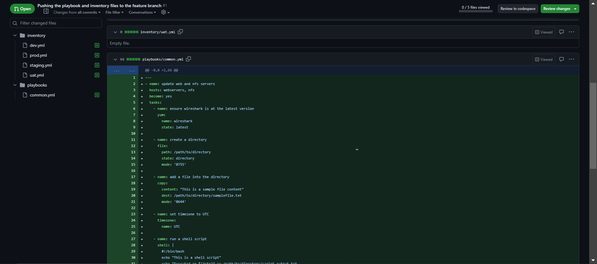
  - Merge the pull request to the `master` branch.
   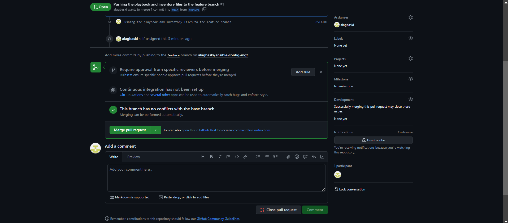

- **Pull the Latest Changes On Local Repository:**
    - Checkout from the feature branch into the master branch.
        ```sh
        git checkout main
        git pull origin main
        ```
        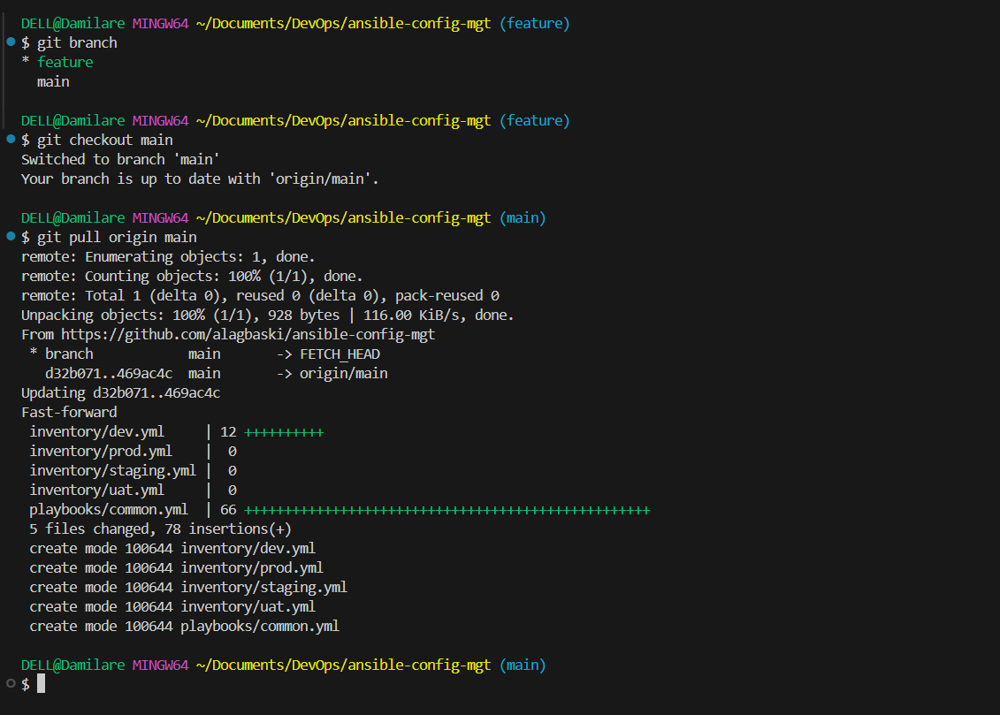

## Step 7: Run the First Ansible Test
- **SSH into your Jenkins-Ansible instance Using the VSC `SSH-Agent`.**
  -  Configure SSH keys for Ansible:
        ```sh
        eval `ssh-agent -s`
        ssh-add <path-to-private-key>
        ssh-add -l
        ```
     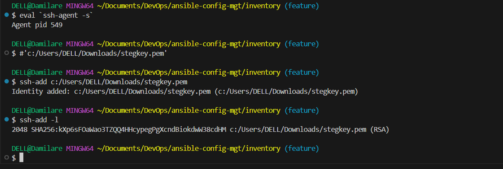

  - SSH into your Jenkins-Ansible server using `ssh-agent`:
    ```sh
    ssh -A ubuntu@<public-ip>
    ```
    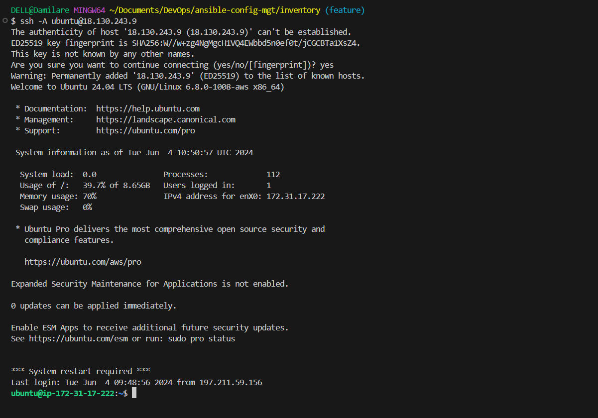
 
- **Run your playbook:**
    ```sh
    #navigate to ansible build files
    cd /var/lib/jenkins/jobs/ansible/builds/1/archive/
    
    #run the playbook command
    ansible-playbook -i inventory/dev.yml playbooks/common.yml
    ```
    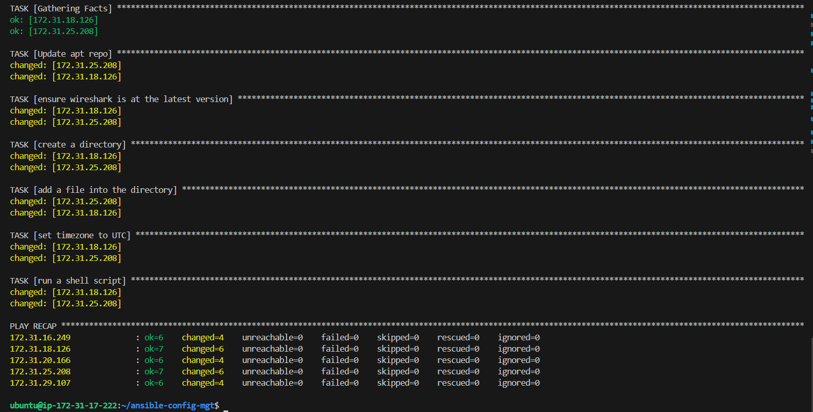

  - Verify that `wireshark` is installed on each of the servers by running:
    ```sh
    which wireshark
    wireshark --version
    ```
    - Output Web Server
     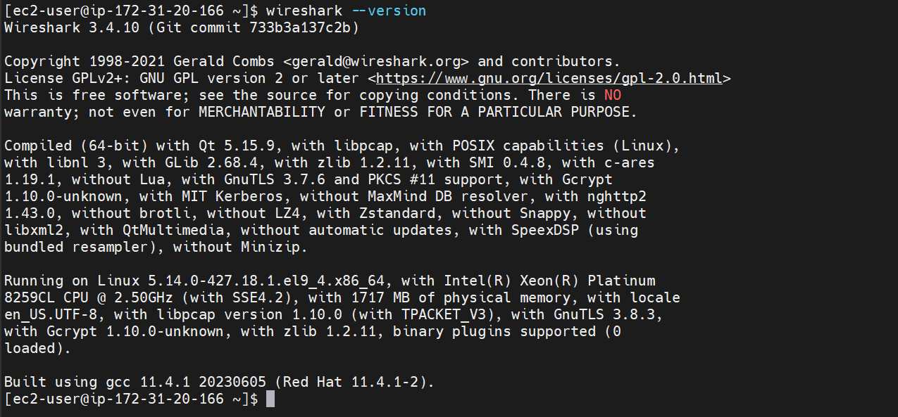

    - Output Database Srver
     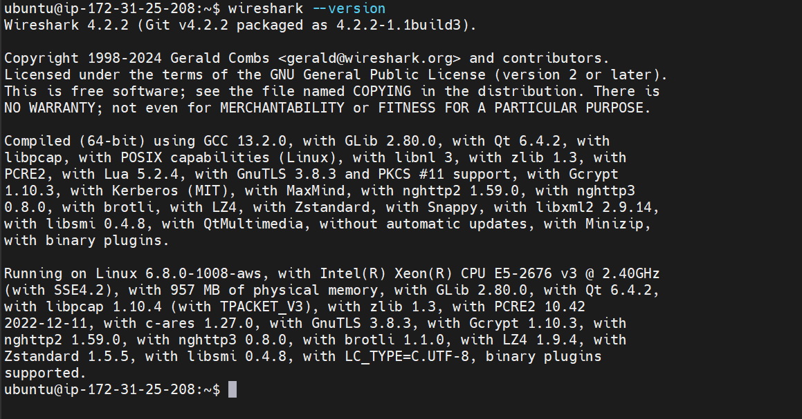

    - Output Load-Balancer
     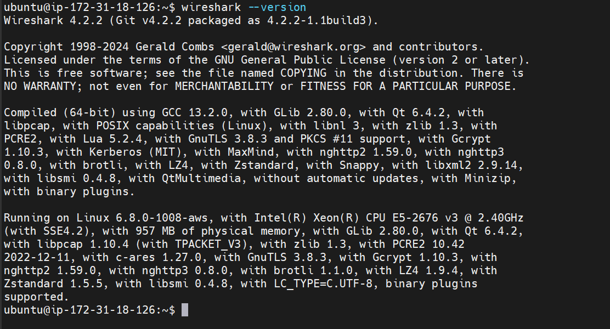

    - Output NFS Server
     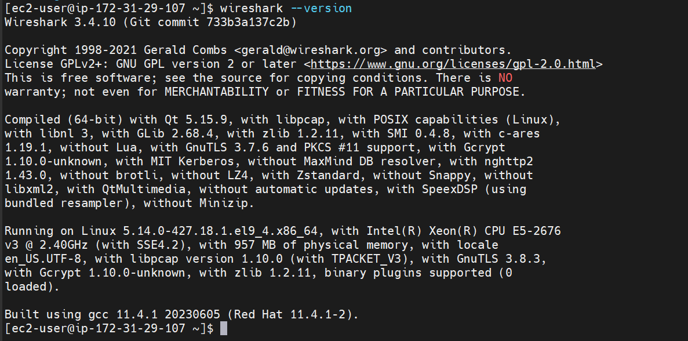

## Optional Step: Repeat the Process
- Update your Ansible playbook with new tasks and repeat the full cycle of:
    > Checkout -> Change codes -> Commit -> PR -> Merge -> Build -> ansible-playbook

## Conclusion
Congratulations! You have successfully automated routine tasks using Ansible. This guide has walked you through the process of setting up Ansible, creating and running playbooks, and automating server configurations.

---