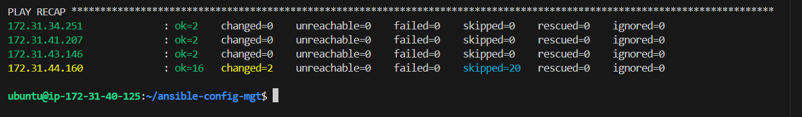

# Project Documentation: Implementing Ansible Dynamic Assignments and Community Roles

### Introduction

This is a continuation of the pervious projects for `Tooling Website Solution`, in this guide, we will walk through the steps to implement dynamic assignments using the `include` module in Ansible and leverage community `roles` for configuring MySQL and Load-Balancers. By the end of this guide, you will have a flexible and efficient Ansible setup for managing configurations across different environments.

### Key Concepts

- **Static Assignments:** Use the `import` module. All statements are pre-processed when the playbooks are parsed.

- **Dynamic Assignments:** Use the `include` module. All statements are processed during the execution of the playbook, allowing changes to be considered.

### Prerequisites

- Ensure Ansible is installed on your `Jenkins-Ansible` server.

- Have a GitHub repository named `ansible-config-mgt` for storing Ansible configurations.

### Step-by-Step Implementation

- **Create a New Branch and Folder:**

    First, let's start by creating a new branch named `dynamic-assignments` in your GitHub repository. Then, create a folder named `dynamic-assignments` and add a file `env-vars.yml`.

    ```sh
    # Navigate to your repository
    cd ansible-config-mgt

    # Create a new branch
    git checkout -b dynamic-assignments

    # Create the dynamic-assignments directory and the env-vars.yml file
    mkdir dynamic-assignments
    touch dynamic-assignments/env-vars.yml
    ```
    
- **Set Up Directory Layout:**

    Next, we'll create the directory structure needed for this project. Create these directory and files.

    ```sh
    # Create env-vars directory and its files
    mkdir env-vars
    touch env-vars/dev.yml env-vars/stage.yml env-vars/uat.yml env-vars/prod.yml
    ```
    - Update the `env-vars/uat.yml` file with the code below:
    
        ```yml
        ---
        load_balancer_is_required: true
        enable_nginx_lb: true
        enable_apache_lb: false
        ```


    Your GitHub repository should have the following structure:

    ```arduino
    ansible-config-mgt/
    ├── dynamic-assignments
    │   └── env-vars.yml
    ├── env-vars
    │   ├── dev.yml
    │   ├── stage.yml
    │   ├── uat.yml
    │   └── prod.yml
    ├── inventory
    │   ├── dev
    │   ├── stage
    │   ├── uat
    │   └── prod
    ├── playbooks
    │   └── site.yml
    └── static-assignments
        ├── common.yml
        └── uat-webservers.yml
    ```
    Then do a `push`, create a `pull-request` and `merge` to main branch.

    ```sh
    git add .

    git commit -m "your-commit-message"

    git push origin dynamic-assignments
    ```

    

    > **Note:** The above folder structure is a result of the previous project `Ansible-Refactoring-Static-Assignment`.

- **Configure Dynamic Assignment:**
    
    Let's configure the `env-vars.yml` file to dynamically include environment-specific variables.

    Open `dynamic-assignments/env-vars.yml` and add the following content:

    ```yml
    ---
    vars_files:
      - "{{ playbook_dir }}/../../env-vars/dev.yml"
      - "{{ playbook_dir }}/../../env-vars/stage.yml"
      - "{{ playbook_dir }}/../../env-vars/prod.yml"
      - "{{ playbook_dir }}/../../env-vars/uat.yml"
    ```
- **Update site.yml for Dynamic Assignments:**

    Next, update the `site.yml` file to include the dynamic assignments. Open playbooks/site.yml and update it as follows:

    ```yml
    ---
    - name: Include dynamic variables
      hosts: all
      become: yes
      tasks:
        - include_vars: ../dynamic-assignments/env-vars.yml
          tags:
            - always

    - name: DBserver assignment
      ansible.builtin.import_playbook: ../static-assignments/db-server.yml

    - name: Webservers Tasks
      ansible.builtin.import_playbook: ../static-assignments/uat-webservers.yml

    - name: Load balancer Tasks
      ansible.builtin.import_playbook: ../static-assignments/loadbalancers.yml
      when: load_balancer_is_required
    ```

- **Download and Configure `MySQL` Community Role:**

    - We will now download a MySQL role from `Ansible Galaxy` and configure it for our project. We'll use the MySQL role developed by `geerlingguy`.

    - First, make sure you are in your project directory (`ansible-config-mgt`) in the `Jenkins-Ansible` server, then run:

        ```sh
        # Initialize git in the ansible-config-mgt directory if not already done
        git init

        # Clone/Pull the latest changes from your GitHub repository
        git clone https://github.com/<your-name>/ansible-config-mgt.git
    
        git pull origin main

        # Create a new branch for roles
        git branch roles-feature

        git switch roles-feature

        # Install the MySQL role from Ansible Galaxy
        ansible-galaxy install geerlingguy.mysql

        # Rename the downloaded role directory
        cd roles/

        mv geerlingguy.mysql/ /home/ubuntu/ansible-config-mgt/roles/mysql
        ```

        

        

    - Configure the MySQL role to connect with your Database ec2-instance. Navigate to the `roles/mysql/var/main.yml`, if there is no `main.yml` create one and update it with the following code:

        ```yml
        ---
        mysql_root_password:
        mysql_databases:
        - name: db-name
          encoding: latin1
          collation: latin1_general_ci
        mysql_users:
        - name: db-username
          host: "subnet-cird-ip"
          password: db-password
          priv: "db-name.*:ALL"
        ```
    
    - Create `db-server.yml` file under `static-assignments/` and add the following code into .
    
        ```yml
        ---
        - hosts: db-server
          become: yes
          vars_files:
            - vars/main.yml
          roles:
            - role: mysql
        ```

    - After configuring the MySQL role, `commit` and `push` your changes to GitHub.
    
        ```sh
        # Add and commit changes
        git add .
        git commit -m "Add dynamic assignments and MySQL role"

        # Push changes to the roles-feature branch
        git push origin roles-feature
        ```
        

        

        

        > **Note:** You might have to make use of token to run `push` successfully to Github, if you don't have one generate one in Github under `Setting`>`Developer-Settings`>`Generate-Classic-Token`, also make sure to add `admin.repo` privilleges to the token.


- **Download and Configure Load Balancer Community Role for `Nginx` & `Apache`:**

    - We will set up roles for both `Nginx` and `Apache` load balancers. Follow these steps:

        ```sh
        # Install the Nginx and Apache role from Ansible Galaxy
        ansible-galaxy install geerlingguy.nginx

        ansible-galaxy install geerlingguy.apache

        # Rename the downloaded roles directories
        cd roles/

        mv geerlingguy.nginx /home/ubuntu/ansible-config-mgt/roles/nginx

        mv geerlingguy.apache /home/ubuntu/ansible-config-mgt/roles/apache
        ```

        

        
    
    - Configure `Nginx` role to server as a load balancer, first navigate to the `/roles/nginx/defaults/main.yml` and make changes to the file code blocks accordingly:
    
        ```yml
        ---
        nginx_vhosts:
          - listen: "80" # default: "80"
            server_name: "example.com" # default: N/A
            server_name_redirect: "example.com"
            root: "/var/www/html" # default: N/A
            index: "index.php index.html index.htm" # default: "index.html index.htm"
            #filename: "nginx.conf" # Can be used to set the vhost filename.
            locations:
                      - path: "/"
                        proxy_pass: "http://myapp1"

            # Properties that are only added if defined:
            server_name_redirect: "www.example.com" # default: N/A
            error_page: ""
            access_log: ""
            error_log: ""
            extra_parameters: "" # Can be used to add extra config blocks (multiline).
            template: "{{ nginx_vhost_template }}" # Can be used to override the `nginx_vhost_template` per host.
            state: "present" # To remove the vhost configuration.

        nginx_upstreams:
        - name: myapp1
          strategy: "ip_hash" # "least_conn", etc.
          keepalive: 16 # optional
          servers:
            - "web-server-private-ip weight=5"
            - "web-server-private-ip weight=5"

        nginx_log_format: |-
          '$remote_addr - $remote_user [$time_local] "$request" '
          '$status $body_bytes_sent "$http_referer" '
          '"$http_user_agent" "$http_x_forwarded_for"'
        become: yes

        enable_nginx_lb: false

        load_balancer_is_required: false
        ```
    
    - Edit the `handlers/main.yml` file tasks to have `become: yes` like this:
    
        ```yml
        ---
        - name: restart nginx
          service: name=nginx state=restarted
          become: yes

        - name: validate nginx configuration
          command: nginx -t -c /etc/nginx/nginx.conf
          changed_when:
          become: yes

        - name: reload nginx
          service: name=nginx state=reloaded
          when: nginx_service_state == "started"
          become: yes
        ```

    - Edit the `main.yml`, `setup-Ubuntu.yml` and `vhosts.yml` in the `/roles/nginx/tasks` directory.
    
        - Make changes to `tasks/main.yml`:
        
            ```yml
            # Add the tasks below under (Variable Setup Code Block).
            ---
            - name: Check if Apache is running
              ansible.builtin.service_facts:

            - name: Stop and disable Apache if it is running
              ansible.builtin.service:
                name: apache2  # Adjust depending on your system's service name (apache2 for Debian/Ubuntu, httpd for RedHat/CentOS)
                state: stopped
                enabled: no
              when: "'apache2' in services and services['apache2'].state == 'running'"
              become: yes

            #Edit the (Setup/install tasks Code Block).
            - include_tasks: setup-Ubuntu.yml
              when: ansible_distribution == 'Ubuntu'
              vars:
                ansible_become: true

            #Also Update the (Nginx setup code block to have `become: yes` key value pair for each task.
            ```
        
        - Make changes to `tasks/setup-Ubuntu.yml`:
        
            ```yml
            ---
            - name: Ensure dirmngr is installed (gnupg dependency).
              apt:
                name: dirmngr
                state: present
              become: yes
            ```

        - Make changes to `tasks/vhosts.yml`:
        
            > Add `become: true` under all the tasks in this file.

    - Replace the entire code in `templates/nginx.conf.j2` file with the code below:

        ```j2
        user  {{ nginx_user }};

        error_log  {{ nginx_error_log }};
        pid        {{ nginx_pidfile }};

        
        worker_processes  {{ nginx_worker_processes }};
        

        
        {{ nginx_extra_conf_options }}
        

        
        events {
            worker_connections  {{ nginx_worker_connections }};
            multi_accept {{ nginx_multi_accept }};
        }
        

        http {
            

        
            include       {{ nginx_mime_file_path }};
            default_type  application/octet-stream;

            server_names_hash_bucket_size {{ nginx_server_names_hash_bucket_size }};

            client_max_body_size {{ nginx_client_max_body_size }};

            log_format  main  {{ nginx_log_format|indent(23) }};

            access_log  {{ nginx_access_log }};

            sendfile        {{ nginx_sendfile }};
            tcp_nopush      {{ nginx_tcp_nopush }};
            tcp_nodelay     {{ nginx_tcp_nodelay }};

            keepalive_timeout  {{ nginx_keepalive_timeout }};
            keepalive_requests {{ nginx_keepalive_requests }};

            server_tokens {{ nginx_server_tokens }};
        
            proxy_cache_path {{ nginx_proxy_cache_path }};
        
        

        
            # gzip on;
        

        
            {{ nginx_extra_http_options|indent(4, False) }}
        

        
        
            upstream {{ upstream.name }} {
        
                {{ upstream.strategy }};
        
        
                server {{ server }};
        
        
                keepalive {{ upstream.keepalive }};
        
            }
        
        

        
            include {{ nginx_conf_path }}/*.conf;
        
            {# include {{ nginx_vhost_path }}/*; #}

        
            server {
                listen {{ vhost.listen }};
                server_name {{ vhost.server_name }};
                root {{ vhost.root }};
                index {{ vhost.index }};
            
                location {{ location.path }} {
                    proxy_pass {{ location.proxy_pass }};
                }
            
        }
        

        
        


            
        }
        ```

    - Now setup `Apache` role to work as a load balancer, first navigate to the `/roles/apache/defaults/main.yml` and make add the code below at the end of the file:

        ```yml
        ---
        enable_apache_lb: false

        load_balancer_is_required: false
        ```

    - Make changes in the `roles/apache/handlers/main.yml` with code below:
    
        ```yml
        ---
        - name: restart apache
          service:
            name: "{{ apache_service }}"
            state: "{{ apache_restart_state }}"
          become: yes
        ```

    - Edit the `main.yml` and `configure-Debian.yml` in the `/roles/apache/tasks` directory.
    
        - Make changes to `tasks/main.yml`:

            ```yml
            ---
            # Setup/install tasks.
            - name: Setup/install tasks
              include_tasks: "setup-{{ ansible_os_family }}.yml"
              vars:
                ansible_become: true

            # Configure Apache.
            - name: Configure Apache.
              include_tasks: "configure-{{ ansible_os_family }}.yml"

            - name: Ensure Apache has selected state and enabled on boot.
              service:
                name: "{{ apache_service }}"
                state: "{{ apache_state }}"
                enabled: "{{ apache_enabled }}"
              become: true
            ```

        - Make changes to `tasks/configure-Debian.yml`:
        
            ```yml
            ---
            - name: Check if nginx is running
              ansible.builtin.service_facts:

            - name: Stop and disable nginx if it is running
              ansible.builtin.service:
                name: nginx  # Adjust depending on your system's service name (apache2 for Debian/Ubuntu, httpd for RedHat/CentOS)
                state: stopped
                enabled: no
              when: "'nginx' in services and services['nginx'].state == 'running'"
              become: yes

            - name: Configure Apache.
              lineinfile:
                dest: "{{ apache_server_root }}/ports.conf"
                regexp: "{{ item.regexp }}"
                line: "{{ item.line }}"
                state: present
                mode: 0644
              with_items: "{{ apache_ports_configuration_items }}"
              notify: restart apache
              become: yes

            - name: Enable Apache mods.
              file:
                src: "{{ apache_server_root }}/mods-available/{{ item }}.load"
                dest: "{{ apache_server_root }}/mods-enabled/{{ item }}.load"
                state: link
                mode: 0644
              with_items: "{{ apache_mods_enabled }}"
              notify: restart 
              become: yes

            - name: Enable Apache modules
              ansible.builtin.shell:
                cmd: "a2enmod {{ item }}"
              loop:
                - rewrite
                - proxy
                - proxy_balancer
                - proxy_http
                - headers
                - lbmethod_byrequests
              notify: restart apache
              become: yes

            # - name: Disable Apache mods.
            #   file:
            #     path: "{{ apache_server_root }}/mods-enabled/{{ item }}.load"
            #     state: absent
            #   with_items: "{{ apache_mods_disabled }}"
            #   notify: restart apache

            # - name: Check whether certificates defined in vhosts exist.
            #   stat: "path={{ item.certificate_file }}"
            #   register: apache_ssl_certificates
            #   with_items: "{{ apache_vhosts_ssl }}"
            #   no_log: "{{ apache_ssl_no_log }}"

            - name: Add apache vhosts configuration.
              template:
                src: "{{ apache_vhosts_template }}"
                dest: "{{ apache_conf_path }}/sites-available/{{ apache_vhosts_filename }}"
                owner: root
                group: root
                mode: 0644
              notify: restart apache
              when: apache_create_vhosts | bool
              become: yes

            # - name: Add vhost symlink in sites-enabled.
            #   file:
            #     src: "{{ apache_conf_path }}/sites-available/{{ apache_vhosts_filename }}"
            #     dest: "{{ apache_conf_path }}/sites-enabled/{{ apache_vhosts_filename }}"
            #     state: link
            #     mode: 0644
            #     force: "{{ ansible_check_mode }}"
            #   notify: restart apache
            #   when: apache_create_vhosts | bool

            # - name: Remove default vhost in sites-enabled.
            #   file:
            #     path: "{{ apache_conf_path }}/sites-enabled/{{ apache_default_vhost_filename }}"
            #     state: absent
            #   notify: restart apache
            #   when: apache_remove_default_vhost

            # - name: Add load balancer settings to Apache vhosts configuration
            #   ansible.builtin.blockinfile:
            #     path: "{{ apache_conf_path }}/sites-available/{{ apache_vhosts_filename }}"
            #     marker: "# {mark} ANSIBLE MANAGED BLOCK - DO NOT EDIT"
            #     block: |
            #       <Proxy "balancer://mycluster">
            #          BalancerMember http://web-server-private-ip:80 loadfactor=5 timeout=1
            #          BalancerMember http://web-server-private-ip:80 loadfactor=5 timeout=1
            #          ProxySet lbmethod=byrequests
            #       </Proxy>
            #       ProxyPass "/" "balancer://mycluster/"
            #       ProxyPassReverse "/" "balancer://mycluster/"
            #     insertbefore: "</VirtualHost>"
            #   notify: restart apache
            #   become: yes
            #   ignore_errors: yes

            - name: Insert load balancer configuration into Apache virtual host
              ansible.builtin.blockinfile:
                path: /etc/apache2/sites-available/000-default.conf
                block: |
                <Proxy "balancer://mycluster">
                    BalancerMember http:web-server-private-ip:80 loadfactor=5 timeout=1
                    BalancerMember http://web-server-private-ip:80 loadfactor=5 timeout=1
                    ProxySet lbmethod=byrequests
                </Proxy>
                ProxyPass "/" "balancer://mycluster/"
                ProxyPassReverse "/" "balancer://mycluster/"
                marker: "# {mark} ANSIBLE MANAGED BLOCK"
                insertbefore: "</VirtualHost>"
              notify: restart apache
              become: yes
            ```

- **Create and update `loadbalancers.yml` file in `static-assignments/`**

    ```yml
    ---
    - hosts: lb
      roles:
        - { role: nginx, when: enable_nginx_lb and load_balancer_is_required }
        - { role: apache, when: enable_apache_lb and load_balancer_is_required }
    ```

- **Configure Environment Variables**

    - Set the necessary environment variables in the respective `env-vars` files to choose which load balancer to use.

    - For example, to use `Nginx` in the UAT environment, update `env-vars/uat.yml`:
    
        ```yml
        enable_apache_lb: false
        enable_nginx_lb: true
        load_balancer_is_required: true
        ```

    - And to use `Apache` in the UAT environment, update with:
    
        ```yml
        enable_apache_lb: true
        enable_nginx_lb: false
        load_balancer_is_required: true
        ```

    > **Note:** Make sure to also make changes to the values of `enable_apache_lb`/`enable_nginx_lb` and `load_balancer_is_required` in `defaults/main.yml` file inrespective of the load-balancer roles you want to implement.

    - **Examples**
    
        - For `Apache` make the changes in `/roles/nginx/defalts/main.yml`:

            ```yml
            ---
            enable_nginx_lb: false

            load_balancer_is_required: false
            ```
        
        - And in `/roles/apache/defalts/main.yml` change it to:
        
            ```yml
            ---
            enable_apache_lb: true

            load_balancer_is_required: true
            ```

        - For `Nginx` make the changes in `/roles/apache/defalts/main.yml`:

            ```yml
            ---
            enable_apache_lb: false

            load_balancer_is_required: false
            ```

        - And in `/roles/nginx/defalts/main.yml` change it to:
        
            ```yml
            ---
            enable_nginx_lb: true

            load_balancer_is_required: true
            ```

- **Testing and Verification**

    - Make sure your `site.yml` playbook and `inventory` files are properly configured.
    
    - For example, `inventory/uat` might look like this:
    
        ```
        [uat-webservers]
        <private-ip> ansible_ssh_user='ec2-user'
        <private-ip> ansible_ssh_user='ec2-user'

        [db-server]
        <private-ip> ansible_ssh_user='ubuntu'

        [lb]
        <private-ip> ansible_ssh_user='ubuntu'
        ```

    - Run Ansible Playbooks against UAT Environment:
    
        ```sh
        # Connect to Jenkins-Ansible server using the ssh-agent
        eval `ssh-agent -s`
        ssh-add <path-to-private-key>
        ssh -A ubuntu@server-pubic-ip

        #Run the playbook tasks
        ansible-playbook -i inventory/uat playbooks/site.yml
        ```

        - Apache Task/LB Output:
         
         

        - Nginx Task/LB Output:
         
         
         
         
         


> Additionally, i updated the webserver role tasks in `roles/webserver/tasks/main.yml` to install `php and its modules`, `remi-repo` and `mysql-client` for the uat/web-servers. 

### Conclusion

You have successfully implemented dynamic assignments and integrated community roles in your Ansible project, providing a flexible and efficient way to manage configurations across different environments.

---