# Ansible Refactoring & Static Assignments (Imports and Roles)

## Task Overview
In this project, you will continue working with the `ansible-config-mgt` repository to improve and refactor your Ansible code. You will create assignments and learn to use the imports functionality to organize and reuse tasks efficiently. Imports allow you to include previously created playbooks into new playbooks.

---

## Step 1 - Jenkins Job Enhancement

### Create a New Directory for Artifacts
- **Log in to your Jenkins-Ansible server via SSH.**
    
    ```sh
    ssh -i keypair.pem ubuntu@public-ip
    ```

- **Create a new directory to store artifacts after each build:**
    
    ```sh
    sudo mkdir /home/ubuntu/ansible-config-artifact
    ```
- **Change permissions to allow Jenkins to `save`, `write` and `execute` files:**
    
    ```sh
    sudo chmod -R 777 /home/ubuntu/ansible-config-artifact
    ```
- **Add `Jenkins` to `Ubuntu` group:**

    ```sh
    sudo usermod -a -G jenkins ubuntu

    #Considering 'ubuntu' is a group name with admin rights
    ```

### Install the Copy Artifact Plugin
- **Go to Jenkins web console.**

- **Navigate to `Manage Jenkins` > `Manage Plugins`.**
 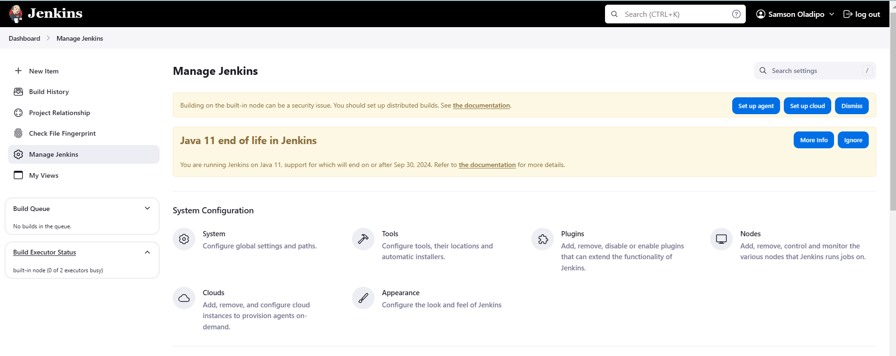

- **In the `Available` tab, search for `Copy Artifact` and install it without restarting Jenkins.**
 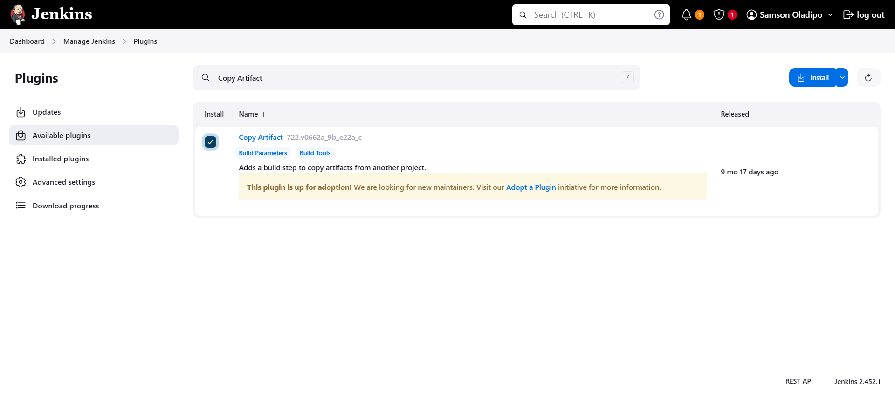
 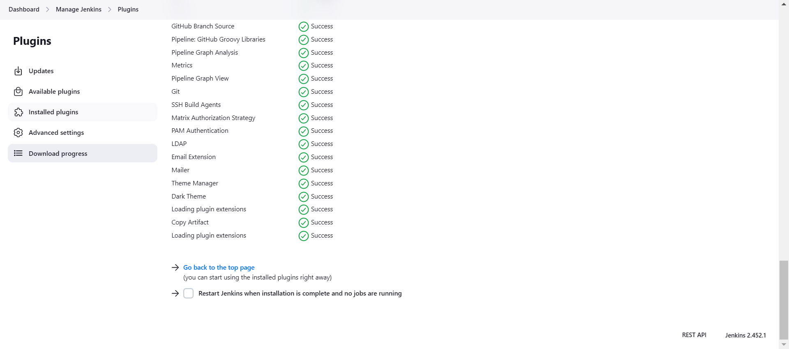

### Create a New Jenkins Freestyle Project
- **Create a new Freestyle project named `save_artifacts`.**
 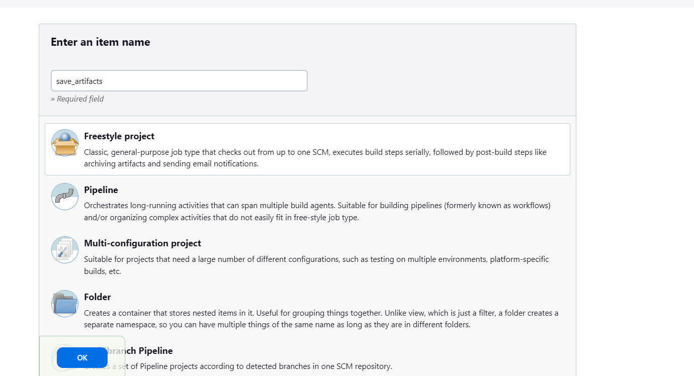
 
- **Configure it to be triggered by the completion of your existing `ansible` project.**
 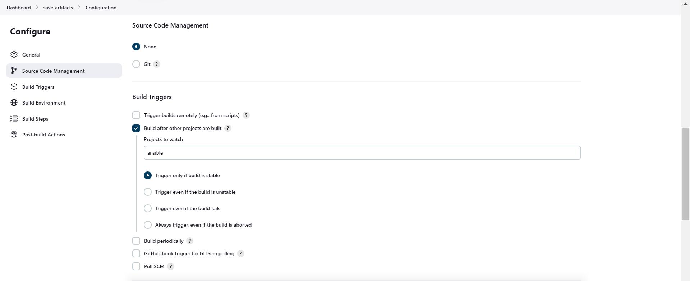

- **Configure Job to Discard Old Builds for clean dev pipeline:**
 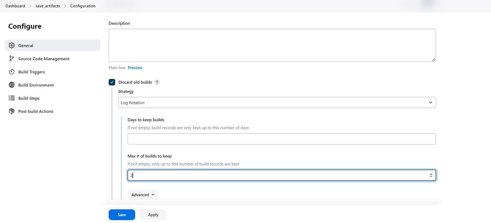
    
    - Add a `Build` step and choose `Copy artifacts from other project`.

    - Set `ansible` as the source project.
    
    - Set `/home/ubuntu/ansible-config-artifact` as the target directory.
    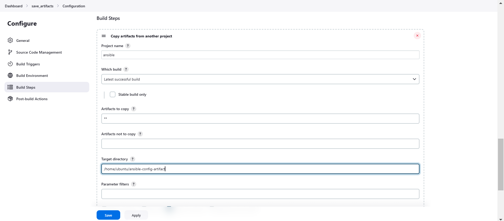 

### Test the Setup
- **Make a change in the `README.md` file in the `main` branch of the `ansible-config-mgt` repository.**
  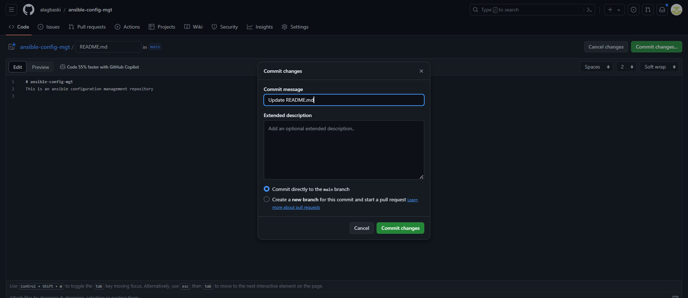

- **Verify that both Jenkins jobs complete and that files are updated in `/home/ubuntu/ansible-config-artifact` on the Jenkins server.**
    ```sh
    cd /home/ubuntu/ansible-config-artifact
    ls
    ```
    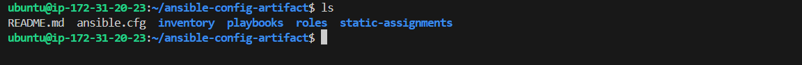

---

## Step 2 - Refactor Ansible Code by Importing Other Playbooks into `site.yml`

### Setup the Repository
- **Pull the latest code from the `main` branch.**

- **Create a new branch named `refactor`:**
    
    ```sh
    git checkout -b refactor
    ```
    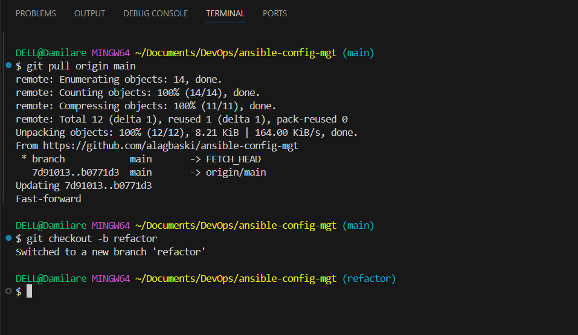

### Create the `site.yml` File
- **Within the `playbooks` folder, create a new file named `site.yml` and add the code below into the file:**
    
    ```yaml
    ---
    - hosts: all
    - import_playbook: ../static-assignments/common.yml
    ```

### Organize Playbooks
- **Create a new folder named `static-assignments` at the root of the repository.**

- **Move `common.yml` to the `static-assignments` folder.**

### Folder Structure
**Your folder structure should look like this:**
    
```
    ├── static-assignments
	│   └── common.yml
	├── inventory
    		└── dev
    		└── stage
    		└── uat
    		└── prod
	└── playbooks
    		└── site.yml
```
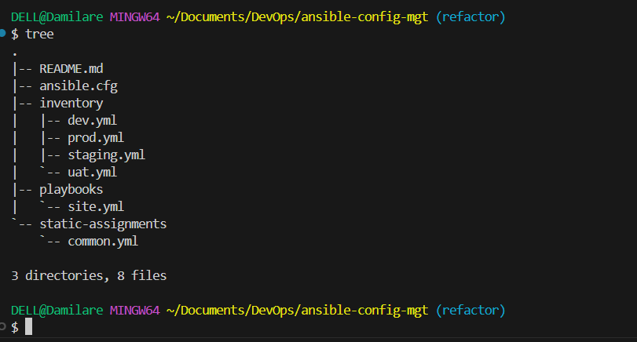


### Create `common-del.yml` Playbook
- **Create a new playbook named `common-del.yml` in `static-assignments` to delete `wireshark`:**
    
    ```yaml
    ---
    - name: update web, nfs, and db servers
      hosts: webservers, nfs
      remote_user: ec2-user
      become: yes
      become_user: root
      tasks:
      - name: delete wireshark
        yum:
          name: wireshark
          state: removed

    - name: update LB server
      hosts: lb, db
      remote_user: ubuntu
      become: yes
      become_user: root
      tasks:
      - name: delete wireshark
        apt:
          name: wireshark
          state: absent
          autoremove: yes
          purge: yes
          autoclean: yes
    ```

### Update `site.yml`
- **Replace the import of `common.yml` with `common-del.yml`:**
    
    ```yaml
    ---
    - hosts: all
    - import_playbook: ../static-assignments/common-del.yml
    ```

### Run the Playbook
- **Run the playbook against the `dev` environment using the `ssh-agent` on VSC:**
    
    ```sh
    eval `ssh-agent -s`
    ssh-add <path-to-key>
    ssh -A ubuntu@public-ip


    cd /home/ubuntu/ansible-config-mgt/
    ansible-playbook -i inventory/dev.yml playbooks/site.yml
    ```
    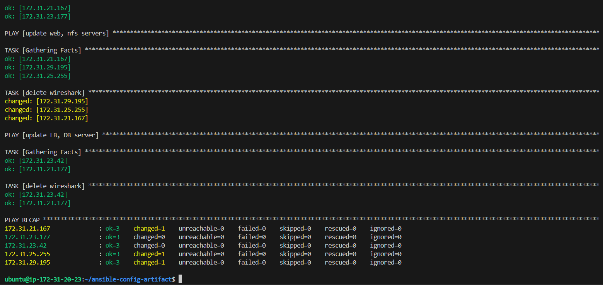

- Ensure `wireshark` is deleted by running `wireshark --version` on the servers.
  
  - Output Webserver:
   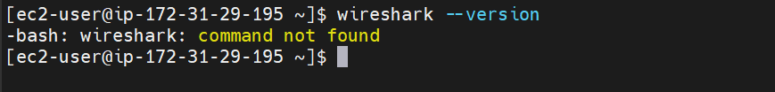

  - Output LBserver:
   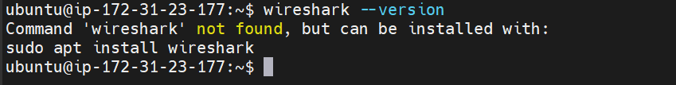
  

---

## Step 3 - Configure UAT Webservers with a Role 'Webserver'

### Launch UAT Servers
- **Launch 2 new EC2 instances using the RHEL 9 image.**
- **Name them `Web1-UAT` and `Web2-UAT`.**
 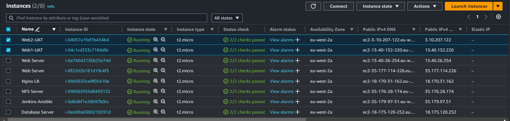

### Create the Role Structure
- **Create a `roles` directory:**

  - Create the folder for `roles` manually in the `static-assignments` directory
 
    ```sh
    cd static-assignments
    mkdir roles
    cd roles
    ansible-galaxy init webserver
    ```
- Alternatively, create the directory structure manually. The initial structure should be:
    
    ```
    └── webserver
        ├── README.md
        ├── defaults
        │   └── main.yml
        ├── handlers
        │   └── main.yml
        ├── meta
        │   └── main.yml
        ├── tasks
        │   └── main.yml
        └── templates
    ```
    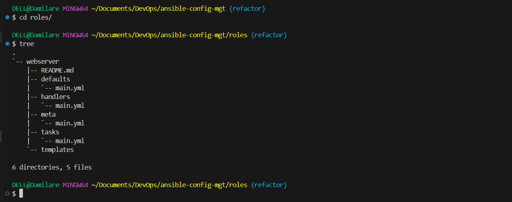

    - Final Folder Structure:
     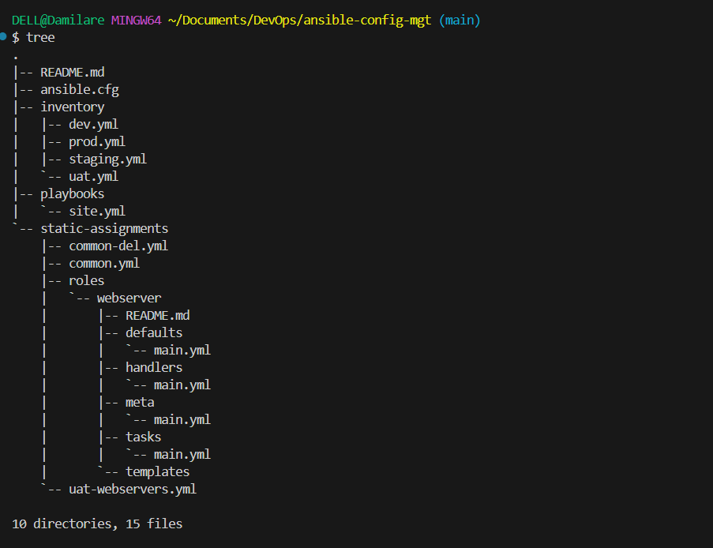

### Update UAT Inventory
- **Update the `ansible-config-mgt/inventory/uat.yml` with the IP addresses of the UAT servers:**
    
    ```ini
    [uat-webservers]
    <Web1-UAT-Server-Private-IP-Address> ansible_ssh_user='ec2-user'
    <Web2-UAT-Server-Private-IP-Address> ansible_ssh_user='ec2-user'
    ```

### Configure the `webserver` Role
- **Add `roles_path` in `ansible.cfg` file:**
    
    ```ini
    roles_path = /home/ubuntu/ansible-config-mgt/roles
    ```

- **Add tasks in `roles/webserver/tasks/main.yml`:**
    
    ```yaml
    ---
    - name: install apache
      become: true
      ansible.builtin.yum:
        name: "httpd"
        state: present

    - name: install git
      become: true
      ansible.builtin.yum:
        name: "git"
        state: present

    - name: clone a repo
      become: true
      ansible.builtin.git:
        repo: https://github.com/<your-name>/tooling.git
        dest: /var/www/html
        force: yes

    - name: copy html content to one level up
      become: true
      command: cp -r /var/www/html/html/ /var/www/

    - name: start service httpd, if not started
      become: true
      ansible.builtin.service:
        name: httpd
        state: started

    - name: recursively remove /var/www/html/html/ directory
      become: true
      ansible.builtin.file:
        path: /var/www/html/html
        state: absent
    ```

---

## Step 4 - Reference the `webserver` Role

### Create `uat-webservers.yml` Assignment
- **Inside `static-assignments`, create a new playbook `uat-webservers.yml` to reference the `webserver` role:**
    
    ```yaml
    ---
    - hosts: uat-webservers
      roles:
        - webserver
    ```

### Update `site.yml` to Include `uat-webservers.yml`
- **Modify `playbooks/site.yml` to include the `uat-webservers.yml` playbook:**
    
    ```yaml
    ---
    - hosts: all
    - import_playbook: ../static-assignments/common-del.yml

    - hosts: uat-webservers
    - import_playbook: ../static-assignments/uat-webservers.yml
    ```

---

## Step 5 - Commit & Test

### Commit Your Changes
- **Commit and push your changes to the repository:**
    
    ```sh
    git add .
    git commit -m "Refactored Ansible code and added roles for UAT webservers"
    git push origin refactor
    ```

- **Create a Pull Request and merge changes to the `main` branch.**
  
  - Create PR:
   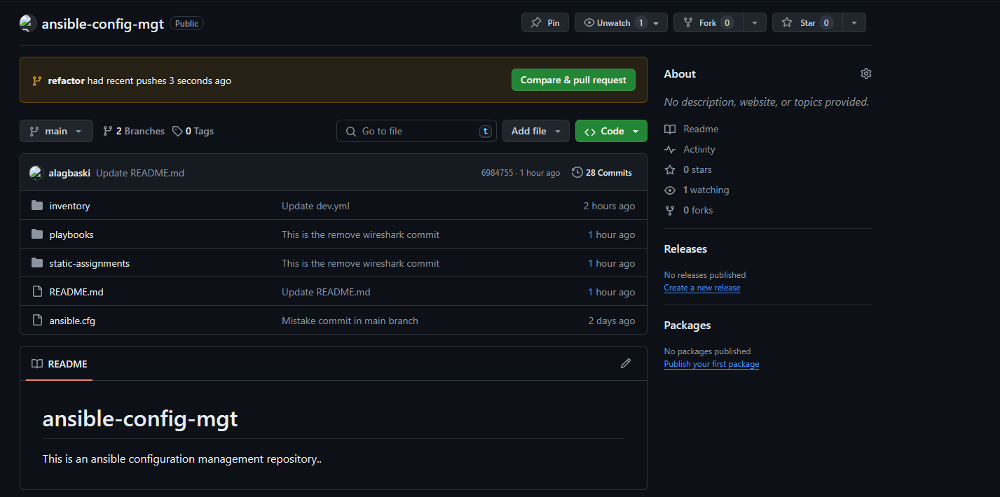

  - Merge Changes:
    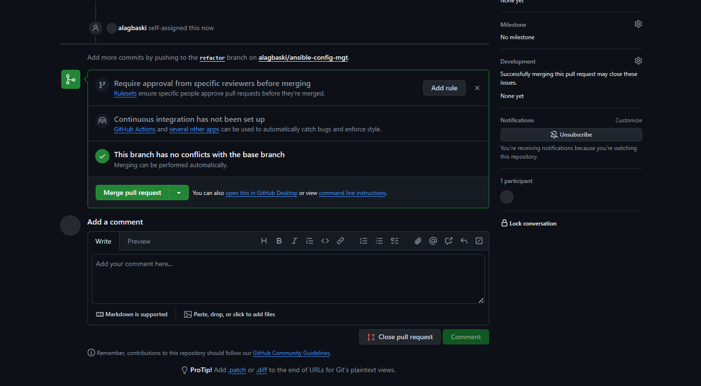

### Verify Jenkins Jobs
- **Ensure the webhook triggers two consecutive Jenkins jobs.**
- **Confirm that files are copied to `/home/ubuntu/ansible-config-artifact/`.**

### Run the Playbook Against the `uat` Inventory
- **Execute the playbook:**
    
    ```sh
    cd /home/ubuntu/ansible-config-artifact
    ansible-playbook -i inventory/uat.yml playbooks/site.yml
    ```
    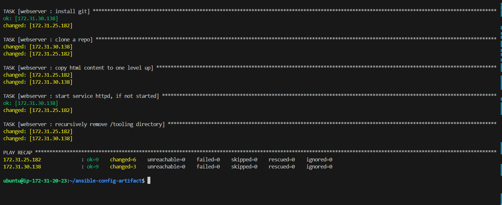

### Verify Web Server Configuration
- **Access the UAT web servers from your browser:**
    - `http://<Web1-UAT-Server-Public-IP-or-Public-DNS-Name>/index.php`
     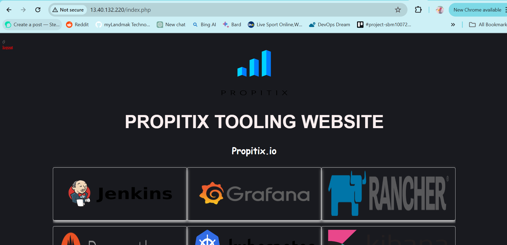

    - `http://<Web2-UAT-Server-Public-IP-or-Public-DNS-Name>/index.php`
     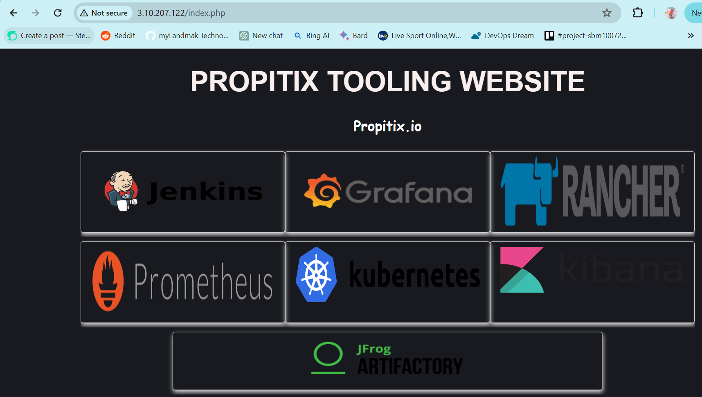


### Conclusion
Congratulations! You have successfully deployed and configured UAT Web Servers using Ansible imports and roles.

---

### Blocker
- I encountered a blocker while doing a test run to save a copy of artifact/files on the jenkins server into `/home/ubuntu/ansible-config-artifact` directory. I noticed the `save-artifatc` job build failed, i got `AccessDeniedException` error:
 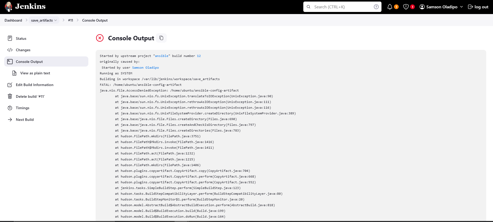

 I was able to resolve the blocker after setting proper permissions for jenkins user by running the following commands:

 ```sh
 sudo usermod -a -G jenkins ubuntu
 sudo chmod 777 /home/ubuntu/ansible-config-artifact
 sudo chown ubuntu:jenkins /ansible-config-artifact
 ```

---
