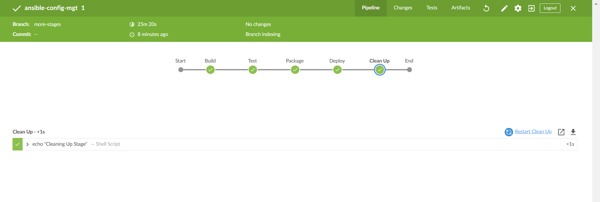
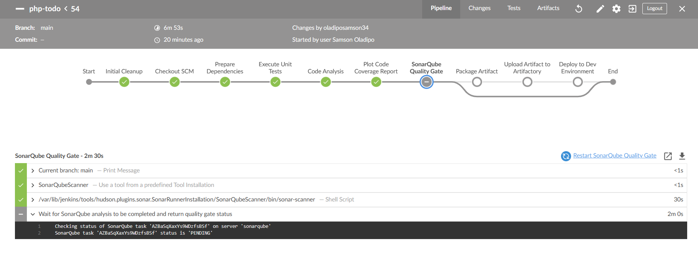
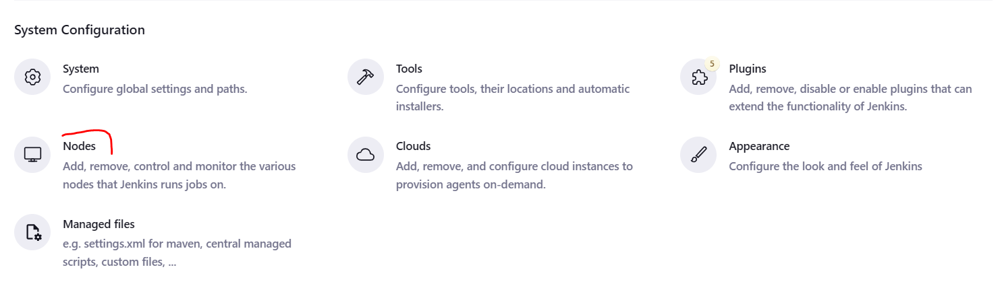

# Continuous Integration with Jenkins | Ansible | Artifactory | SonarQube | PHP

## Introduction

### Simulating a typical CI/CD Pipeline for a PHP Based application:

  As part of the ongoing infrastructure development with Ansible started from [Ansible-Config-MGT](../Ansible-Configuration-Management/), you will be tasked to create a pipeline that simulates continuous integration and delivery.

   It is important to know that both `Tooling` and `TODO` Web Applications are based on an interpreted (scripting) language (PHP). It means, it can be deployed directly onto a server and will work without compiling the code to a machine language.

   The problem with that approach is, it would be difficult to package and version the software for different releases. And so, in this project, we will be using a different approach for releases, rather than downloading directly from git, we will be using Ansible `uri module`.

## Project Implementation Steps

This project is partly a continuation of your Ansible work, so simply add and subtract based on the new setup in this project. It will require a lot of servers to simulate all the different environments from `dev`, `ci` all the way to `production`. This will be quite a lot of servers altogether (But you don't have to create them all at once. Only create servers required for an environment you are working with at the moment. For example, when doing deployments for `dev`, do not create servers for `sit`, `pentest`, or `production` yet).

**1. Setting Up Infrastructure**
  - Create AWS EC2 Instances: Start with minimal servers as needed for the Dev environment.
    - Dev Environment: `Nginx`, `Tooling Web Server`, `Todo Web Server`, `Database`
    - Ci Environment: `Jenkins`, `Nginx`, `SonarQube`, `JFrog Artifactory`

**2. DNS Configuration**
  - Domain and Subdomains:
    - Set up DNS entries for subdomains using your main domain `mightygull.click`.

    | Server                 |            Domain                              |
    |------------------------|------------------------------------------------|
    | Jenkins                | https://ci.infradev.mightygull.click           |
    | Sonarqube              | https://sonar.infradev.mightygull.click        |
    | Artifactory            | https://artifacts.infradev.mightygull.click    |
    | Production Tooling     | https://tooling.mightygull.click               |
    | Pre-Prod Tooling       | https://tooling.preprod.mightygull.click       |
    | Pentest Tooling        | https://tooling.pentest.mightygull.click       |
    | UAT Tooling            | https://tooling.uat.mightygull.click           |
    | SIT Tooling            | https://tooling.sit.mightygull.click           |
    | Dev Tooling            | https://tooling.dev.mightygull.click           |
    | Production TODO-WebApp | https://todo.mightygull.click                  |
    | Pre-Prod TODO-WebApp   | https://todo.preprod.mightygull.click          |
    | Pentest TODO-WebApp    | https://todo.pentest.mightygull.click          |
    | UAT TODO-WebApp        | https://todo.uat.mightygull.click              |
    | SIT TODO-WebApp        | https://todo.sit.mightygull.click              |
    | Dev TODO-WebApp        | https://todo.dev.mightygull.click              |
	    

**3. Ansible Inventory Setup**
  - Inventory Structure:

    ```
    ├── ci.yml
    ├── dev.yml
    ├── pentest.yml
    ├── pre-prod.yml
    ├── prod.yml
    ├── sit.yml
    └── uat.yml
    ```

    - Create Ansible inventory files (`ci`, `dev`, `pentest`, etc.) with respective server users and IP addresses.
    
    `ci.yml`:
    ```yml
    [jenkins]
    <Jenkins-Private-IP-Address> ansible_ssh_user=ubuntu

    [nginx]
    <Nginx-Private-IP-Address> ansible_ssh_user=ubuntu

    [sonarqube]
    <SonarQube-Private-IP-Address> ansible_ssh_user=ubuntu

    [artifactory]
    <Artifactory-Private-IP-Address> ansible_ssh_user=ubuntu
    ```

    `dev.yml`
    ```yml
    [tooling]
    <Tooling-Private-IP-Address> ansible_ssh_user=ec2-user
    <Tooling-Private-IP-Address> ansible_ssh_user=ec2-user

    [nginx]
    <Nginx-Private-IP-Address> ansible_ssh_user=ubuntu

    [db]
    <DB-Private-IP-Address> ansible_ssh_user=ubuntu

    [todo]
    <TODO-Private-IP-Address> ansible_ssh_user=ec2-user
    ```

    `pentest.yml`
    ```yml
    [pentest:children]
    pentest-todo
    pentest-tooling

    [pentest-todo]
    <Pentest-for-Todo-Private-IP-Address> ansible_ssh_user=ec2-user

    [pentest-tooling]
    <Pentest-for-Tooling-Private-IP-Address> ansible_ssh_user=ec2-user
    ```

**4. Ansible Roles for CI Environment**
  - Update Ansible Roles:
    - Add roles for `Artifactory` to your Ansible setup.

**5. Configuring Jenkins for Deployment**
  - Install Required Plugins:
    - Install the `Blue Ocean` plugin for Jenkins.
    
      

    - Open the `Blue Ocean` plugin and create a new pipeline.
      
      

    - Select `Github`.
      
      

    - Connect github with jenkins using your github personal access token
      
      - Login to GitHub & Generate an Access Token:
        
        - Select `Settings`:
        
        

        - Select `Developer Settings` > `Token Classic`:
        
        

        

        

        

        - Copy & Paste Generated Token to Jenkins Pipeline:
        
        
      
       

    - Select the repository
      
      

      

    - Create the pipeline
      
      

  - Set Up Jenkins Pipeline:
    - Create a `Jenkinsfile` in your Ansible project (`deploy/Jenkinsfile`).
    
      - Input the code below into the file:
  
        ```groovy
        pipeline {
            agent any


        stages {
            stage('Build') {
            steps {
                script {
                sh 'echo "Building Stage"'
                }
            }
            }
            }
        }
        ```
    - Now go back into the Ansible pipeline in Jenkins, and select configure.
      
      `Dashboard` > `ansible-config-mgt` > `Configure`

      

    - Scroll down to `Build Configuration` section and specify the location of the **Jenkinsfile** at `deploy/Jenkinsfile`.
      
      
    
    - Back to the pipeline again, this time click `Build Now`.
      
      

- Create a new git branch and name it `feature/jenkinspipeline-stages`.
  
  

- Currently we only have the `Build` stage. Let us add another stage called `Test`.
  
  - Paste the code snippet below and push the new changes to GitHub.

    ```groovy
    pipeline {
        agent any

    stages {
        stage('Build') {
        steps {
            script {
            sh 'echo "Building Stage"'
            }
        }
        }

        stage('Test') {
        steps {
            script {
            sh 'echo "Testing Stage"'
            }
        }
        }
        }
    }
    ```

- To make your new branch show up in Jenkins, we need to tell Jenkins to scan the repository.

  - Click on the `Administration` button on `Blue Ocean` dashboard.
 
  - Navigate to the `ansible-config-mgt` and click on `Scan repository now`.

  - Refresh the page and both branches will start building automatically.
    
    
  
  - You can go into `Blue Ocean` and see both branches there too.

  - In Blue Ocean, you can now see how the `Jenkinsfile` has caused a new step in the pipeline launch build for the new branch.
    
    

#### THE QUICK TASK:
- Create a pull request to merge the latest code into the `main branch`
- After merging the `PR`, go back into your terminal and switch into the `main` branch.
- Pull the latest change.
- Create a new branch, add more stages into the Jenkins file to simulate below phases. (Just add an `echo` command like we have in `build` and `test` stages)
   - Package 
   - Deploy 
   - Clean up

        ```groovy
        pipeline {
                agent any

            stages {
                stage('Build') {
                steps {
                    script {
                    sh 'echo "Building Stage"'
                    }
                }
                }

                stage('Test') {
                steps {
                    script {
                    sh 'echo "Testing Stage"'
                    }
                }
                }

                stage('Package') {
                steps {
                    script {
                    sh 'echo "Packaging Stage"'
                    }
                }
                }

                stage('Deploy') {
                steps {
                    script {
                    sh 'echo "Deployment Stage"'
                    }
                }
                }

                stage('Clean Up') {
                steps {
                    script {
                    sh 'echo "Clean Up Stage"'
                    }
                }
                }
            }
        }  
        ```

- Verify in Blue Ocean that all the stages are working, then merge your new branch to the main branch.

**6. Verify Jenkins Pipeline**
  - Trigger Builds:
    - Trigger builds manually to verify stages (`Build`, `Test`, `Package`, `Deploy`, `Clean Up`).

    - Use Blue Ocean interface to monitor pipeline execution.
      
      

**7. Running Ansible Playbook from Jenkins**

  - Install Ansible on the Jenkins server, if it is a new Jenkins server.
  
    ```
    sudo apt update && sudo apt upgrade -y
    sudo apt install ansible -y
    ```

- To get the ansible path on the Jenkins Server, Run :

  ```sh
  which ansible
  ```

  - Configure `Ansible` and `SSH-Agent` Plugin in Jenkins:

    - Install the `Ansible` and `SSH Agent` plugin and in Jenkins UI to run Ansible playbooks.
      
      - Install `Ansible`:
        
        

      - Install `SSH-Agent`:
        
        

    - Click on `Dashboard` > `Manage Jenkins` > `Tools` > `Add Ansible`. Add a name and the `path` ansible is installed on the jenkins server.
      
      
    
    - Create a `Global Credentials` in Jenkins using a `SSH Username with Private Key` credential `Kind`, set ID as `private-key`, Username as `ec2-user` and then copy the content of the key into the `Key` section and Save the credential.
      
      

  - Update Jenkins Pipeline for Ansible Deployment:
    
    - Add the code below into the `.ansible.cfg` file and change the file location to the `/deploy` directory.

        ```ini
        [defaults]
        timeout = 160
        callback_whitelist = profile_tasks
        log_path=~/ansible.log
        host_key_checking = False
        ansible_python_interpreter=/usr/bin/python3
        allow_world_readable_tmpfiles=true

        [ssh_connection]
        ssh_args = -o ControlMaster=auto -o ControlPersist=30m -o ControlPath=/tmp/ansible-ssh-%h-%p-%r -o ServerAliveInterval=60 -o ServerAliveCountMax=60 -o ForwardAgent=yes
        ```

    - Modify the Jenkinsfile to include Ansible playbook execution steps to run `Artifactory` roles.

        ```groovy
        pipeline {
            agent any

            environment {
                ANSIBLE_CONFIG = "${WORKSPACE}/deploy/ansible.cfg"
                ANSIBLE_HOST_KEY_CHECKING = 'False'
            }

            stages {
                stage("Initial cleanup") {
                    steps {
                        dir("${WORKSPACE}") {
                            deleteDir()
                        }
                    }
                }

                stage('Checkout SCM') {
                    steps {
                        git branch: 'main', url: 'https://github.com/<username>/ansibllle-config-mgt.git'
                    }
                }

                stage('Prepare Ansible For Execution') {
                    steps {
                        sh 'echo ${WORKSPACE}'
                        sh 'sed -i "3 a roles_path=${WORKSPACE}/roles" ${WORKSPACE}/deploy/ansible.cfg'
                    }
                }

                stage('Test SSH Connections') {
                    steps {
                        script {
                            def hosts = [
                                [group: 'tooling', ip: 'private-ip', user: 'ec2-user'],
                                [group: 'tooling', ip: 'private-ip', user: 'ec2-user'],
                                [group: 'nginx', ip: 'private-ip', user: 'ubuntu'],
                                [group: 'artifactory', ip: 'private-ip', user: 'ubuntu'],
                                [group: 'db', ip: 'private-ip', user: 'ubuntu']
                            ]
                            for (host in hosts) {
                                sshagent(['private-key']) {
                                    sh "ssh -o StrictHostKeyChecking=no -i /home/ubuntu/.ssh/key.pem ${host.user}@${host.ip} exit"
                                }
                            }
                        }
                    }
                }

                stage('Run Ansible playbook') {
                    steps {
                        sshagent(['private-key']) {
                            ansiblePlaybook(
                                become: true,
                                credentialsId: 'private-key',
                                disableHostKeyChecking: true,
                                installation: 'ansible',
                                inventory: "${WORKSPACE}/inventory/dev.yml",
                                playbook: "${WORKSPACE}/playbooks/site.yml"
                            )
                        }
                    }
                }

                stage('Clean Workspace after build') {
                    steps {
                        cleanWs(cleanWhenAborted: true, cleanWhenFailure: true, cleanWhenNotBuilt: true, cleanWhenUnstable: true, deleteDirs: true)
                    }
                }
            }
        }
        ```

    - Blue Ocean dashboard:

      

    - Pipeline Output:
      
      


### Parameterizing Jenkinsfile For Ansible Deployment

Instead of manually updating the `Jenkinsfile` for each environment, we'll use parameterization to dynamically select the `inventory` file and other parameters during pipeline execution.

 - Update your Ansible inventory files (sit, uat, pentest, etc.) with the appropriate server IP addresses and configurations for each environment.
  
    ```yml
    [tooling]
    <Private-IP> ansible_ssh_user=ec2-user
    <Private-IP> ansible_ssh_user=ec2-user

    [nginx]
    <Private-IP> ansible_ssh_user=ubuntu

    [db]
    <Private-IP> ansible_ssh_user=ubuntu

    [todo]
    <Private-IP> ansible_ssh_user=ec2-user
    ```

  - There are always several environments that need configuration, such as `CI`, `sit`, and `pentest` environments etc. To manage and run these environments dynamically, we need to update the `Jenkinsfile`.

    ```groovy
    pipeline {
        agent any

        parameters {
        string(name: 'inventory', defaultValue: 'dev',  description: 'This is the inventory file for the environment to deploy configuration')
        }
    ...
    }
    ```

- Replace any hardcoded references to `inventory/dev` with `${inventory}`.
  
    ```groovy
    stage('Run Ansible playbook') {
        steps {
            sshagent(['private-key']) {
                ansiblePlaybook(
                    become: true,
                    credentialsId: 'private-key',
                    disableHostKeyChecking: true,
                    installation: 'ansible',
                    inventory: "${WORKSPACE}/${inventory}",
                    playbook: "${WORKSPACE}/playbooks/site.yml"
                )
            }
        }
    }
    ```

> Notice the Build Now is changed to Build with Parameters and this enables us to run differenet environment easily.

  

- Add another parameter to the one we added above. specify the parameter name as `ansible_tags` and the default value to webserver.

    ```groovy
    string(name: 'ansible_tags', defaultValue: 'webserver', description: 'Ansible tags to run specific roles or tasks')
    ```

  - Add the `tags` key to the Jenkinsfile and run the pipeline to install `Artifactory` in the respective server in `ci` enivironment:
    ```groovy
    stage('Run Ansible playbook') {
        steps {
            sshagent(['private-key']) {
                ansiblePlaybook(
                    become: true,
                    credentialsId: 'private-key',
                    disableHostKeyChecking: true,
                    installation: 'ansible',
                    inventory: "${WORKSPACE}/${inventory}",
                    playbook: "${WORKSPACE}/playbooks/site.yml"
                    tags: "${params.ansible_tags}"
                )
            }
        }
    }
    ```

    

    - Output Artifactory Tasks:
      
      

    - Accessing the `JFrog` web-page, login with default credentials `admin` and `password`.
      
      - JFrog login page:
        
        

      - JFrog Dashboard:

        

      - Create a `local` repository in Jfrog
        
      Output 1:

        

      Output 2:

        

      Output 3:

        

      Output 4:

        

### CI/CD Pipeline for TODO application

We already have tooling website as a part of deployment through Ansible. Here we will introduce another PHP application to add to the list of software products we are managing in our infrastructure. The good thing with this particular application is that it has unit tests, and it is an ideal application to show an end-to-end CI/CD pipeline for a particular application.

Our goal here is to deploy the application onto servers directly from `Artifactory` rather than from `Git`.

Now, let's set up the CI/CD pipeline for the `TODO` application using Jenkins and `Artifactory`.


### Phase 1 - Prepare Jenkins and Artifactory Integration

- Install necessary packages on your Jenkins server (`PHP7.0`, `Composer2.2`, etc.)

  ```sh
  sudo apt update
  sudo apt install -y zip libapache2-mod-php phploc php7.0-{xml,bcmath,bz2,intl,gd,mbstring,mysql,zip}
  php -r "copy('https://getcomposer.org/download/2.2.0/composer.phar', 'composer.phar');"
  sudo mv composer.phar /usr/local/bin/composer
  sudo chmod +x /usr/local/bin/composer
  php -r "unlink('composer-setup.php');"
  php -v
  composer -v
  ```

- Install required Jenkins plugins:
  - Plot plugin (for displaying test reports and coverage)
    
    

  - Artifactory plugin (for uploading artifacts)
    
    

- Configure Artifactory Integration:

  - In Jenkins UI, configure the Artifactory server:
    - Add server `ID`, `URL`, and `credentials`.
    - Test the connection to ensure it's configured correctly.
      
      


### Phase 2 - Setup Jenkins Multibranch Pipeline

- First step, `Fork` the TODO repository below into your GitHub account.
  
  ```
  https://github.com/StegTechHub/php-todo.git
  ```
   

- Create a basic Jenkinsfile in the root of the TODO application repository. This file will define your pipeline stages.

Example `Jenkinsfile`:

```groovy
pipeline {
    agent any

  stages {

     stage("Initial cleanup") {
          steps {
            dir("${WORKSPACE}") {
              deleteDir()
            }
          }
        }
  
    stage('Checkout SCM') {
      steps {
            git branch: 'main', url: 'https://github.com/<user-name>/php-todo.git'
      }
    }

    stage('Prepare Dependencies') {
      steps {
             sh 'composer install'
             sh 'php artisan migrate'
             sh 'php artisan db:seed'
             sh 'php artisan key:generate'
      }
    }
  }
}
```

- Configure Multibranch Pipeline in Blue Ocean:

  - Use `Blue Ocean` in Jenkins to create a new multibranch pipeline.
    
    

  - Connect it to your GitHub repository where the `TODO` application is forked.
    
    

    

- Database Setup:

  - On your database server, create the necessary database and user as specified in the `TODO` application `.env`.

    ```sql
    Create database homestead;
    CREATE USER 'homestead'@'%' IDENTIFIED BY 'sePret^i';
    GRANT ALL PRIVILEGES ON * . * TO 'homestead'@'%';
    ```

- Create a `.env` file in TODO repo and update it with the credentials to connect the database, use sample the code below :

    ```
    APP_ENV=local
    APP_DEBUG=true
    APP_KEY=SomeRandomString
    APP_URL=http://localhost
                        
    DB_HOST=<DB-Private_ip>
    DB_DATABASE=homestead
    DB_USERNAME=homestead
    DB_PASSWORD=sePret^i
                        
    CACHE_DRIVER=file
    SESSION_DRIVER=file
    QUEUE_DRIVER=sync
                        
    REDIS_HOST=127.0.0.1
    REDIS_PASSWORD=null
    REDIS_PORT=6379
                        
    MAIL_DRIVER=smtp
    MAIL_HOST=mailtrap.io
    MAIL_PORT=2525
    MAIL_USERNAME=null
    MAIL_PASSWORD=null
    MAIL_ENCRYPTION=null
    ```

> NOTE:

```sh
# update database server configuration to allow access from 0.0.0.0
sudo vi /etc/mysql/mysql.conf.d/mysqld.cnf
                        
# install mysql-client on jenkins server
sudo apt install mysql-client -y 
```

- Run the `TODO` Pipeline:
  
  

(After successful run of this step, login to the database, run `SHOW TABLES` and you will see the tables being created for you)

  

- Update the Jenkinsfile to include `Unit tests` step:

    ```groovy
    stage('Execute Unit Tests') {
        steps {
                sh './vendor/bin/phpunit'
        }
    }
    ```
  
  

### Phase 3 - Code Quality Analysis

For PHP the most commonly tool used for code quality analysis is `phploc`.

- The data produced by phploc can be ploted onto graphs in Jenkins.
  
  - First, install `phploc` and `phpunit` on Jenkins Server.

    ```sh
    # Install phploc
    wget -O phploc.phar https://phar.phpunit.de/phploc-6.0.0.phar

    # Add the permission to make file executeable 
    chmod +x phploc.phar

    # Reolad Shell Config
    sudo mv phploc.phar /usr/local/bin/phploc

    # verify the installation
    phploc --version

    # Download the phpunit PHAR file
    wget -O phpunit.phar https://phar.phpunit.de/phpunit-9.5.10.phar

    # Make the PHAR file executable
    chmod +x phpunit

    # Move the PHAR file to a directory in your PATH
    sudo mv phpunit /usr/local/bin/phpunit

    #Verify the installation
    phpunit --version
    ```

  - Add the `Code Analysis` step in Jenkinsfile. The output of the data will be saved in `build/logs/phploc.csv` file.

    ```groovy
    stage('Code Analysis') {
        steps {
                sh 'phploc app/ --log-csv build/logs/phploc.csv'

        }
    }
    ```

    

- Plot the data using plot Jenkins plugin.

    ```groovy
    stage('Plot Code Coverage Report') {
                steps {
                    plot csvFileName: 'plot-loc.csv', csvSeries: [[displayTableFlag: false, exclusionValues: 'Lines of Code (LOC),Comment Lines of Code (CLOC),Non-Comment Lines of Code (NCLOC),Logical Lines of Code (LLOC)', file: 'build/logs/phploc.csv', inclusionFlag: 'INCLUDE_BY_STRING', url: '']], group: 'phploc', numBuilds: '100', style: 'line', title: 'A - Lines of Code', yaxis: 'Lines of Code'
                    plot csvFileName: 'plot-structures.csv', csvSeries: [[displayTableFlag: false, exclusionValues: 'Directories,Files,Namespaces', file: 'build/logs/phploc.csv', inclusionFlag: 'INCLUDE_BY_STRING', url: '']], group: 'phploc', numBuilds: '100', style: 'line', title: 'B - Structures Containers', yaxis: 'Count'
                    plot csvFileName: 'plot-avg-length.csv', csvSeries: [[displayTableFlag: false, exclusionValues: 'Average Class Length (LLOC),Average Method Length (LLOC),Average Function Length (LLOC)', file: 'build/logs/phploc.csv', inclusionFlag: 'INCLUDE_BY_STRING', url: '']], group: 'phploc', numBuilds: '100', style: 'line', title: 'C - Average Length', yaxis: 'Average Lines of Code'
                    plot csvFileName: 'plot-complexity.csv', csvSeries: [[displayTableFlag: false, exclusionValues: 'Cyclomatic Complexity / Lines of Code,Cyclomatic Complexity / Number of Methods', file: 'build/logs/phploc.csv', inclusionFlag: 'INCLUDE_BY_STRING', url: '']], group: 'phploc', numBuilds: '100', style: 'line', title: 'D - Relative Cyclomatic Complexity', yaxis: 'Cyclomatic Complexity by Structure'
                    plot csvFileName: 'plot-classes.csv', csvSeries: [[displayTableFlag: false, exclusionValues: 'Classes,Abstract Classes,Concrete Classes', file: 'build/logs/phploc.csv', inclusionFlag: 'INCLUDE_BY_STRING', url: '']], group: 'phploc', numBuilds: '100', style: 'line', title: 'E - Types of Classes', yaxis: 'Count'
                    plot csvFileName: 'plot-methods.csv', csvSeries: [[displayTableFlag: false, exclusionValues: 'Methods,Non-Static Methods,Static Methods,Public Methods,Non-Public Methods', file: 'build/logs/phploc.csv', inclusionFlag: 'INCLUDE_BY_STRING', url: '']], group: 'phploc', numBuilds: '100', style: 'line', title: 'F - Types of Methods', yaxis: 'Count'
                    plot csvFileName: 'plot-constants.csv', csvSeries: [[displayTableFlag: false, exclusionValues: 'Constants,Global Constants,Class Constants', file: 'build/logs/phploc.csv', inclusionFlag: 'INCLUDE_BY_STRING', url: '']], group: 'phploc', numBuilds: '100', style: 'line', title: 'G - Types of Constants', yaxis: 'Count'
                    plot csvFileName: 'plot-testing.csv', csvSeries: [[displayTableFlag: false, exclusionValues: 'Test Classes,Test Methods', file: 'build/logs/phploc.csv', inclusionFlag: 'INCLUDE_BY_STRING', url: '']], group: 'phploc', numBuilds: '100', style: 'line', title: 'I - Testing', yaxis: 'Count'
                    plot csvFileName: 'plot-lloc.csv', csvSeries: [[displayTableFlag: false, exclusionValues: 'Logical Lines of Code (LLOC),Classes Length (LLOC),Functions Length (LLOC),LLOC outside functions or classes', file: 'build/logs/phploc.csv', inclusionFlag: 'INCLUDE_BY_STRING', url: '']], group: 'phploc', numBuilds: '100', style: 'line', title: 'AB - Code Structure by Logical Lines of Code', yaxis: 'Logical Lines of Code'
                    plot csvFileName: 'plot-functions.csv', csvSeries: [[displayTableFlag: false, exclusionValues: 'Functions,Named Functions,Anonymous Functions', file: 'build/logs/phploc.csv', inclusionFlag: 'INCLUDE_BY_STRING', url: '']], group: 'phploc', numBuilds: '100', style: 'line', title: 'H - Types of Functions', yaxis: 'Count'
                    plot csvFileName: 'plot-objects.csv', csvSeries: [[displayTableFlag: false, exclusionValues: 'Interfaces,Traits,Classes,Methods,Functions,Constants', file: 'build/logs/phploc.csv', inclusionFlag: 'INCLUDE_BY_STRING', url: '']], group: 'phploc', numBuilds: '100', style: 'line', title: 'BB - Structure Objects', yaxis: 'Count'
                }
            }
    ```

    

- You should now see a `Plot` menu item on the left menu. Click on it to see the charts.
  
  Output 1:
  

  Output 2:
  

- Bundle the application code into an artifact (archived package) upload to `Artifactory`:

    ```groovy
    stage ('Package Artifact') {
        steps {
                sh 'zip -qr php-todo.zip ${WORKSPACE}/*'
        }
        }
    ```

  

- Publish the resulted artifact into `Artifactory`:

    ```groovy
    stage ('Upload Artifact to Artifactory') {
            steps {
                script { 
                    def server = Artifactory.server 'artifactory-server'                 
                    def uploadSpec = """{
                        "files": [
                        {
                        "pattern": "php-todo.zip",
                        "target": "<name-of-artifact-repository>/php-todo",
                        "props": "type=zip;status=ready"

                        }
                        ]
                    }""" 
                    println "Upload Spec: ${uploadSpec}"
                                      try {
                                          server.upload spec: uploadSpec
                                          println "Upload successful"
                                      } catch (Exception e) {
                                          println "Upload failed: ${e.message}"
                                      }
                }
                }
    
            }
    ```

  - Confirm Artifact was Uploaded into `JFrog` local repo.
    
    

- Deploy the application to the dev environment by launching Ansible pipeline:

    ```groovy
    stage ('Deploy to Dev Environment') {
        steps {
        build job: 'ansible-config-mgt/main', parameters: [[$class: 'StringParameterValue', name: 'env', value: 'dev']], propagate: false, wait: true
        }
    }
    ```

The build job used in this step tells Jenkins to start another job. In this case it is the `ansible-config-mgt` job, and we are targeting the `main` branch. Hence, we have `ansible-config-mgt/main`. Since the Ansible project requires parameters to be passed in, we have included this by specifying the `parameters` section. The name of the parameter is `env` and its value is `dev`. Meaning, deploy to the Development environment.

- Write the `Ansible-Roles` tasks neccesary for setting up the `TODO` server in the `dev` environment in order to preapre it for deployment, like updating package manager, installing `php`, `apache`, `creating html directories` , etc , here is a sample of the tasks.

> Make sure the required ports are open to traffic on the TODO instance

```yml
---
# Install Apache
- name: Install Apache
  remote_user: ec2-user
  become: true
  ansible.builtin.yum:
    name: httpd
    state: present

# Install EPEL release
- name: Install EPEL release
  remote_user: ec2-user
  become: true
  ansible.builtin.command:
    cmd: sudo dnf install https://dl.fedoraproject.org/pub/epel/epel-release-latest-9.noarch.rpm -y

# Install dnf-utils and Remi repository
- name: Install dnf-utils and Remi repository
  remote_user: ec2-user
  become: true
  ansible.builtin.command:
    cmd: sudo dnf install dnf-utils http://rpms.remirepo.net/enterprise/remi-release-9.rpm -y

# Reset PHP module
- name: Reset PHP module
  remote_user: ec2-user
  become: true
  ansible.builtin.command:
    cmd: sudo dnf module install php:remi-7.4 -y

# Enable PHP 7.4 module
- name: Enable PHP 7.4 module
  remote_user: ec2-user
  become: true
  ansible.builtin.command:
    cmd: sudo dnf module enable php:remi-7.4 -y

# Install PHP and extensions
- name: Install PHP and extensions
  remote_user: ec2-user
  become: true
  ansible.builtin.yum:
    name:
      - php
      - php-opcache
      - php-gd
      - php-curl
      - php-mysqlnd
      - php-common
      - php-mbstring
      - php-intl
      - php-xml
      - php-fpm
      - php-json
    state: present
    enablerepo: remi-7.4

# Start PHP-FPM service
- name: Start PHP-FPM service
  remote_user: ec2-user
  become: true
  ansible.builtin.service:
    name: php-fpm
    state: started

# Enable PHP-FPM service
- name: Enable PHP-FPM service
  remote_user: ec2-user
  become: true
  ansible.builtin.service:
    name: php-fpm
    enabled: true

# Set SELinux boolean for httpd_execmem
- name: Set SELinux boolean for httpd_execmem
  remote_user: ec2-user
  become: true
  ansible.builtin.command:
    cmd: sudo setsebool -P httpd_execmem 1

# Start httpd service, if not started
- name: Start httpd service, if not started
  remote_user: ec2-user
  become: true
  ansible.builtin.service:
    name: httpd
    state: started

# Download the artifact
- name: Download the artifact
  remote_user: ec2-user
  become: yes
  ansible.builtin.get_url:
    url: http://<public-ip>:8082/artifactory/todo-php-repo/php-todo.zip
    dest: /home/ec2-user/php-todo.zip
    url_username: admin
    url_password: Admin123

# Unzip the artifacts
- name: Unzip the artifacts
  ansible.builtin.unarchive:
    src: /home/ec2-user/php-todo.zip
    dest: /home/ec2-user/
    remote_src: yes
  become: true

# Run chmod on /var/www/html
- name: Run chown on /var/www/html
  remote_user: ec2-user
  ansible.builtin.command:
    cmd: sudo chown -R $USER:$USER /var/www/html
  become: true

# Give .env executable permission
- name: Ensure .env file and config directory have correct permissions - chmod
  remote_user: ec2-user
  become: true
  ansible.builtin.command:
    cmd: chmod -R 775 /var/www/html/

# Deploy the code
- name: Deploy the code
  remote_user: ec2-user
  become: true
  ansible.builtin.copy:
    src:  /home/ec2-user/var/lib/jenkins/workspace/php-main/.
    dest: /var/www/html/
    force: yes
    remote_src: yes

# Delete the zip file after unzipping
- name: Delete the zip file after unzipping
  ansible.builtin.file:
    path: /home/ec2-user/php-todo.zip
    state: absent
  become: true

# Delete the unzipped files after copying
- name: Delete the unzipped files after copying
  ansible.builtin.file:
    path: /home/ec2-user/php-todo/
    state: absent
  become: true

# Remove nginx default page
- name: Remove nginx default page
  remote_user: ec2-user
  become: true
  ansible.builtin.file:
    path: /etc/httpd/conf.d/welcome.conf
    state: absent

# Set SELinux context for web directory and PHP files
- name: Set SELinux context for web directory
  remote_user: ec2-user
  become: true
  ansible.builtin.command:
    cmd: chcon -R -t httpd_sys_content_t /var/www/html

- name: Set SELinux context for PHP writable files
  remote_user: ec2-user
  become: true
  ansible.builtin.command:
    cmd: chcon -R -t httpd_sys_rw_content_t /var/www/html

# Generate a new APP_KEY if missing or invalid
- name: Generate a new APP_KEY if missing or invalid
  remote_user: ec2-user
  become: true
  ansible.builtin.command:
    cmd: php artisan key:generate
  args:
    chdir: /var/www/html

# Clear the configuration cache
- name: Clear the configuration cache
  remote_user: ec2-user
  become: true
  ansible.builtin.command:
    cmd: php artisan config:cache
  args:
    chdir: /var/www/html

# Restart httpd
- name: Restart httpd
  remote_user: ec2-user
  become: true
  ansible.builtin.service:
    name: httpd
    state: restarted

# Verify PHP version
- name: Verify PHP version
  remote_user: ec2-user
  become: true
  ansible.builtin.command: php -v
  register: php_version

# Display PHP version
- name: Display PHP version
  remote_user: ec2-user
  become: true
  ansible.builtin.debug:
    msg: "{{ php_version.stdout }}"
```

- PHP Pipeline Blue Ocean Output:
    
    

  - Dev environment build triggered:
    
    


- Visit the `TODO-Public_IP` address to access the application:

  `http://<public_ip>/public`

  

### Install SonarQube on Ubuntu 24.04 With PostgreSQL as Backend Database

Despite that DevOps CI/CD pipeline helps with fast software delivery, it is of the same importance to ensure the quality of such delivery. Hence, we will need `SonarQube` to set up `Quality gates`.

SonarQube is a tool that can be used to create `quality gates` for software projects, and the ultimate goal is to be able to ship only `quality` software code.

- Below is a step by step guide how to install `SonarQube 7.9.3` version. It has a strong prerequisite to have `Java` installed since the tool is Java-based:
  
  - First we will make some Linux Kernel configuration changes to ensure optimal performance of the tool - we will increase `vm.max_map_count`, `file discriptor` and `ulimit`.

    ```sh
    # Tune Linux Kernel
    sudo sysctl -w vm.max_map_count=262144
    sudo sysctl -w fs.file-max=65536
    ulimit -n 65536
    ulimit -u 4096

    # To make a permanent change, edit the file /etc/security/limits.conf and append the below
    sonarqube   -   nofile   65536
    sonarqube   -   nproc    4096

    # Before installing, update and upgrade system packages
    sudo apt update && sudo apt upgrade -y

    # Install wget and unzip packages
    sudo apt-get install wget unzip -y

    # Install OpenJDK and Java Runtime Environment
    sudo apt-get install openjdk-11-jdk -y
    sudo apt-get install openjdk-11-jre -y

    # Set default JDK - To set default JDK or switch to OpenJDK enter below command
    sudo update-alternatives --config java    #Type "1,2,3,.." to switch OpenJDK

    # Verify the set JAVA Version
    java -version
    ```

  - Install and Setup `PostgreSQL 10` Database for `SonarQube`:

    ```sh
    # The command below will add PostgreSQL repo to the repo list
    sudo sh -c 'echo "deb http://apt.postgresql.org/pub/repos/apt/ `lsb_release -cs`-pgdg main" >> /etc/apt/sources.list.d/pgdg.list'

    # Download PostgreSQL software
    wget -q https://www.postgresql.org/media/keys/ACCC4CF8.asc -O - | sudo apt-key add -

    # Install PostgreSQL Database Server
    sudo apt-get -y install postgresql postgresql-contrib

    # Start PostgreSQL Database Server
    sudo systemctl start postgresql

    # Enable it to start automatically at boot time
    sudo systemctl enable postgresql

    # Change the password for default postgres user (Pass in the password you intend to use, and remember to save it somewhere)
    sudo passwd postgres

    # Switch to the postgres user
    su - postgres

    # Create a new user sonar
    createuser sonar
    ```

  - Switch to the PostgreSQL shell by running `psql` and run the commands below line by line:

    ```psql
    ALTER USER sonar WITH ENCRYPTED password 'sonar';
    CREATE DATABASE sonarqube OWNER sonar;
    grant all privileges on DATABASE sonarqube to sonar;
    
    //exit
    \q
    ```

  - Switch back to the `sudo` user by running the `exit or logout` command.

    ```sh
    exit
    ```

  - Install `SonarQube` on Ubuntu

    ```sh
    # Navigate to the tmp directory to temporarily download the installation files
    cd /tmp && sudo wget https://binaries.sonarsource.com/Distribution/sonarqube/sonarqube-7.9.3.zip

    # Unzip the archive setup to /opt directory
    sudo unzip sonarqube-7.9.3.zip -d /opt

    # Move extracted setup to /opt/sonarqube directory
    sudo mv /opt/sonarqube-7.9.3 /opt/sonarqube
    ```

  - Configure `SonarQube`:

    ```sh
    # Create a group sonar
    sudo groupadd sonar

    # Now add a user with control over the /opt/sonarqube directory
    sudo useradd -c "user to run SonarQube" -d /opt/sonarqube -g sonar sonar 
    sudo chown sonar:sonar /opt/sonarqube -R

    # Open SonarQube configuration file using your favourite text editor (e.g., nano or vim)
    sudo vim /opt/sonarqube/conf/sonar.properties
    ```

  - Find, uncomment and add postgre credentials in the following lines:
    ```sh
    #sonar.jdbc.username=
    #sonar.jdbc.password=
    ```

    - Final:

        ```sh
        sonar.jdbc.username=sonar
        sonar.jdbc.password=sonar
        sonar.jdbc.url=jdbc:postgresql://localhost:5432/sonarqube
        ```

  - Edit the `sonar` script file and set `RUN_AS_USER`:

    ```sh
    sudo nano /opt/sonarqube/bin/linux-x86-64/sonar.sh

    # ADD the code below into the file and save and exit
    RUN_AS_USER=sonar

    # Switch to sonar user
    sudo su sonar

    # Navigate to the script directory
    cd /opt/sonarqube/bin/linux-x86-64/

    # Run the script to start SonarQube
    ./sonar.sh start

    # Check SonarQube running status
    ./sonar.sh status

    # To check SonarQube logs, navigate to /opt/sonarqube/logs/sonar.log directory
    tail /opt/sonarqube/logs/sonar.log
    ```

  - Configure `SonarQube` to run as a `systemd` service:

    ```sh
    # Stop the currently running SonarQube service
    cd /opt/sonarqube/bin/linux-x86-64/
    ./sonar.sh stop
    ```

  - Create a `systemd` service file for SonarQube to run as System Startup

    ```
    sudo nano /etc/systemd/system/sonar.service

    #Add the following configuration below into the file
    [Unit]
    Description=SonarQube service
    After=syslog.target network.target

    [Service]
    Type=forking

    ExecStart=/opt/sonarqube/bin/linux-x86-64/sonar.sh start
    ExecStop=/opt/sonarqube/bin/linux-x86-64/sonar.sh stop

    User=sonar
    Group=sonar
    Restart=always

    LimitNOFILE=65536
    LimitNPROC=4096

    [Install]
    WantedBy=multi-user.target

    #Save and exit file
    ```

  - Control the `SonarQube` service with `systemctl`:

    ```sh
    sudo systemctl start sonar
    sudo systemctl enable sonar
    sudo systemctl status sonar
    ```

    

  - To access `SonarQube` using browser, type server's IP address followed by port `9000`:

    ```
    http://server-Public_IP:9000
    ```

  - Login to SonarQube with default administrator username and password - `admin`

    

### Configure SonarQube and Jenkins For Quality Gate

- In Jenkins, install `SonarScanner` plugin
  
  

- Navigate to configure `System` and `Tools` in Jenkins. Add SonarQube server as shown below:

  `Dashboard` > `Manage Jenkins` > `Configure System`

    
  
  > Also
  
  `Dashboard` > `Manage Jenkins` > `Configure Tools`

    

- Generate authentication token in SonarQube:

  `User` > `My Account` > `Security` > `Generate Tokens`

    

- Configure Quality Gate Jenkins Webhook in SonarQube - The URL should point to your Jenkins server:
  
  `Administration` > `Configuration` > `Webhooks` > `Create`

  `http://<Jenkins-Public_IP>:8080/sonarqube-webhook/`

   Output 1:
    


   Output 2:
    

### Update Jenkins Pipeline to include SonarQube scanning and Quality Gate

- Below is the snippet for a Quality Gate stage in Jenkinsfile

    ```groovy
    stage('SonarQube Quality Gate') {
        environment {
            scannerHome = tool 'SonarQubeScanner'
        }
        steps {
            withSonarQubeEnv('sonarqube') {
                sh "${scannerHome}/bin/sonar-scanner"
            }
        }
    }
    ```
> **NOTE:** The above step will fail because we have not updated `sonar-scanner.properties`

- Configure `sonar-scanner.properties` - From the step above, Jenkins will install the scanner tool on the `Jenkins` server. You will need to go into the `tools` directory on the server to configure the properties file in which SonarQube will require to function during pipeline execution.

    ```sh
    cd /var/lib/jenkins/tools/hudson.plugins.sonar.SonarRunnerInstallation/SonarQubeScanner/conf/

    # Open sonar-scanner.properties file
    sudo vi sonar-scanner.properties

    # Add configuration related to php-todo project
    sonar.host.url=http://<SonarQube-Server-IP-address>:9000
    sonar.projectKey=php-todo
    #----- Default source code encoding
    sonar.sourceEncoding=UTF-8
    sonar.php.exclusions=**/vendor/**
    sonar.php.coverage.reportPaths=build/logs/clover.xml
    sonar.php.tests.reportPath=build/logs/junit.xml

    # To further examine the configuration of the scanner tool on the Jenkins server - navigate into the tools directory
    cd /var/lib/jenkins/tools/hudson.plugins.sonar.SonarRunnerInstallation/SonarQubeScanner/bin

    # List the content to see the scanner tool sonar-scanner
    ls -latr
    ```

     

- Run your pipeline script and View the Quailty Gate for the PHP-Todo app in SonarQube:
  
  

  - SoanrQube Dashboard:

    

### Conditionally Deploy to Higher Environments

Assuming a basic `gitflow` implementation restricts only the `develop` branch to deploy code to Integration environment like `sit`.

- Let us update our `Jenkinsfile` to implement this:

    ```groovy
    when { branch pattern: "^develop*|^hotfix*|^release*|^main*", comparator: "REGEXP"}
    ```
- Then we add a timeout step to wait for SonarQube to complete analysis and successfully finish the pipeline only when code quality is acceptable.

    ```groovy
    timeout(time: 1, unit: 'MINUTES') {
            waitForQualityGate abortPipeline: true
        }
    ```

- The complete stage will now look like this:

    ```groovy
    stage('SonarQube Quality Gate') {
        when { branch pattern: "^develop*|^hotfix*|^release*|^main*", comparator: "REGEXP"}
            environment {
                scannerHome = tool 'SonarQubeScanner'
            }
            steps {
                withSonarQubeEnv('sonarqube') {
                    sh "${scannerHome}/bin/sonar-scanner -Dproject.settings=sonar-project.properties"
                }
                timeout(time: 1, unit: 'MINUTES') {
                    waitForQualityGate abortPipeline: true
                }
            }
        }
    ```

- To test, create different branches and push to GitHub. You will realise that only branches other than `develop`, `hotfix`, `release` or `main` will be able to deploy the code.
  
  
  
  - If everything goes well, you should be able to see something like this:
    
    

### Complete the following tasks to finish the Project

- Introduce Jenkins `agents/slaves` - Add 2 more servers to be used as Jenkins `slave`. Configure Jenkins to run its pipeline jobs randomly on any available `slave-nodes`.
  
  - Let's add two more servers to be used as Jenkins `Nodes`. Launch two more instances for Jenkins slave and install java in them

    ```sh
    # install  java on slave nodes
    sudo yum install java-11-openjdk-devel -y
                            
    #verify Java is installed
    java --version
    ```

    

- Configure Jenkins to run its pipeline jobs randomly on any available `jenkins nodes`. Let's Configure the new nodes on Jenkins Server. Navigate to `Dashboard` > `Manage Jenkins` > `Nodes`, 
  
  

- Click on `New node` and enter a `Name` and click on `Create`.
  
  

  - To connect to `node_one`, click on the `node_one` and completed this fields and save.
  
    - Name: `node_one`
    - Remote root directory: `/opt/build` (This can be any directory for the builds)
    - Labels: `node_one` and save
    - Click back on `node_one` to configure and navigate to `status`
    - Use any options. But since i am making use of a UNIX system ,I would use the first option.
      
      

    - In the `node_one` terminal, enter the following

        ```sh
        # Download agent.jar to /opt/build. Make sure to replace Jenkins IP here
        curl -sO http://<jenkins-public-ip>:8080/jnlpJars/agent.jar

        sudo mkdir /opt/build
        sudo chmod 777 /opt/build

        # Make sure to have configured Jenkins security agents and opened the necessary port (8080,22,5000) on jenkins node before running the command below:
        java -jar agent.jar -url http://<jenkins-public-ip>:8080/ -secret c2d38f8cd0ae08fc1930f1a486adfe095fc4a38f83d7948a273cfaa506e05aa7 -name "node_one" -workDir "/opt/build"
        ```

      

  - Go to `Dashboard` > `Manage Jenkins` > `Security` > `Agents`
    
    Output 1:
    

    Output 2:
    

> Note: Configure the TCP port for `Jenkins Nodes` inbound-rule to allow traffic at port `5000` ( or any one you choose )

- Verify that `node_one` is connected in Jenkins
  
  

  - Repeat same process for `node_two`

    

- Configure `webhook` between Jenkins and GitHub to automatically run the pipeline when there is a code push.

  - Configure webhook between Jenkins and GitHub to automatically run the pipeline when there is a code push. The PHP-Todo repo, click on `Settings` > `Webhooks`. For the Payload URL input - `http://<jenkins-publi-ip>:8080/github-webhook/` and in content-type, select `application/json` and `save`.
    
    Output 1:
      

    Output 2:
      

> Note: Inbound -Rules are opened on port `8080`, `5000` and `22` from Anywhere


**Optional Step**
  
Using ansible roles, Install wireshark in the pentest env server. here are a list of ansible roles you could use:

  - https://github.com/ymajik/ansible-role-wireshark (Ubuntu)
  - https://github.com/wtanaka/ansible-role-wireshark (RedHat)

- Add the roles to your ansible configuration managenment project.

- Import the playbook in your `playbooks/site.yml` file

- Add the `wireshark.yml` playbook inside the `static-assignments` directory.

- Push to your repository and allow the pipeline build and deploy ansible playbook tasks


### Conclusion

By completing these tasks, you will have a robust CI/CD pipeline set up with Jenkins, incorporating quality gates with SonarQube, deployment automation with Ansible, scalability with Jenkins agents, and GitHub integration via webhooks. This comprehensive setup prepares you to handle real-world DevOps scenarios effectively. Adjust configurations as per your specific project requirements and infrastructure setup.

---