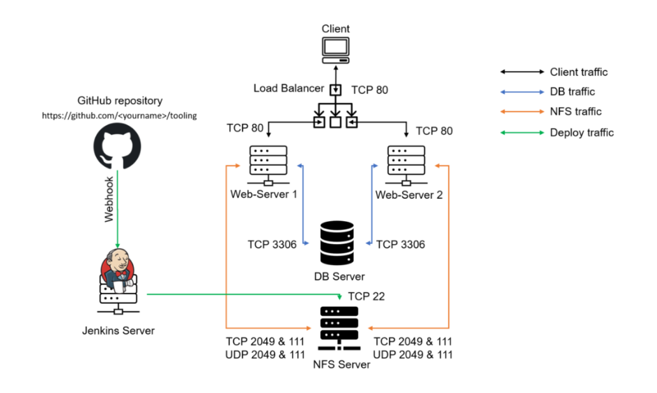
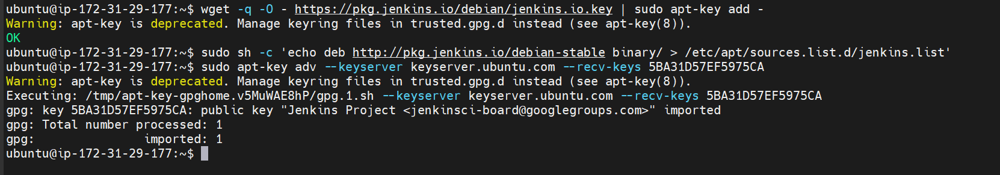
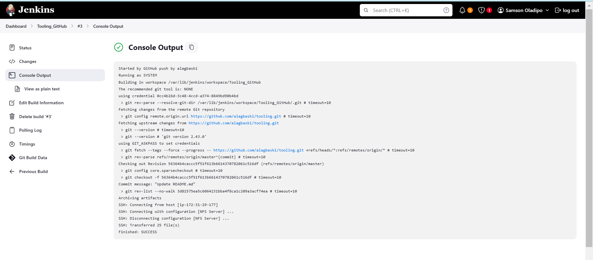
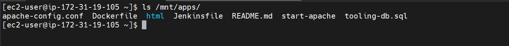

# Tooling Website Deployment Automation with Continuous Integration Using Jenkins

## Overview



This guide will walk you through setting up a Jenkins server for continuous integration and deployment, automating the deployment of source code changes from GitHub to an NFS server. A continuation of the Tooling Website Solution from [Project 7](../DevOps-Tooling-Website-Solution/) & [Project 8](../Load-Balancer-Solution-With-Apache/).

---

## Prerequisites

Before starting, ensure you have the following:
- An AWS account.
- Access to Tooling Website GitHub repository.
- NFS server setup and accessible from the previous projects.

> **Note**: I won't be provisioning the `Web Servers`, `Database Server` along with `Load Balancer` in this project since the task requirements focuses on the `NFS Server` and `Jenkins Server`.

## Step 1: Install Jenkins Server

- **Create an AWS EC2 instance**
   - Launch an EC2 instance using Ubuntu Server 24.02 LTS AMI and name it `Jenkins`.
   - Ensure the security group allows inbound TCP traffic on port 8080.

- **Update the system, Install JDK and Verify JDK**
    ```sh
    sudo apt update && sudo apt upgrade -y
    sudo apt install openjdk-11-jdk -y
    java -version
    ```
    

- **Install Jenkins**
   ```bash
    wget -q -O - https://pkg.jenkins.io/debian/jenkins.io.key | sudo apt-key add - 
    sudo sh -c 'echo deb http://pkg.jenkins.io/debian-stable binary/ > /etc/apt/sources.list.d/jenkins.list'
    sudo apt-key adv --keyserver keyserver.ubuntu.com --recv-keys 5BA31D57EF5975CA
    ```
    

    ```bash
    sudo apt update
    sudo apt install jenkins -y
    ```
    

- **Start Jenkins service and verify its status**
    ```bash
    sudo systemctl start jenkins
    sudo systemctl enable jenkins
    sudo systemctl status jenkins
    ```
    

- **Open port 8080**

  - Modify the security group to add a new inbound rule allowing TCP traffic on port 8080.
   

- **Perform initial Jenkins setup**

  - Access Jenkins through your browser using `http://<jenkins-server-public-ip>:8080`.
   
  
  - Retrieve the initial admin password from the Jenkins server:
    ```sh
    sudo cat /var/lib/jenkins/secrets/initialAdminPassword
    ```

  - Follow the setup wizard and install the suggested plugins.
   

    - Create Jenkins First Console User:
     

    - Jenkins Set-Up Completed:
       


## Step 2: Configure Jenkins to Retrieve Source Codes from GitHub using Webhooks

- **Enable webhooks in the GitHub repository settings**
  - Go to your GitHub repository, navigate to `Settings` > `Webhooks` > `Add webhook`.
  
  - Set the payload URL to `http://<jenkins-server-public-ip>:8080/github-webhook/` and choose `application/json` as the content type.
  
  - Select `Just the push event` and add the webhook. 
   

- **Create a Freestyle project in Jenkins**

  - In the Jenkins dashboard, click `New Item`, name it `Tooling_GitHub`, and select `Freestyle project`.
   
  
  - In the project configuration, under `Source Code Management`, choose `Git`.
  
  - Provide the Git repository URL and add credentials if required.
   

  - Run the Build manually on Jenkins Console to see if the GitHub is connceted.
   
    

- **Configure build triggers and post-build actions**

  - In the project configuration, under `Build Triggers`, select `GitHub hook trigger for GITScm polling`.
   

  - Under `Post-build Actions`, select `Archive the artifacts` and specify `**` to archive all files.
   
   

- **Test the configuration**

  - Make a change in your GitHub repository (e.g., update `README.md`) and push it to the master branch.

  - Jenkins should automatically trigger a build and archive the files.
   

  - Verify that the artifact is stored on Jenkins Server locally
    ```sh
    ls /var/lib/jenkins/jobs/tooling_github/builds/<build-number>/archive/
    ```
    


## Step 3: Configure Jenkins to Copy Files to NFS Server via SSH

- **Install Publish Over SSH Plugin in Jenkins**

  - Go to `Manage Jenkins` > `Manage Plugins` > `Available`, search for `Publish Over SSH,` and install it.
   
   

- **Configure SSH in Jenkins**

  - Go to `Manage Jenkins` > `Configure System`.
  
  - Scroll down to `Publish over SSH`, add the SSH server details (hostname, username, remote directory `/mnt/apps`, and private key for authentication).
   
  
  - Test the configuration to ensure it connects successfully.
   

- **Add post-build action to copy artifacts to NFS server**

  - In the project configuration, under `Post-build Actions`, select `Send build artifacts over SSH`.
   
  
  - Choose the configured SSH server, specify the source files (`**`), and the remote directory.
   

- **Test the full pipeline**

  - Make another change in your GitHub repository (e.g., update `README.md`) and push it to the master branch.
  
  - Jenkins should trigger a new build, archive the artifacts, and transfer them to the NFS server.
   
  
  - Verify the update on the NFS server by checking the contents of `/mnt/apps/README.md`.
    ```sh
    sudo cat /mnt/apps/README.md
    ```
    


**Blocker:**
- At the proccess of setup and installing Jenkins recommended plugins i encountered an error:
  

- I was able to resolve the issue after modifiying the jenkins file
    ```sh
    sudo vi /etc/default/jenkins
    ```
    - Look for the comment section with `# make jenkins listen on IPv4 address` and uncomment the `JAVA_ARGS="-Djava.net.preferIPv4Stack=true"`
     

    - Save and Exit editior 

### Conclusion

Congratulations! You have successfully implemented a continuous integration solution using Jenkins CI. This setup ensures that any change in your GitHub repository is automatically deployed to your NFS server, streamlining your development and deployment process.

---