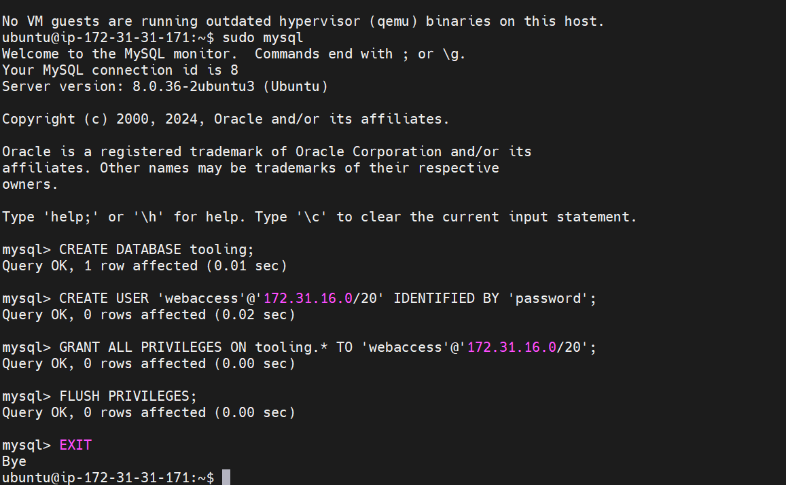

# DevOps Tooling Website Solution Project

## Overview


As a member of the DevOps team, you will implement a tooling website solution that provides easy access to DevOps tools within the corporate infrastructure. This project involves setting up an infrastructure consisting of:

1. **Infrastructure**: AWS
2. **Web Server**: Red Hat Enterprise Linux 8
3. **Database Server**: Ubuntu 24.04 + MySQL
4. **Storage Server**: Red Hat Enterprise Linux 8 + NFS
5. **Programming Language**: PHP
6. **Code Repository**: GitHub

## Step 1: Prepare NFS Server

- **Launch an EC2 Instance**:
   - Create an EC2 instance with RHEL 8 Operating System that will serve as the `NFS server`.
   - Create three 10GiB volumes in the same Availability Zone (AZ) as the `NFS server`.
   - Attach the volumes to the `NFS server`.

- **Open the Linux Terminal**:
   - **SSH into the instance**
  
    ```
    ssh -i keypair.pem ec2-user@public-ip
    ```
   - Inspect attached block devices: `lsblk`
        

   - Check all mounts and free space: `df -h`

- **Create Partitions on Each Disk**:
   - Use `gdisk` to create a single partition on each of the three disks:
     ```sh
     sudo gdisk /dev/xvdf
     sudo gdisk /dev/xvdg
     sudo gdisk /dev/xvdh
     ```

      1. Type `n` to create new partition.
      2. Type `1` to select numbers of new partition.
      3. Click on `Enter` to accept default settings till it prompts for a command again.
      4. Type `w` to write.
      5. Then `y` to overwrite the partition.
      6. Repeat same process for other disks

    - Inspect attached block devices: `lsblk`
        

- **Configure LVM on the Server**:
   - First we install the `lvm2` service.
     ```sh
     sudo yum install lvm2 -y
     sudo lvmdiskscan
     ```
   - Create physical volumes, a volume group, and logical volumes:
   
     ```sh
     sudo pvcreate /dev/xvdf1 /dev/xvdg1 /dev/xvdh1
     sudo vgcreate webdata-vg /dev/xvdf1 /dev/xvdg1 /dev/xvdh1
     sudo lvcreate -n opt-lv -L 10G webdata-vg
     sudo lvcreate -n apps-lv -L 10G webdata-vg
     sudo lvcreate -n logs-lv -L 10G webdata-vg
     ```
     

     

   - Format the logical volumes with `xfs`:
     ```sh
     sudo mkfs.xfs /dev/webdata-vg/opt-lv
     sudo mkfs.xfs /dev/webdata-vg/apps-lv
     sudo mkfs.xfs /dev/webdata-vg/logs-lv
     ```
     

   - Create mount points and mount the logical volumes:
     ```sh
     sudo mkdir -p /mnt/apps /mnt/logs /mnt/opt
     sudo mount /dev/webdata-vg/apps-lv /mnt/apps
     sudo mount /dev/webdata-vg/logs-lv /mnt/logs
     sudo mount /dev/webdata-vg/opt-lv /mnt/opt
     ```
     

- **Install and Configure NFS Server**:
   - Install NFS server packages and start the service:
     ```sh
     sudo yum update -y
     sudo yum install nfs-utils -y
     sudo systemctl start nfs-server.service
     sudo systemctl enable nfs-server.service
     sudo systemctl status nfs-server.service
     ```
     

   - Set permissions for the mount points:
     ```sh
     sudo chown -R nobody: /mnt/apps /mnt/logs /mnt/opt
     sudo chmod -R 777 /mnt/apps /mnt/logs /mnt/opt
     sudo systemctl restart nfs-server.service
     ```
     

   - Configure NFS exports:
     ```sh
     sudo vi /etc/exports
     ```
     Add the following lines:
     ```sh
     /mnt/apps 172.31.16.0/20(rw,sync,no_all_squash,no_root_squash)
     /mnt/logs 172.31.16.0/20(rw,sync,no_all_squash,no_root_squash)
     /mnt/opt <subnet-cird>(rw,sync,no_all_squash,no_root_squash)
     ```
     Save and apply the changes:
     ```sh
     sudo exportfs -arv
     ```
     

- **Open NFS Ports**:
   - Check NFS ports and open them in the security group:
     ```sh
     rpcinfo -p | grep nfs
     ```
     

   - Open ports TCP 111, UDP 111, and UDP 2049 in the security group.
    

## Step 2: Configure the Database Server
- **SSH into the instance**
  
    ```
    ssh -i keypair.pem ubuntu@public-ip
    ```

- **Install MySQL Server on Ubuntu 24.04**:
   - Update and install MySQL server:
     ```sh
     sudo apt update && sudo apt upgrade -y
     sudo apt install mysql-server -y
     ```

- **Create a Database and User**:
   - Log in to MySQL and create a database and user:
     ```sh
     sudo mysql
     ```
     ```sql
     CREATE DATABASE tooling;
     CREATE USER 'webaccess'@'172.31.16.0/20' IDENTIFIED BY 'password';
     GRANT ALL PRIVILEGES ON tooling.* TO 'webaccess'@'<subnet-cidr>';
     FLUSH PRIVILEGES;
     EXIT;
     ```
     

    - Edit the MySQL configuration file to bind it to all IP addresses, (0.0.0.0) Open the MySQL configuration file, which is located at `/etc/mysql/mysql.conf.d/mysqld.cnf`
        ```sh
        sudo vi /etc/mysql/mysql.conf.d/mysqld.cnf
        ```

    - Start and enable MySQL service:
        ```sh
        sudo systemctl restart mysql
        sudo systemctl enable mysql
        sudo systemctl status mysql
        ```
        

## Step 3: Prepare the Web Servers
- **SSH into the instance**
  
    ```
    ssh -i keypair.pem ec2-user@public-ip
    ```

- **Configure NFS Client on All Web Servers**:
   - Launch (3) new EC2 instances with RHEL 8 OS.
   - Install NFS client:
     ```sh
     sudo yum update -y
     sudo yum install nfs-utils nfs4-acl-tools -y
     ```
   - Mount NFS Web shares `/var/www`:
     ```sh
     sudo mkdir -p /var/www
     sudo mount -t nfs -o rw,nosuid 172.31.16.182:/mnt/apps /var/www
     ```
   - Add the following lines to `/etc/fstab` to ensure mounts persist after reboot:
     ```sh
     sudo vi /etc/fstab
     ```
     Add:
     ```
     172.31.16.182:/mnt/apps /var/www nfs defaults 0 0
     ```
     

- **Install Apache and PHP**:
   - Install Remi's repository, Apache, and PHP:
     ```sh
     sudo yum install httpd -y
     sudo dnf install https://dl.fedoraproject.org/pub/epel/epel-release-latest-9.noarch.rpm -y
     sudo dnf install dnf-utils http://rpms.remirepo.net/enterprise/remi-release-9.rpm -y
     sudo dnf module reset php -y
     sudo dnf module enable php:remi-7.4 -y
     sudo dnf install php php-opcache php-gd php-curl php-mysqlnd -y
     sudo systemctl start php-fpm
     sudo systemctl enable php-fpm
     sudo setsebool -P httpd_execmem 1
     ```
   - Start and enable Apache:
     ```sh
     sudo systemctl start httpd
     sudo systemctl enable httpd
     ```
   - Mount NFS Logs shares `/var/log/httpd`:
     ```sh
     sudo mkdir -p /var/log/httpd
     sudo mount -t nfs -o rw,nosuid <NFS-Server-private-ip>:/mnt/logs /var/log/httpd
     ```
   - Add the following lines to `/etc/fstab` to ensure mounts persist after reboot:
     ```sh
     sudo vi /etc/fstab
     ```
     Add:
     ```
     <NFS-Server-private-ip>:/mnt/logs /var/log/httpd nfs defaults 0 0
     ```
     

- **Deploy Tooling Application**:
   - Fork the tooling source code from `Darey.io GitHub` account to your GitHub account.
    
   
   - Then `clone` the source code repository to the Web server.
        ```sh
        sudo yum install git -y
        git clone https://github.com/alagbaski/tooling.git
        ```

   - Deploy the code to the web server and ensure the `html` folder from the repository is deployed to `/var/www/html`.
        ```sh
        cd tooling/html
        sudo mv * /var/www/html/
        ```

   - Verify that Apache files and directories are available on the web server in `/var/www` and also on the NFS server `/mnt/apps`.

   - If you see the same files, it means NFS is mounted correctly. Create a new file `touch test.txt` from one server and check if it is accessible from other web servers.
    
    - Verify the NFS Mounted Correctly
    

- **Configure Database Connection for the Website**:
   - Update the website's configuration to connect to the database (in `/var/www/html/functions.php` file).
        ```sh
        sudo vi /var/www/html/functions.php
        ```
      - Add the `db-private-ip` as `host`, also include `username`, `password` and `db-name` into the file.

   - Apply the `tooling-db.sql` script to your database:
     - Fist make sure MySQL client is installed on the Web servers.
      ```sh
      sudo yum install mysql -y
      ```
      ```sh
      cd tooling
      mysql -h <database-private-ip> -u <db-username> -p <db-name> tooling < tooling-db.sql
      ```
   - Database Security Group:
    

- **Create Admin User in MySQL**:
   - First, we access the Database remotely from the web server with `webaccess` user credentials.
     ```sh
     sudo mysql -u webaccess -p -h <db-server-private-ip>
     ```
   - Create a new admin user with username `myuser` and password `password`:
     ```sql
     USE tooling;
     INSERT INTO users (id, username, password, email, user_type, status) VALUES (2, 'myuser', '5f4dcc3b5aa765d61d8327deb882cf99', 'user@mail.com', 'admin', '1');
     EXIT
     ```

- **Open Port 80 & Required Ports**:
   - Ensure TCP port 80 is open on the web server to allow HTTP traffic.
    

- **If Encountering 403 Errors & Apache Fails to Restart**:
  - Then you will need to allow apache to use NFS mounted directories with SElinux enabled
   
     ```sh
     sudo setsebool -P httpd_use_nfs 1
     ```
  - Allow apache to make outside connection requests
     ```sh
     sudo setsebool -P httpd_can_network_connect=1
     ```
  - Then restart the Apache service again
     ```sh
     sudo systemctl restart httpd
     ```
     

- **Access the Website**:
   - Open a browser and navigate to `http://<web-server-public-ip>/index.php`.
    

   - Log in with the `myuser` user.
    

### Conclusion
Congratulations! You have successfully implemented a web solution for a DevOps team using a LAMP stack with remote database and NFS servers.

---