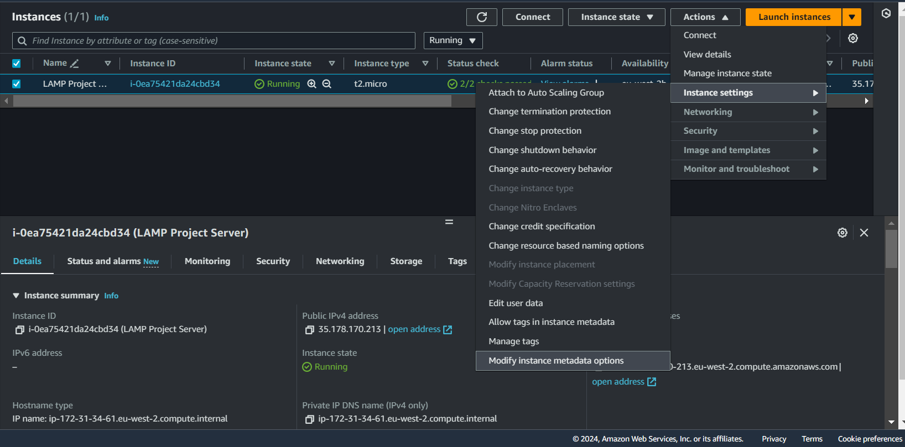

# LAMP Project
After navigating to the AWS Management Console to launch an ec2-instance i made sure that port 80 (HTTP) and 22 (SSH) are open to allow web traffic and SSH access before going ahead to connect to the instance using a tool called (Mobaxterm).

- To ssh into the ec2-instance i made sure my command line terminal was in the directory where my key pair was downloaded to before running the command below:
  
  ```
  ssh -i keypair-name.pem ubuntu@public-ip
  ```

  

### Installing & Configuring The LAMP Stack On The EC2-Instance:
- **Install Apache:** First i updated and upgraded the 'apt' package manager for the ubuntu server before installing the Apache package, below were the commands i ran;
  
  ```
  sudo apt update
  ```
  ```
  sudo apt upgrade -y
  ```
  ```
  sudo apt install apache2 -y
  ```

After successfull installation of the package i ran the below command to check if the service is up and running and also access the default web-page using the public-ip of the instance;
  
  ```
  sudo systemctl status apache2
  ```

  

- **Install MySQL:** Next i installed MySQL, after installation switched to the MySQL shell prompt to configure the 'root' user password and secured the MySQL installation running the following commands below;
  ```
  sudo apt install mysql-server -y
  ```

  ```
  sudo mysql
  ```

  ```
  ALTER USER 'root'@'localhost' IDENTIFIED WITH mysql_native_password BY 'mysql-password';
  ```
  ```
  exit
  ```
  ```
  sudo mysql_secure_installation
  ```

After successfully installation of MySQL i tested the configuration, hence the screenshot below;

  

- **Install PHP:** Next i installed the PHP package, running the commands below;
  
  ```
  sudo apt install php libapache2-mod php-mysql -y
  ```
  ```
  php -v
  ```

  

- **Create Virtual Host In Apache:** To create a virtual host in Apache, i created a new directory in the */var/www* directory, then i change the owner permission and group permission of that directory to a default user in the instance, then i created a new configuration file for Apache in the */etc/apache2/site-available directory* before disabling the default Apache website and enabling the new virtual host. Then i restared the Apache service before creating a new index.html file and storing an output to display as a web page on the browser. Below are the commands and steps to create and configure the virtual host;
  
  ```
  sudo mkdir /var/www/custom-name
  ```

  

  ```
  sudo vi /etc/apache2/sites-available/custom-name.conf
  ```

  

  **#enable new virtualhost**

  ```
  sudo a2ensite custom-name
  ```
  
  **#disable default apache webpage**
  
  ```
  sudo a2dissite 000-default
  ```

  **#test apache config**

  ```
  sudo apache2ctl configtest
  ```

  **#restart apache service**

  ```
  sudo systemctl restart apache2
  ```

  **#create an index.html file and store some values in it**
  
  ```
  sudo echo 'Hello LAMP from hostname' $(curl -s http://169.254.169.254/latest/meta-data/public-hostname) 'with public IP' $(curl -s http://169.254.169.254/latest/meta-data/public-ipv4) > /var/www/custom-name/index.html
  ```

  

- **Enable PHP On Website:** First we modifiy the *dir.conf* file in the */etc/apache2/mods-enabled* directory, we change the order in which the *index.php* file is listed in the **DirectoryIndex** directive. Then we reload the Apache service and finally create a PHP script in the custom location to host our website files. Below are the commands and script used;
  
  ```
  sudo vi /etc/apache2/mods-enabled/dir.conf
  ```

  **Make this changes in the file**
  ```
  DirectoryIndex index.php index.html index.cgi index.pl index.xhtml index.htm
  ```

  **#Save and exit the text editior and restart apache service**

  ```
  sudo systemctl restart apache2
  ```
  
  **#Create a php script in your custom dir**

  ```
  vi /var/www/custom-name/index.php
  ```

  
  

  Save and exit the editior

  **#Refresh the Website on the browser**

  

  **#After testing, remove the php file**
  
  ```
  sudo rm /var/www/custom-name/index.php
  ```

**N.B:** The *curl* commands shown below to display the ec2-instance **public-hostname** and **public-ip** was not displaying the required output, instead it gave an error output of (*error 404, Unauthorized*).
  
  ```
  curl -s http://169.254.169.254/latest/meta-data/public-hostname
  ```

  ```
  curl -s http://169.254.169.254/latest/meta-data/public-ipv4
  ```

But after a lot of troubleshooting, i got a temporary solution to get the appropriate results for our task by setting IMDSv2 session-oriented requests to (Optional) using the *Actions* drop down option for the instance via the management console. Below are the screenshot of how to go about it.




---