# Apache Load Balancer Configuration for Tooling Website Solution

## Overview
This project is based on the pervious project which involves setting up a comprehensive DevOps tooling website solution on AWS, utilizing a combination of `RHEL 9` and `Ubuntu 24` EC2 instances. The infrastructure includes `web servers`, a `database server`, and an `NFS storage server`, all orchestrated to deliver a robust and scalable solution. And an `Apache Load Balancer` will be configured to ensure high availability, secure and efficient distribution of traffic across the web servers.

## Infrastructure Components
1. **Infrastructure**: AWS
2. **Web Server OS**: Red Hat Enterprise Linux 9
3. **Database Server OS**: Ubuntu 24
4. **Database**: MySQL
5. **Storage Server OS**: Red Hat Enterprise Linux 9 + NFS
6. **Programming Language**: PHP
7. **Code Repository**: GitHub
8. **Load Balancer OS**: Ubuntu 24

## Prerequisites

Ensure the following servers are installed and configured based on the pervious project deployment of a Tooling Website Solution:
- Two RHEL9 Web Servers.
- One MySQL DB Server (Ubuntu-based).
- One RHEL9 NFS Server.
- Apache (httpd) running on both web servers.
- `/var/www` directories of both web servers mounted to `/mnt/apps` on the NFS server.
- Necessary TCP/UDP ports open on web, DB, and NFS servers.
- Browser access to both web servers via the Apache Load Balancer public IP addresses or DNS names.
- One (Ubuntu-based) Load Balancer Server.

## Configuration Prerequisites

- Apache (httpd) process is up and running on both Web Servers.
    - Web Server 1 Output:
     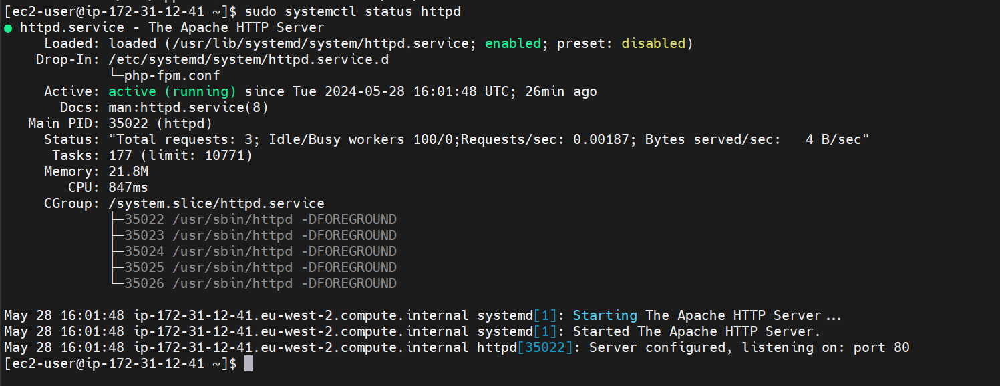

    - Web Server 2 Output:
     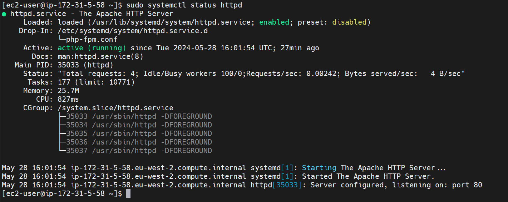

- `/var/www` directories of both Web Servers are mounted to `/mnt/apps` on the NFS server.
    - Web Server 1 Output:
     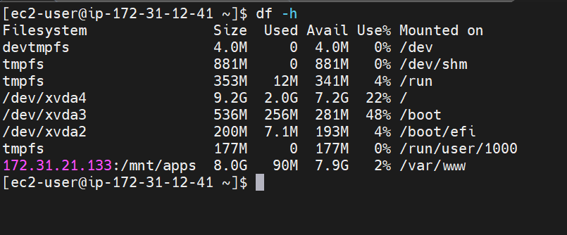

    - Web Server 2 Output:
     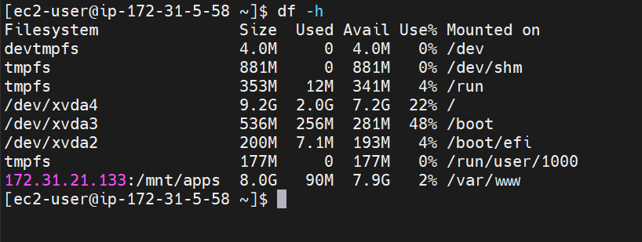

- All necessary TCP/UDP ports are open on Web, DB, and NFS servers.
    
    - Web-Server Security Group:
     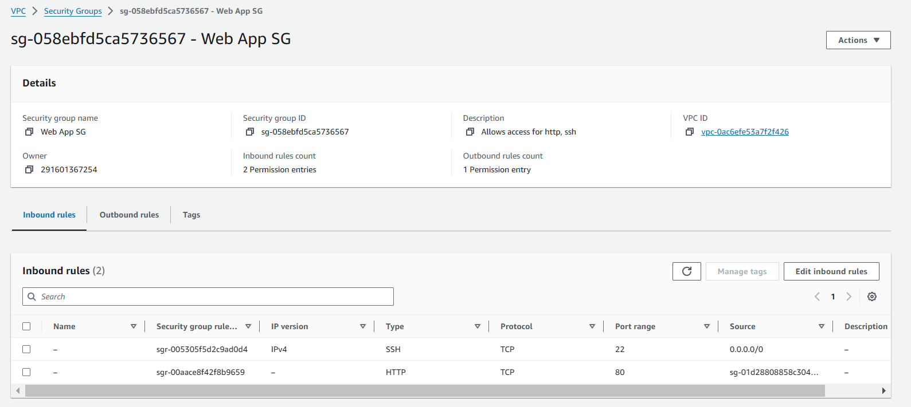

    - DB-Server Security Group:
     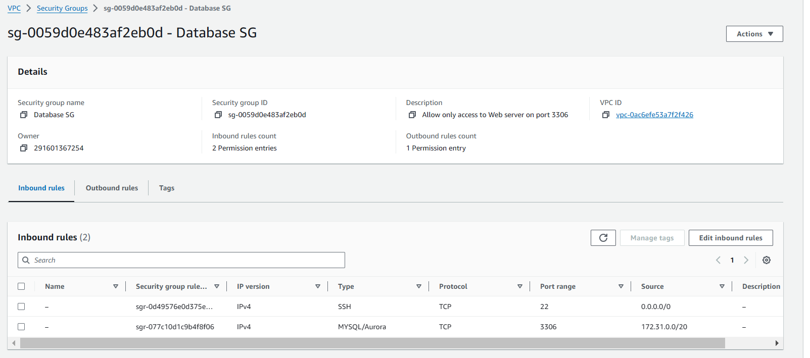

    - NFS Server Security Group:
     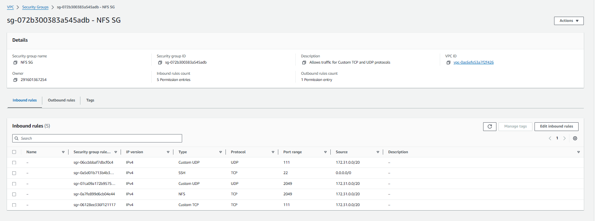

- The client browser can access both Web Servers using their respective Public IP addresses or Public DNS names and can open the Tooling Website.

You can find additional documentation on how to deploy the previous project `Devops-Tooling-Website` by clicking this [Link](../DevOps-Tooling-Website-Solution/).


## Configure Apache as a Load Balancer

### Create an Ubuntu Server EC2 Instance On AWS
- SSH into the instance
  
    ```
    ssh -i keypair.pem ubuntu@public-ip
    ```

- Create an EC2 instance and name it `Project-8-apache-lb`.
- Open TCP port 80 on the `Project-8-apache-lb` server.
  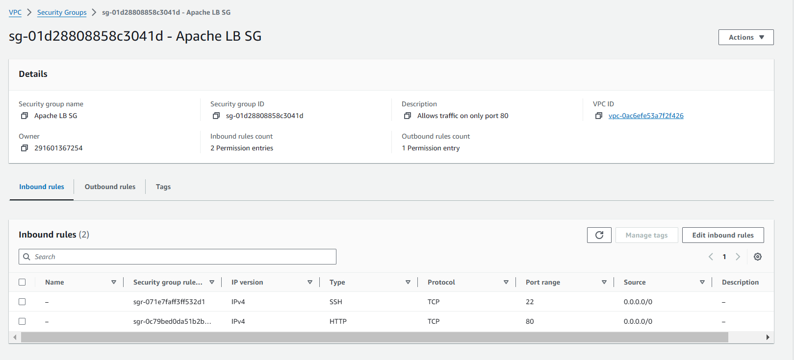

### Install and Configure Apache

- **Update and Install Apache**
    ```sh
    sudo apt update && sudo apt upgrade -y
    sudo apt install apache2 -y
    sudo apt-get install libxml2-dev
    ```

- **Enable Required Apache Modules**
    ```sh
    sudo a2enmod rewrite
    sudo a2enmod proxy
    sudo a2enmod proxy_balancer
    sudo a2enmod proxy_http
    sudo a2enmod headers
    sudo a2enmod lbmethod_byrequests
    ```

- **Restart Apache Service**
    ```sh
    sudo systemctl restart apache2
    ```

- **Verify Apache Service**
    ```sh
    sudo systemctl status apache2
    ```

### Configure Load Balancing

- **Edit the Default Apache Configuration**
    ```sh
    sudo vi /etc/apache2/sites-available/000-default.conf
    ```

- **Add the Following Configuration to the `<VirtualHost *:80>` Section**
    ```apache
    <Proxy "balancer://mycluster">
        BalancerMember http://<webserver1-private-ip>:80 loadfactor=5 timeout=1
        BalancerMember http://<webserver2-private-ip>:80 loadfactor=5 timeout=1
        ProxySet lbmethod=byrequests
    </Proxy>

    ProxyPreserveHost On
    ProxyPass / balancer://mycluster/
    ProxyPassReverse / balancer://mycluster/
    ```
    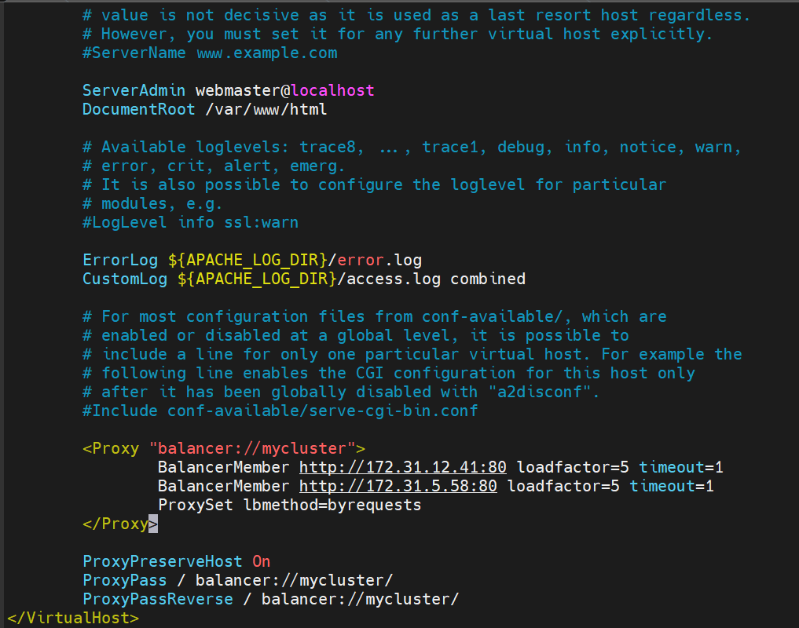

- **Restart Apache Server**
    ```sh
    sudo systemctl restart apache2
    ```

- **If Apache Does Not Run Successfully Follow the below step**:
   - Check for any syntax errors in the Apache configuration files
        ```sh
        sudo apachectl configtest
        ```

### Verify Configuration

- Access the Load Balancer using its public IP address or public DNS name from a browser:
    ```
    http://<Load-Balancer-Public-IP-or-Public-DNS-Name>/index.php
    ```
  - Accessing the `Web Servers` using the `LB Server` Public-IP address on the broswer:
   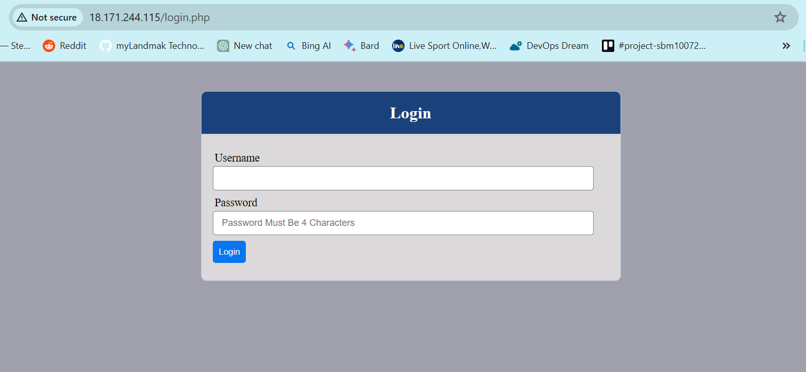

  - Login with `myuser` credentials:
   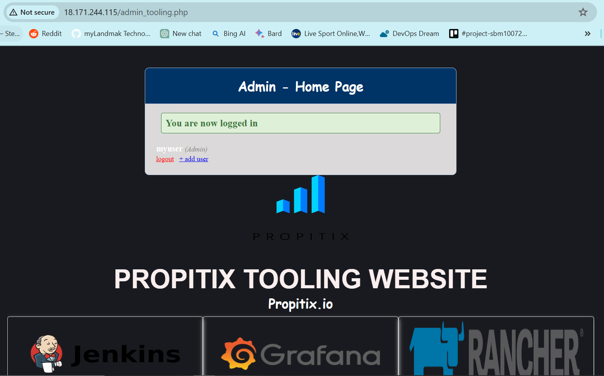   

### Optional: Configure Local DNS Name Resolution

- **Edit the Hosts File on the Load Balancer Server**
    ```sh
    sudo vi /etc/hosts
    ```

- **Add Local IP Addresses and Arbitrary Names for Both Web Servers**
    ```sh
    <webserver1-private-ip> Web1
    <webserver2-private-ip> Web2
    ```
    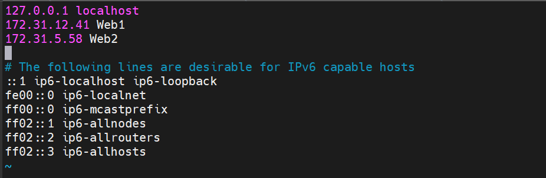

- **Update Load Balancer Configuration with These Names**
    ```apache
    BalancerMember http://Web1:80 loadfactor=5 timeout=1
    BalancerMember http://Web2:80 loadfactor=5 timeout=1
    ```

- **Test the Configuration Locally**
    ```sh
    curl http://Web1
    curl http://Web2
    ```
    - Running `curl` command on Web Server 1:
     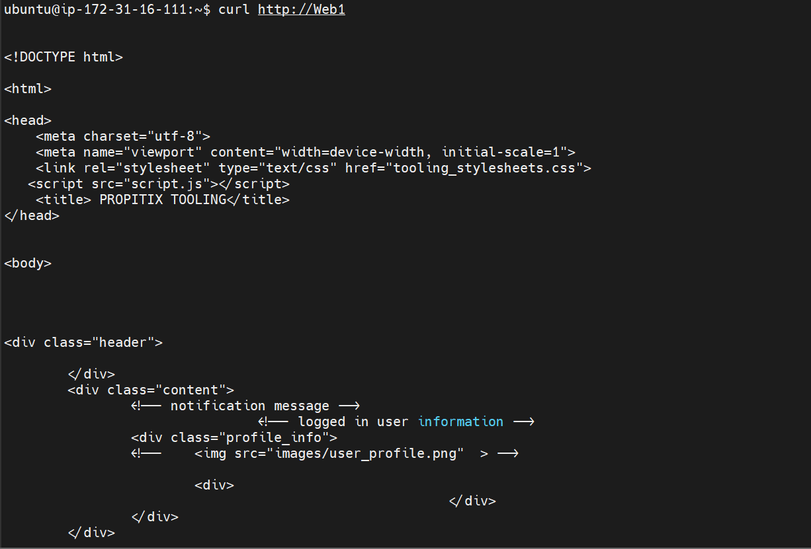

    - Running `curl` command on Web Server 2:
     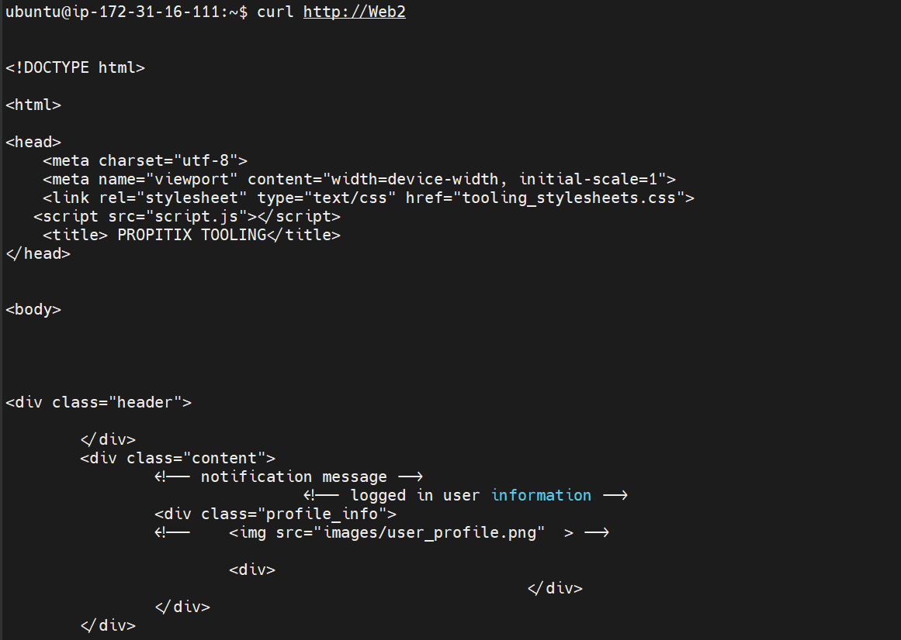

### Monitoring Access Logs

- Open two SSH consoles for both web servers and run the following command to monitor access logs:
    ```sh
    sudo tail -f /var/log/httpd/access_log
    ```
    - Web Server 1 `access_log`:
     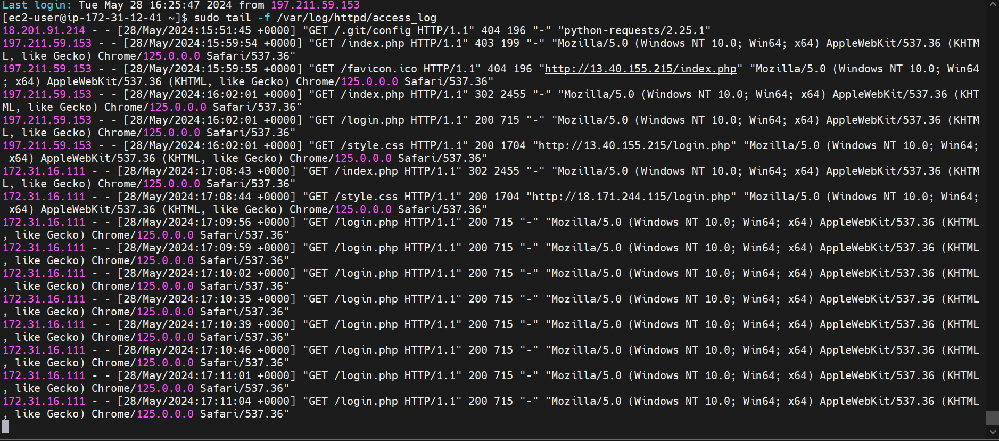

    - Web Server 2 `access_log`:
     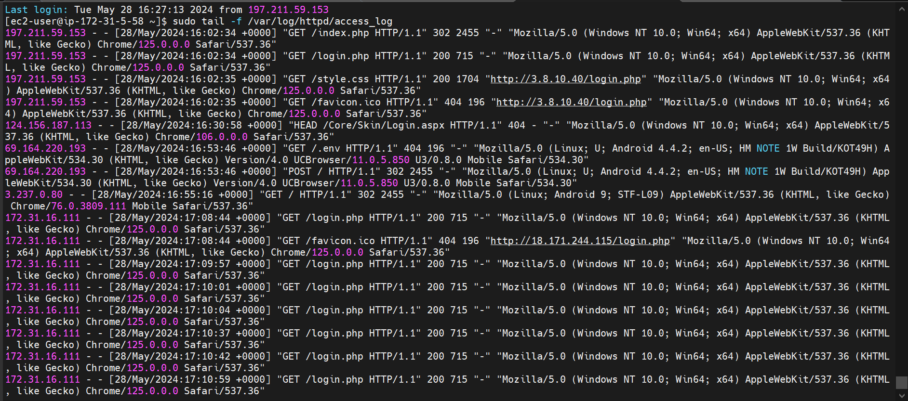 

**Note:** If in the previous project you mounted `/var/log/httpd/` from your Web Server to the NFS server, unmount them and ensure each Web Server has its own log directory.

## Conclusion

By following these steps, you will have successfully deployed and configured an Apache Load Balancer on an Ubuntu EC2 instance, distributing traffic between two RHEL9 Web Servers.

---