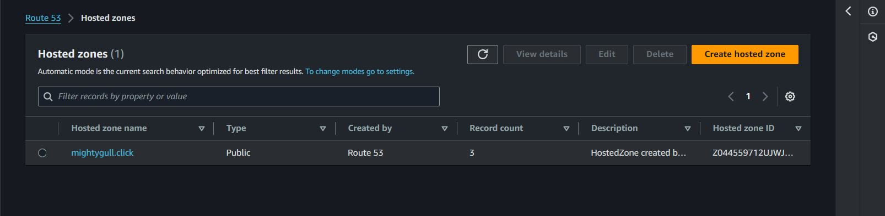

# Load Balancing Solution with Nginx and SSL/TLS

This project is a continuation of the `Tooling Website Solution`, it will guide you through configuring `Nginx` as a load balancer and securing your website with `SSL/TLS` certificates using `LetEncrypt`. We'll achieve this in two parts:

1. Configuring Nginx as a Load Balancer.
2. Registering a domain name and configuring a secured connection using SSL/TLS certificates.

## Part 1: Configure Nginx as a Load Balancer

### Step 1: Create an EC2 Instance
- **Launch an EC2 instance** on AWS based on Ubuntu 24.04 LTS and name it `Nginx LB`.
    

- **Security Group Configuration**:
  - Open TCP port 80 for HTTP.
  - Open TCP port 443 for HTTPS.
   

### Step 2: Update `/etc/hosts` File
- Connect to your EC2 instance via SSH.
    ```sh
    ssh -i keypair.pem ubuntu@server-public-ip
    ```

- Update the `/etc/hosts` file with the names and IP addresses of your web servers:
    ```sh
    sudo vi /etc/hosts
    ```

    - Add the following lines:
        ```
        <web-server-private-ip> Web1
        <web-server-private-ip> Web2
        ```
    

### Step 3: Install and Configure Nginx
- Update and upgrade the system:
    ```
    sudo apt update && sudo apt upgrade -y
    ```

- Install Nginx:
    ```
    sudo apt install nginx -y
    ```

### Step 4: Configure Nginx as a Load Balancer
- Open the Nginx configuration file:
    ```
    sudo vi /etc/nginx/nginx.conf
    ```

- Insert the following configuration into the `http` section:
    ```nginx
    upstream myproject {
        server Web1 weight=5;
        server Web2 weight=5;
    }

    server {
        listen 80;
        server_name www.domain.com;
        location / {
            proxy_pass http://myproject;
        }
    }

    # Comment out this line
    # include /etc/nginx/sites-enabled/*;
    ```
    

- Restart Nginx and ensure the service is running:
    ```sh
    sudo nginx -t
    sudo systemctl restart nginx
    sudo systemctl status nginx
    ```
    

## Part 2: Register a Domain and Configure SSL/TLS

### Step 1: Register a Domain Name
- Register a new domain name using any domain registrar (e.g., GoDaddy, Domain.com, Bluehost), but for this implementation i used AWS Cloud service `Route53` also built for this purpose. I already have a domain name hosted in `Route53` named `mightygull.click`.
    
    - Accessing `Route53` Dashboard on AWS:
     

     - Hosted Zone:
      

### Step 2: Create & Assign Elastic IP and Update DNS
- To create an `Elastic IP` navigate to `VPC` services on the AWS management console and on the left side of the management console under `Virtual Private Cloud` click `Elastic IP` > `Allocate Elastic IP address`.
- Assign the Elastic IP to your `Nginx LB` EC2 instance.
    - Associate the `Elastic IP` to Nginx EC2-Instance:
     
     
     

- Update the `A-Record` in your domain registrar to point to the Elastic IP of your `Nginx LB` instance.
 
 
 
 

### Step 3: Configure Nginx for Your Domain
- Update the `nginx.conf` file to recognize your new domain name:
    ```sh
    sudo vi /etc/nginx/nginx.conf
    ```
    Replace `server_name www.domain.com` with `server_name www.<your-domain-name.com>`.

    

### Step 4: Install Certbot and Obtain SSL Certificate
- Ensure `snapd` service is active:
    ```sh
    sudo systemctl status snapd
    ```
    

- Install Certbot:
    ```sh
    sudo snap install --classic certbot
    ```
    

- Create a symlink for Certbot:
    ```sh
    sudo ln -s /snap/bin/certbot /usr/bin/certbot
    ```

- Obtain and install the SSL certificate:
    ```sh
    sudo certbot --nginx
    ```
    

### Step 5: Test Secure Access
- Verify that you can access your website securely by navigating to `www.<your-domain-name.com>` in your browser.

### Step 6: Set Up Certificate Renewal
- Test renewal in dry-run mode:
    ```sh
    sudo certbot renew --dry-run
    ```
    

- Configure a cron job to renew the certificate periodically:
    ```sh
    crontab -e
    ```
    

    > N.B: Select an editor to modify the file (e.g Input 1-4, where `1` is nano).

- Add the following line to the crontab file:
    ```javascript
    * */12 * * * root /usr/bin/certbot renew > /dev/null 2>&1
    ```
    

- Verify the `Cronjob` configuration was successful
    ```
    crontab -l
    ```
    

- Accessing the Tooling Website using the domain `www.mightygull.click`.

    
    
    

- Also the `Access logs` of both Web Servers
    ```sh
    sudo tail -f /var/log/httpd/access_log
    ```
    - Web Server 1:
     

    - Web Server 2:
     


### Conclusion

Congratulations! You have successfully configured an `Nginx load balancer with SSL/TLS` secured connection and set up automatic certificate renewal. Your web solution is now load-balanced and secured with HTTPS.

---
