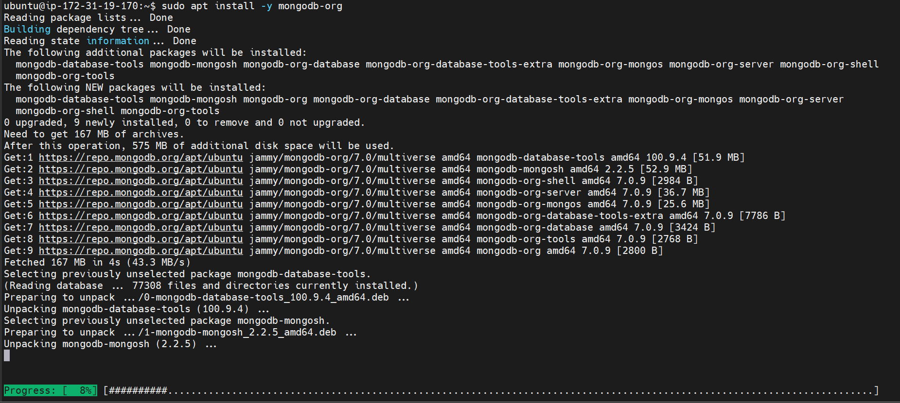

# Book Register Web Application using MEAN Stack

## Introduction
The MEAN stack is a popular choice for building dynamic web applications. It leverages a combination of JavaScript technologies:

- **MongoDB:** A NoSQL document database for flexible data storage.
- **Express.js:** A lightweight web framework for Node.js that simplifies building APIs and web applications.
- **AngularJS:** A powerful framework for creating interactive user interfaces.
- **Node.js:** A JavaScript runtime environment that allows execution of server-side JavaScript code.

This documentation provides a comprehensive overview of setting up and utilizing each component of the MEAN stack to develop the `Book Register` web applications.

---

## Prerequisites
Before starting this project, ensure you have the following:

   
1. Access to an AWS account.
2. An EC2-Instance with Ubuntu image/OS.
3. Security Group for the EC2-Instance allows traffic on port `22`, `80`, `443` & `3300`.


1. Basic knowledge of `Linux`, `JavaScript` and `Web Development` concepts.
2. Administrator access `sudo` on the EC2-Instance.

---

## Deployment Steps

### Connect to your server via SSH

```
ssh -i key-pair.pem username@public-ip
```

### Step 1: Install Node.js

- **Update and upgrade 'apt' package manager:**
    ```bash
    sudo apt update && sudo apt upgrade -y 
    ```

- **Install Node.js 20 (current latest version):**
    ```bash
    curl -fsSL https://deb.nodesource.com/setup_20.x | sudo -E bash -
    ```


- **Install Node.js:**
    ```bash
    sudo apt install nodejs -y
    ```


- **Verify installation:**
    ```bash
    node -v
    npm -v
    ```


---

### Step 2: Install MongoDB

- **Add MongoDB GPG key:**
    ```bash
    curl -fsSL https://www.mongodb.org/static/pgp/server-7.0.asc | sudo gpg -o /usr/share/keyrings/mongodb-server-7.0.gpg --dearmor
    ```

- **Add MongoDB repository:**
    ```bash
    echo "deb [ arch=amd64,arm64 signed-by=/usr/share/keyrings/mongodb-server-7.0.gpg ] https://repo.mongodb.org/apt/ubuntu jammy/mongodb-org/7.0 multiverse" | sudo tee /etc/apt/sources.list.d/mongodb-org-7.0.list
    ```


- **Update packages:**
    ```bash
    sudo apt update
    ```


- **Install MongoDB:**
    ```bash
    sudo apt install -y mongodb-org
    ```


- **Verify MongoDB installation:**
    ```bash
    mongod --version
    ```


- **Start and enable MongoDB service:**
    ```bash
    sudo systemctl start mongod
    sudo systemctl enable mongod
    ```

- **Verify service status:**
    ```bash
    sudo systemctl status mongod
    ```


- **Install 'body-parser' package:**
    ```bash
    sudo npm install body-parser
    ```


- **Create a directory called 'Books':**
    ```bash
    mkdir Books && cd Books
    ```

- **Initialize npm project in 'Books' directory:**
    ```bash
    npm init -y
    ```


- **Add a file named 'server.js':**
    ```bash
    vim server.js
    ```

- **Input the following code into 'server.js':**
    ```javascript
    var express = require('express');
    var bodyParser = require('body-parser');
    var app = express();
    app.use(express.static(__dirname + '/public'));
    app.use(bodyParser.json());
    require('./apps/routes')(app);
    app.set('port', 3300);
    app.listen(app.get('port'), function() {
        console.log('Server up: http://localhost:' + app.get('port'));
    });
    ```

---

### Step 3: Install Express And Set Up Routes To The Server

- **Install Express and Mongoose packages:**
    ```bash
    sudo npm install express mongoose
    ```


- **In 'Books' directory, create a new directory called 'apps':**
    ```bash
    mkdir apps && cd apps
    ```

- **Create a file named 'routes.js':**
    ```bash
    vim routes.js
    ```

- **Input the following code into 'routes.js':**
    ```javascript
    var Book = require('./models/book');
    var path = require('path');

    module.exports = function(app) {
        app.get('/book', async function(req, res) {
            try {
                const result = await Book.find({});
                res.json(result);
            } catch (err) {
                res.status(500).send(err);
            }
        });

        app.post('/book', async function(req, res) {
            try {
                var book = new Book({
                    name: req.body.name,
                    isbn: req.body.isbn,
                    author: req.body.author,
                    pages: req.body.pages
                });
                const result = await book.save();
                res.json({
                    message: "Successfully added book",
                    book: result
                });
            } catch (err) {
                res.status(500).send(err);
            }
        });

        app.delete("/book/:isbn", async function(req, res) {
            try {
                const result = await Book.findOneAndRemove({ isbn: req.params.isbn });
                res.json({
                    message: "Successfully deleted the book",
                    book: result
                });
            } catch (err) {
                res.status(500).send(err);
            }
        });

        app.get('*', function(req, res) {
            res.sendFile(path.join(__dirname + '/public', 'index.html'));
        });
    };
    ```

- **In the 'apps' directory, create a new directory named 'models':**
    ```bash
    mkdir models && cd models
    ```

- **Create a file named 'book.js':**
    ```bash
    vim book.js
    ```

- **Input the following code into 'book.js':**
    ```javascript
    var mongoose = require('mongoose');
    var dbHost = 'mongodb://localhost:27017/test';
    mongoose.connect(dbHost, { useNewUrlParser: true, useUnifiedTopology: true });
    mongoose.connection;
    mongoose.set('debug', true);

    var bookSchema = mongoose.Schema({
        name: String,
        isbn: { type: String, index: true },
        author: String,
        pages: Number
    });

    var Book = mongoose.model('Book', bookSchema);

    module.exports = Book;
    ```

---

### Step 4: Access The Routes With AngularJS

- **Change directory to 'Books':**
    ```bash
    cd ../..
    ```

- **Create a directory named 'public':**
    ```bash
    mkdir public && cd public
    ```

- **Add a file named 'script.js':**
    ```bash
    vim script.js
    ```

- **Input the following code into 'script.js':**
    ```javascript
    var app = angular.module('myApp', []);
    app.controller('myCtrl', function($scope, $http) {
        $http({
            method: 'GET',
            url: '/book'
        }).then(function successCallback(response) {
            $scope.books = response.data;
        }, function errorCallback(response) {
            console.log('Error: ' + response);
        });

        $scope.del_book = function(book) {
            $http({
                method: 'DELETE',
                url: '/book/' + book.isbn,
            }).then(function successCallback(response) {
                console.log(response);
            }, function errorCallback(response) {
                console.log('Error: ' + response);
            });
        };

        $scope.add_book = function() {
            var body = {
                name: $scope.Name,
                isbn: $scope.Isbn,
                author: $scope.Author,
                pages: $scope.Pages
            };
            $http({
                method: 'POST',
                url: '/book',
                data: body,
                headers: { 'Content-Type': 'application/json' }
            }).then(function successCallback(response) {
                console.log(response);
            }, function errorCallback(response) {
                console.log('Error: ' + response);
            });
        };
    });
    ```

- **In the 'public' directory, create a file named 'index.html':**
    ```bash
    vim index.html
    ```

- **Input the following code into 'index.html':**
    ```html
    <!doctype html>
    <html ng-app="myApp" ng-controller="myCtrl">
    <head>
        <script src="https://ajax.googleapis.com/ajax/libs/angularjs/1.6.4/angular.min.js"></script>
        <script src="script.js"></script>
    </head>
    <body>
        <div>
            <table>
                <tr>
                    <td>Name:</td>
                    <td><input type="text" ng-model="Name"></td>
                </tr>
                <tr>
                    <td>Isbn:</td>
                    <td><input type="text" ng-model="Isbn"></td>
                </tr>
                <tr>
                    <td>Author:</td>
                    <td><input type="text" ng-model="Author"></td>
                </tr>
                <tr>
                    <td>Pages:</td>
                    <td><input type="number" ng-model="Pages"></td>
                </tr>
            </table>
            <button ng-click="add_book()">Add</button>
        </div>
        <hr>
        <div>
            <table>
                <tr>
                    <th>Name</th>
                    <th>Isbn</th>
                    <th>Author</th>
                    <th>Pages</th>
                </tr>
                <tr ng-repeat="book in books">
                    <td>{{book.name}}</td>
                    <td>{{book.isbn}}</td>
                    <td>{{book.author}}</td>
                    <td>{{book.pages}}</td>
                    <td><input type="button" value="Delete" data-ng-click="del_book(book)"></td>
                </tr>
            </table>
        </div>
    </body>
    </html>
    ```

- **Change directory back to 'Books':**
    ```bash
    cd ..
    ```

- **Start the server:**
    ```bash
    node server.js
    ```


> **Note:** For this to work, open TCP port 3300 in the instance security group.

- **Access the Book Register web application from the internet with a browser using:**
    ```
    http://server-public-ip:3300
    ```


- **Check Mongodb stores the values from the frontend**


---

### Conclusion

Congratulations! We have successfully set up and deployed a simple Book Register web form using the MEAN stack. This application allows you to add, view, and delete books from a MongoDB database through a web interface powered by AngularJS.
