# Client-Server Architecture with MySQL

## Task
Implement a Client-Server Architecture using MySQL Database Management System.

### Overview
The objective is to create and configure two Linux-based virtual servers in AWS, set up MySQL server on one, and MySQL client on the other, ensuring secure communication between them.

### Introduction
A Client Server Architecture is a network-based computing structure where responsibilities and operations get distributed between clients and servers. Client-Server Architecture is widely used for network applications such as email, web, online banking, e-commerce.

The `client` is the application that requests services from the server, such as retrieving or storing data, performing calculations, or executing commands.  

The `server` is the application that provides services to the client, such as processing requests, sending responses, or completing actions.


### Server Configuration
- **Server A:** `mysql server`
- **Server B:** `mysql client`

### Steps to Implement

#### Create and Configure AWS Servers
- **Launch two Linux-based EC2 instances in AWS:**
    - Name the first instance `mysql server`.
    - Name the second instance `mysql client`.
    
    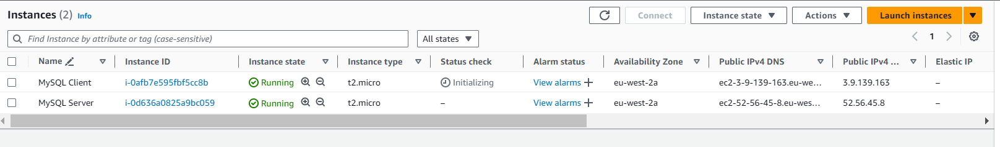

- **Assign security groups:**
    - Ensure security groups allow necessary traffic as described below.

      - **MySQL Server Security Group**
      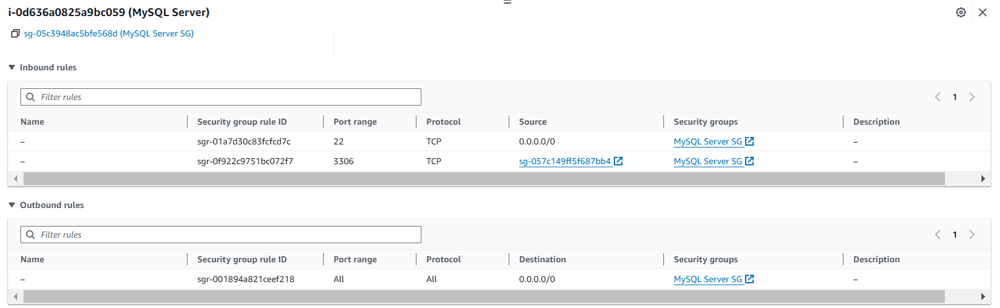

      - **MySQL Client Security Group**
      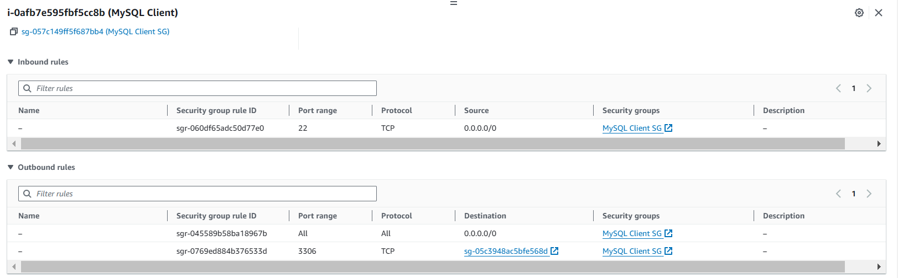

### Connect to both MySQL Servers via SSH

```
ssh -i key-pair.pem username@public-ip
```

#### Install MySQL Software

##### On `mysql server`
- **Update the package index:**
    ```sh
    sudo apt update
    sudo apt upgrade -y
    ```
- **Install MySQL Server:**
    ```sh
    sudo apt install mysql-server
    mysql --version
    ```
    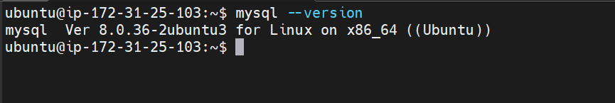

- **Start MySQL service:**
    ```sh
    sudo systemctl start mysql
    ```
- **Enable MySQL to start on boot:**
    ```sh
    sudo systemctl enable mysql
    ```
- **Check MySQL service status**
    ```sh
    sudo systemctl mysql status
    ```
    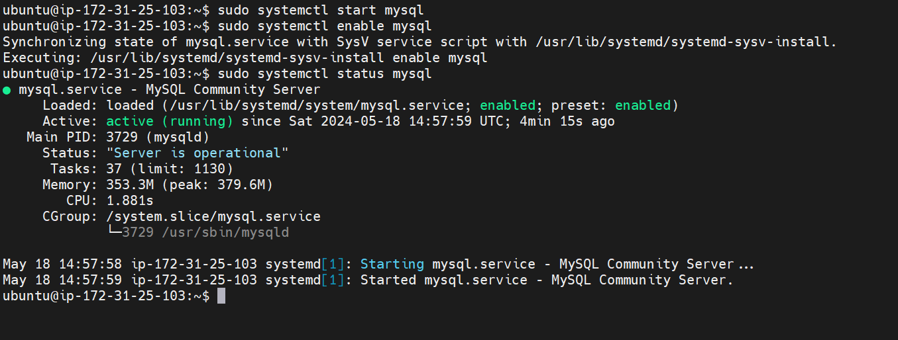

- **Secure MySQL Installation**
  
  ```sh
  sudo mysql_secure_installation
  ```
  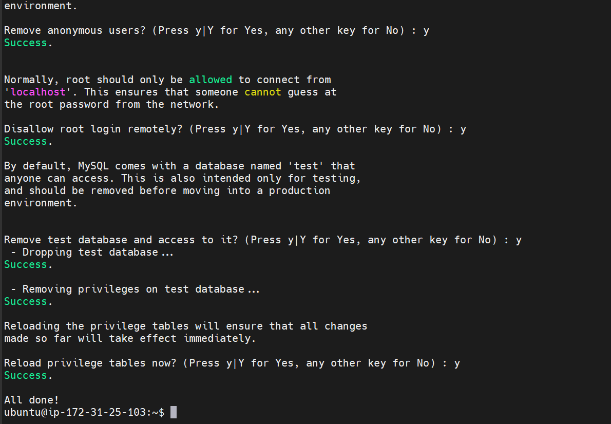

##### On `mysql client` Server
- **Update the package index:**
    ```sh
    sudo apt update
    sudo apt upgrade -y
    ```
- **Install MySQL Client:**
    ```sh
    sudo apt install mysql-client
    ```
    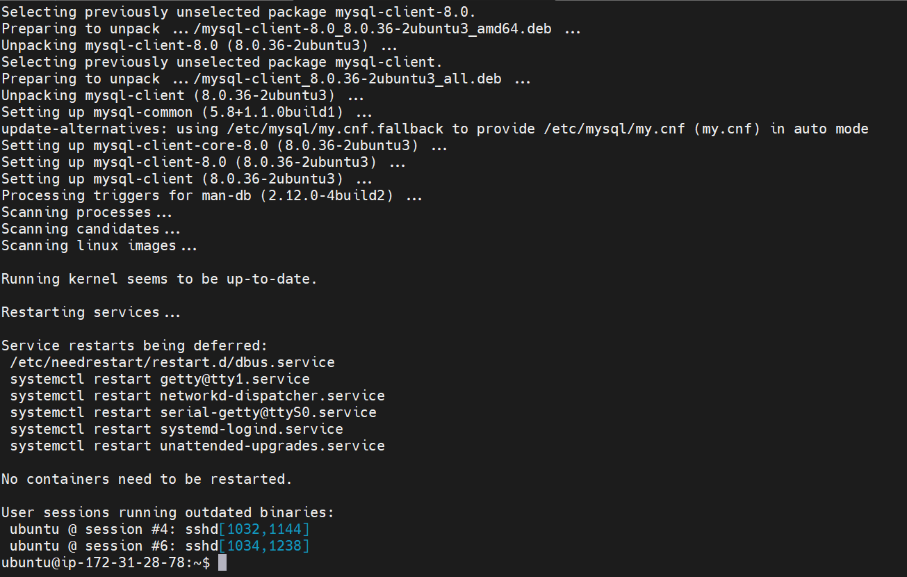

#### Configure MySQL Server for Remote Connections
- **Edit MySQL configuration file to allow remote connections:**
    ```sh
    sudo vim /etc/mysql/mysql.conf.d/mysqld.cnf
    ```
- **Modify the bind-address:**
    - Find the line `bind-address = 127.0.0.1` and change it to `bind-address = 0.0.0.0`
    
    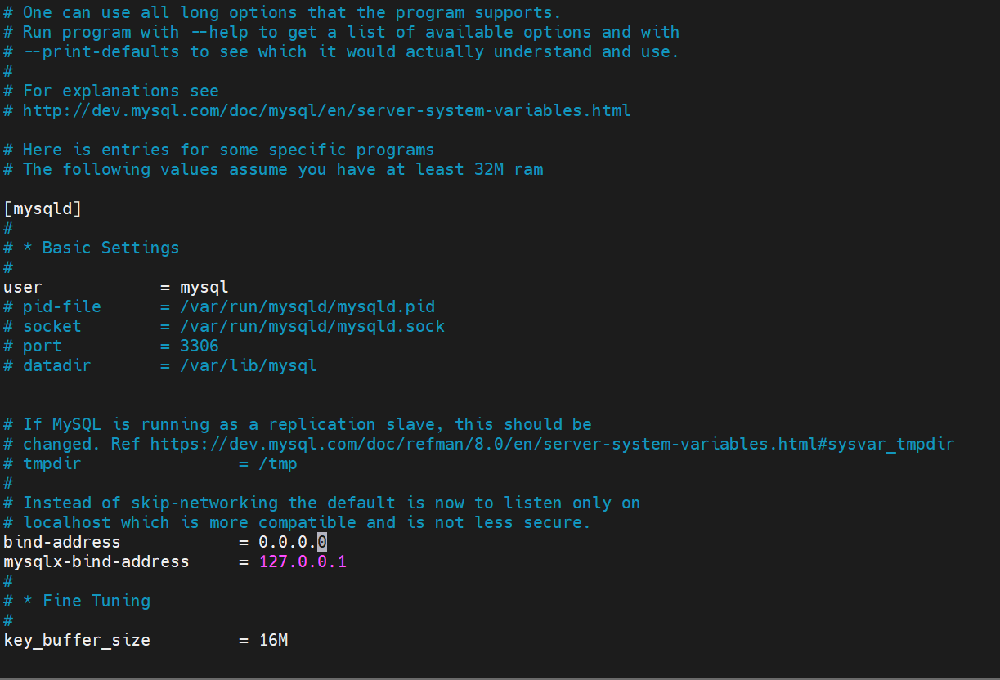

- **Save and exit the file.**
- **Create a user that can connect remotely and grant all privileges.**

```
sudo mysql
```


- **Create a new user**

```sql
CREATE USER 'remote_user'@'%' IDENTIFIED BY 'password';
```

- **Grant all privileges**

```sql
GRANT ALL PRIVILEGES ON *.* TO 'remote_user'@'%' WITH GRANT OPTION;
```

- **Flush privileges & Exit mysql Shell**

```sql
FLUSH PRIVILEGES;
```

```sql
exit
```
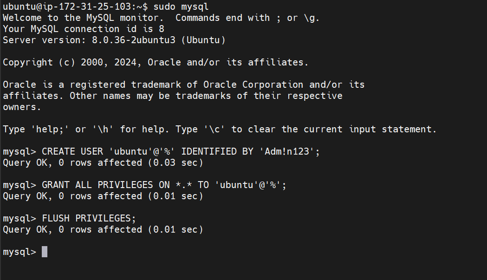

- **Restart MySQL service:**
    
```sh
sudo systemctl restart mysql
```

#### Connect from `mysql client` to `mysql server`
- **Retrieve the local IP address of `mysql server`:**
```sh
ifconfig
```
- **Note the private IP address.**
- **Connect to `mysql server` from `mysql client` using MySQL utility:**
    
```sh
mysql -h <mysql_server_ip> -u <remote_user> -p
```
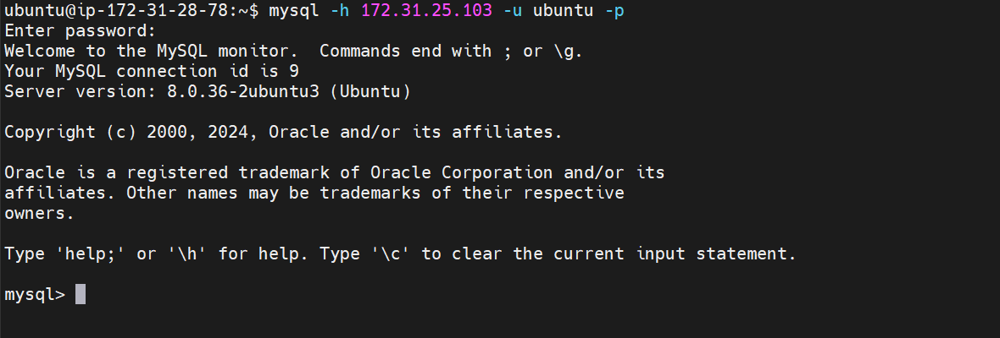


- **Replace `<mysql_server_ip>` with the actual private IP of the `mysql server`.**
- **Replace `<remote_user>` with the MySQL `username`.**

#### Verify the Connection and Perform SQL Queries
- **Check the connection by running SQL queries:**

```sql
SHOW DATABASES;
```

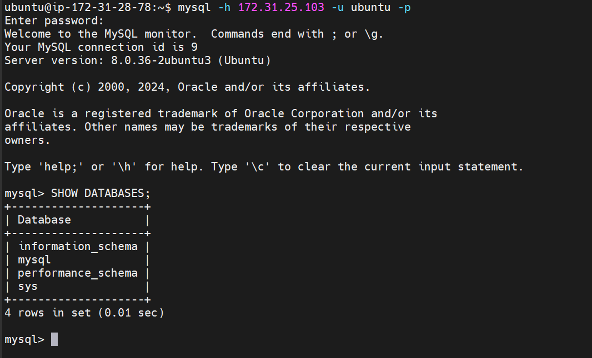


### Playing Around the Database

- **Create database.**

```sql
CREATE DATABASE mightygulldb;
```

  - **Select the database to use it.**

```sql
USE mightygulldb;
```

- **Create tables.**

```sql
CREATE TABLE users (
id INT AUTO_INCREMENT PRIMARY KEY,
name VARCHAR(255) NOT NULL,
email VARCHAR(255) NOT NULL
);
```

- **Insert data in to the tables.**

```sql
INSERT INTO users (name, email) VALUES ('Samson Oladipo', 'oladipookiki@yahoo.com');
```


- **Verify inserted data.**

```sql
SELECT * FROM users;
```

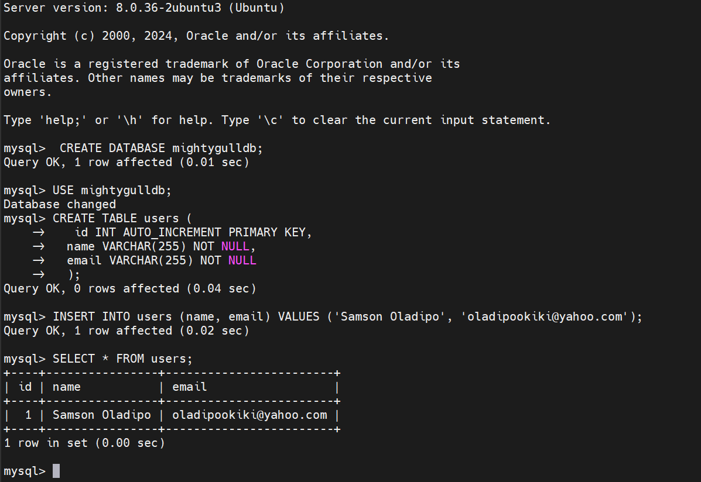
        
- **Drop the table.**

```sql
DROP TABLE users;
```

- **Drop the database.**

```sql
DROP DATABASE mightygulldb;
```


- **Exit the mysql Shell.**

### Conclusion
By following the above steps, you will have successfully set up a client-server architecture with MySQL on AWS.  You have configured a MySQL server to allow remote connections and connected to it from a MySQL client instance without using SSH. You also verified the connection by running SQL queries.

---