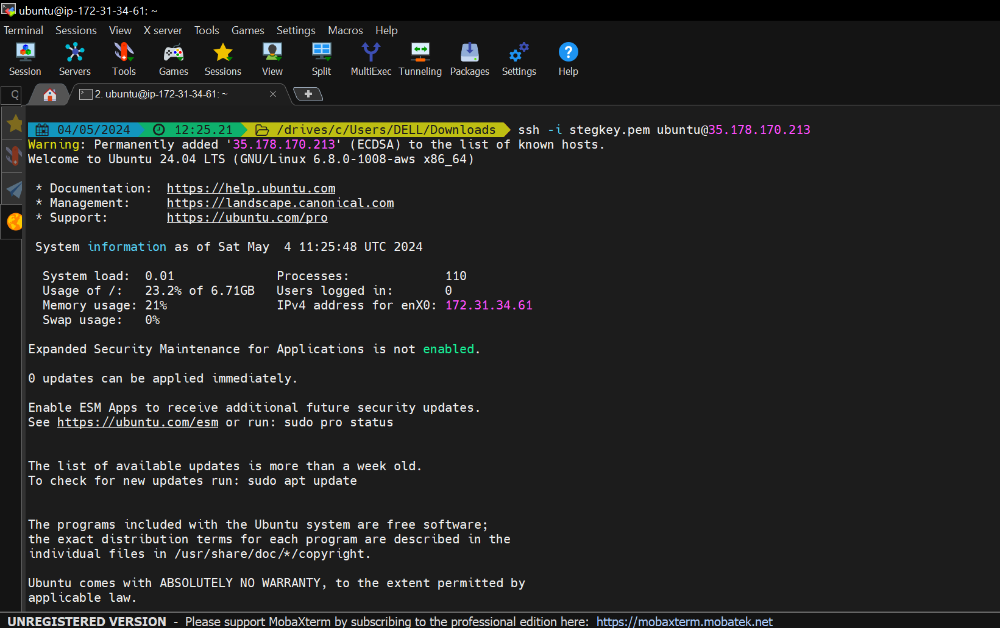
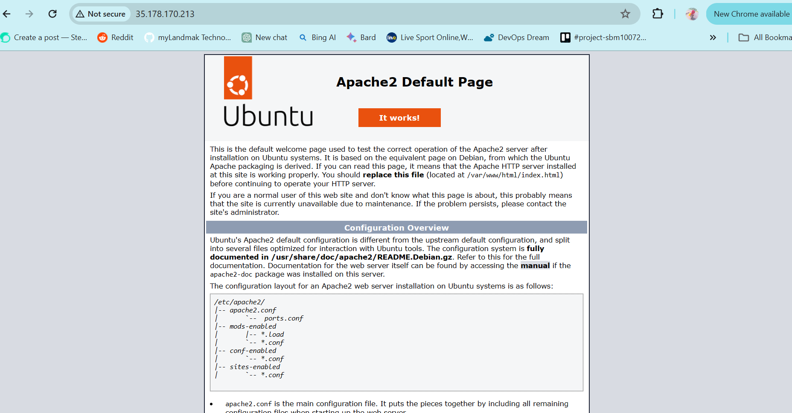
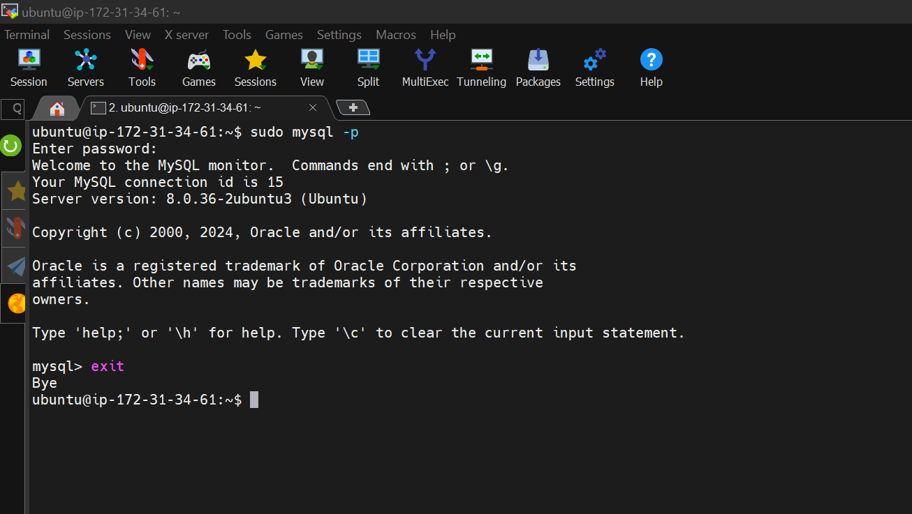
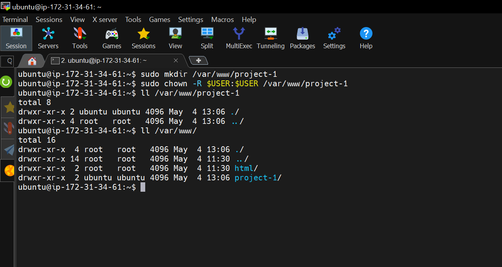
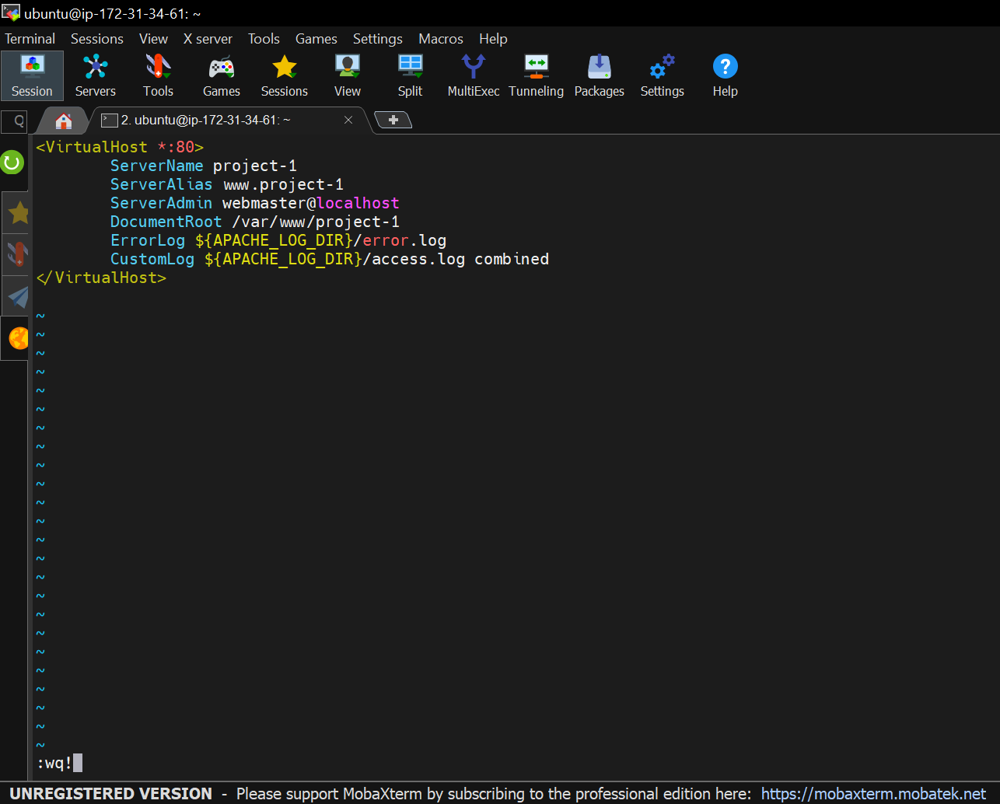
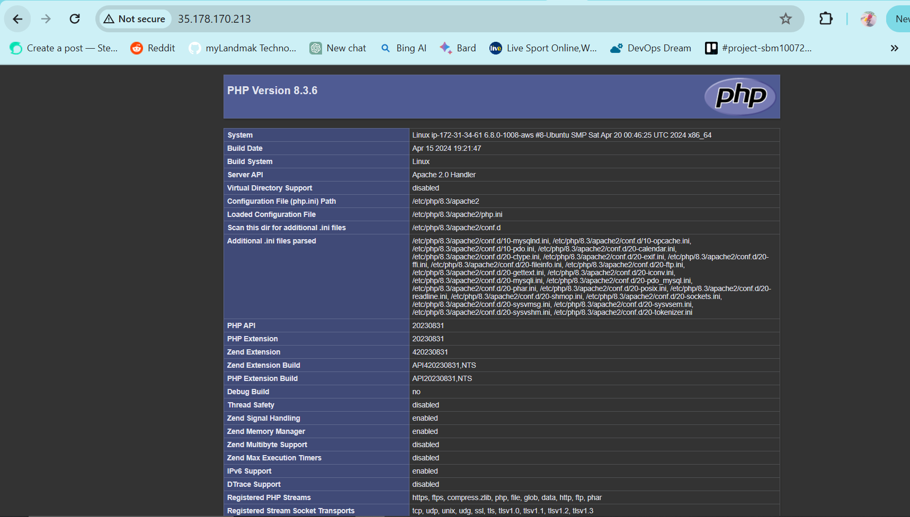
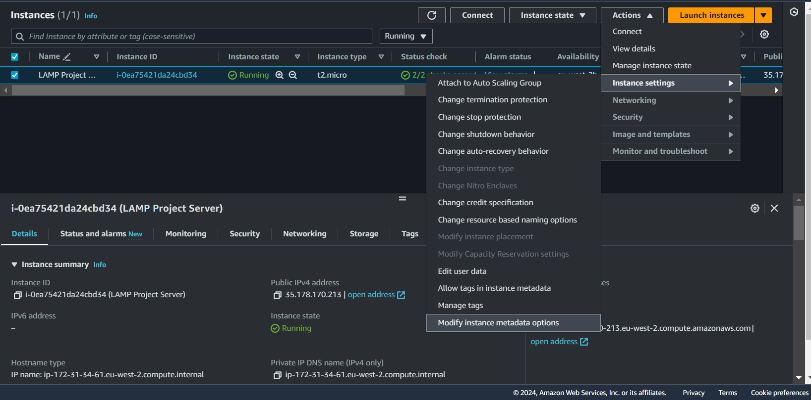
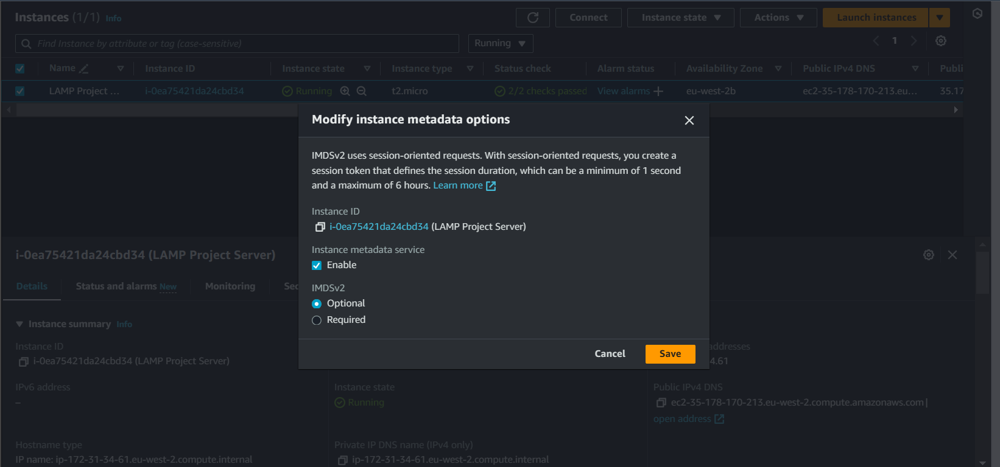

# LAMP Self Side Study & Project

### What is (SDLC)?
SDLC simplify means Software Development Life Cycle, SDLC is a methodology used by software development teams to design, develop, test, deploy, and maintain software systems. It provides a structured framework for managing the entire software development process from inception to delivery.

### Types of (SDLC) modules:
Each model has its own set of characteristics, advantages, and limitations, and the choice depends on project requirements and organization’s preferences:
- **Waterfall Model:** This is a sequential, linear approach to software development, it is divided into distinct phases and progression to the next phase only occurs after completion of the previous phase.
- **Spiral Model:** This is an iterative and incremental approach, it is risk-driven, with a focus on identifying and mitigating risks early in the process.
- **Agile Model:** This approach focuses on delivering working software in short iterations and also collaboration and customer involvement are emphasized throughout the development process.
- **Iterative Model:** Similar to the Agile model, but with less emphasis on customer collaboration and more focus on iterative and incremental development.
- **V-Model:** This is an extension of the Waterfall model that emphasizes the relationship between each development stage and its corresponding testing stage.

### Importance of (SDLC):
SDLC provides a structured  approach to software development, ensuring that projects are delivered on time, within budget, and with the expected quality of products. It also helps manage risks, control costs, and improve collaboration among teams.

### Different Stages of SDLC:
- **Planning:** During this stage, project objectives, requirements, and constraints are identified. Teams collaborate to define project scope, budget, and timelines.
- **Analysis:** Requirements gathering is performed to understand the needs of end-users and stakeholders. Requirements are analyzed for feasibility, clarity, and completeness.
- **Design:** System architecture, data models, user interfaces, and other technical specifications are developed. Design documents serve as blueprints for implementation.
- **Implementation:** Developers write code based on the design specifications. Unit testing and integration testing are conducted to ensure code quality and functionality.
- **Testing:** The software is tested against predefined test cases to identify defects and ensure that it meets the specified requirements. Testing includes functional, performance, and security testing.
- **Deployment:** The software is deployed to production environments or released to end-users. Installation, configuration, and data migration may be performed during this phase.
- **Maintenance:** After deployment, the software enters the maintenance phase. Bug fixes, updates, and enhancements are made to address issues and improve performance.

### Conclusion:
The Software Development Life Cycle is a critical framework for developing high-quality software. By following a systematic process and leveraging appropriate best practices organizations can improve efficiency, reduce risks, and deliver successful software solutions.

---
## What is"LAMP"?
"LAMP" is an acronym that stands for:
- L = Linux : This is an operating system, it provides the underlying infrastructure and resources needed to run web applications.
- A = Apache: This is an open-source web server software, it's responsible for serving web pages to users browsers when they request them.
- M = MySQL: This is a relational database management system (RDBMS) used for storing and managing data.
- P = PHP: This is a server-side scripting language used for developing dynamic web applications, it's embedded within HTML code and executed on the web server to generate dynamic content. 

The LAMP stack provides a powerful and flexible platform for building and deploying web applications.

---
## Understanding 'chmod' & 'chown' commands:
- **'chmod':** The 'chmod' command is used to change the permissions of a file or directory. This permissions determine who can read, write, or execute a file, and they are represented by three sets of characters namely user permissions, group permissions, and others permissions.

- **'chown':** The 'chown' command is used to change the ownership of a file or directory. Ownership includes both the user owner and the group owner of the file or directory.

File and directory permissions consist of three sets of characters namely; 
- **User Permissions (u):** These permissions apply to the owner of the file or directory.
- **Group Permissions (g):** These permissions apply to the group owner of the file or directory.
- **Others Permissions (o):** These permissions apply to all users who are not the owner or members of the group.

And each set of permissions (u, g, o) consists of three characters:
- 'r' = 4 (Read): Allows reading of the file or directory contents.
- 'w' = 2 (Write): Allows writing to the file or directory, including creating, deleting, or modifying files.
- 'x' = 1 (Execute): Allows executing the file (for files) or accessing the directory (for directories).
- '-' (denoting no permission).

---
## Difference between TCP & UDP:
TCP (Transmission Control Protocol) and UDP (User Datagram Protocol) are both protocols used for sending data over the Internet, but they have different characteristics.

- TCP is a connection-oriented protocol, which means it establishes a connection between the sender and receiver before transmitting data. It ensures that all data packets are delivered in the correct order and without errors. It's commonly used for applications that require reliable and ordered delivery of data, such as web browsing, email, and file transfer.
- UDP is a connectionless protocol. And it does not establish a connection between the sender and recevier before sending data and does not provide mechanisms for ensuring reliable delivery or ordering of packets. It is often used for real-time applications where a small amount of packet loss is acceptable, such as video streaming, online gaming, and VoIP (Voice over Internet Protocol).

So in summary, TCP provides reliable, ordered, and error-checked delivery of data, while UDP offers low-latency, connectionless communication with no guarantees of delivery or order.

Examples of ports commonly used in Web:
- http = 80
- https = 443
- ssh = 22
- telnet = 23
- ftp = 21
- sftp = Default port is 22 but to aviod conflicts with ssh port, admins often choose ports above 1024

---
## Vi & Vim Text Editor
- **Vi:** (Vi) stands for Visual Editor. It's one of the oldest and most basic text editors available on Unix systems. Vi has two modes:
  1. **Command mode:** In this mode, keystrokes are interpreted as commands rather than text input. You can navigate the document, delete lines, copy and paste text, and perform other editing operations using commands.
  2. **Insert mode:** In this mode, you can directly input and edit text. You switch to insert mode from command mode by pressing the "i" key. To return to command mode, press the "Esc" key.

- **Vim:** (Vim) stands for Vi IMproved. It's an enhanced version of Vi with additional features and improvements. Vim retains the two modes of Vi (command and insert) but adds many new features, such as syntax highlighting, auto-indentation, multiple buffers, and plugins.Vim is highly customizable and extensible, allowing users to tailor it to their specific needs. It's popular among developers and system administrators for its power and efficiency once mastered.

Both Vi and Vim are modal editors, meaning they have different modes for entering and executing commands and for inserting and editing text. This modal approach can be initially confusing for new users but offers efficient editing workflows once mastered.

---

# LAMP Project
After navigating to the AWS Management Console to launch an ec2-instance i made sure that port 80 (HTTP) and 22 (SSH) are open to allow web traffic and SSH access before going ahead to connect to the instance using a tool called (Mobaxterm).

- To ssh into the ec2-instance i made sure my command line terminal was in the directory where my key pair was downloaded to before running the command below:
  
  >ssh -i keypair-name.pem ubuntu@public-ip

  

### Installing & Configuring The LAMP Stack On The EC2-Instance:
- **Install Apache:** First i updated and upgraded the 'apt' package manager for the ubuntu server before installing the Apache package, below were the commands i ran;
  
  >sudo apt update

  >sudo apt upgrade -y

  >sudo apt install apache2 -y

After successfull installation of the package i ran the below command to check if the service is up and running and also access the default web-page using the public-ip of the instance;
  
  >sudo systemctl status apache2

  

- **Install MySQL:** Next i installed MySQL, after installation switched to the MySQL shell prompt to configure the 'root' user password and secured the MySQL installation running the following commands below;
  
  >sudo apt install mysql-server -y

  >sudo mysql

  >ALTER USER 'root'@'localhost' IDENTIFIED WITH mysql_native_password BY 'mysql-password';

  >exit
  
  >sudo mysql_secure_installation

After successfully installation of MySQL i tested the configuration, hence the screenshot below;

  

- **Install PHP:** Next i installed the PHP package, running the commands below;
  
  >sudo apt install php libapache2-mod php-mysql -y

  >php -v

  

- **Create Virtual Host In Apache:** To create a virtual host in Apache, i created a new directory in the */var/www* directory, then i change the owner permission and group permission of that directory to a default user in the instance, then i created a new configuration file for Apache in the */etc/apache2/site-available directory* before disabling the default Apache website and enabling the new virtual host. Then i restared the Apache service before creating a new index.html file and storing an output to display as a web page on the browser. Below are the commands and steps to create and configure the virtual host;
  
  >sudo mkdir /var/www/custom-name

  

  >sudo vi /etc/apache2/sites-available/custom-name.conf

  

  **#enable new virtualhost**

  >sudo a2ensite custom-name
  
  **#disable default apache webpage**
  
  >sudo a2dissite 000-default

  **#test apache config**

  >sudo apache2ctl configtest

  **#restart apache service**

  >sudo systemctl restart apache2

  **#create an index.html file and store some values in it**

  >sudo echo 'Hello LAMP from hostname' $(curl -s http://169.254.169.254/latest/meta-data/public-hostname) 'with public IP' $(curl -s http://169.254.169.254/latest/meta-data/public-ipv4) > /var/www/custom-name/index.html

  

- **Enable PHP On Website:** First we modifiy the *dir.conf* file in the */etc/apache2/mods-enabled* directory, we change the order in which the *index.php* file is listed in the **DirectoryIndex** directive. Then we reload the Apache service and finally create a PHP script in the custom location to host our website files. Below are the commands and script used;
  
  >sudo vi /etc/apache2/mods-enabled/dir.conf

  **Make this changes in the file**
  
  >DirectoryIndex index.php index.html index.cgi index.pl index.xhtml index.htm

  **#Save and exit the text editior and restart apache service**

  >sudo systemctl restart apache2
  
  **#Create a php script in your custom dir**

  >vi /var/www/custom-name/index.php

  
  

  Save and exit the editior

  **#Refresh the Website on the browser**

  

  **#After testing, remove the php file**
  
  >sudo rm /var/www/custom-name/index.php

**N.B:** The *curl* commands shown below to display the ec2-instance **public-hostname** and **public-ip** was not displaying the required output, instead it gave an error output of (*error 404, Unauthorized*).
  
  >curl -s http://169.254.169.254/latest/meta-data/public-hostname

  >curl -s http://169.254.169.254/latest/meta-data/public-ipv4

But after a lot of troubleshooting, i got a temporary solution to get the appropriate results for our task by setting IMDSv2 session-oriented requests to (Optional) using the *Actions* drop down option for the instance via the management console. Below are the screenshot of how to go about it.

---