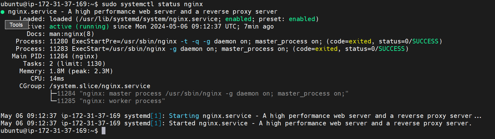
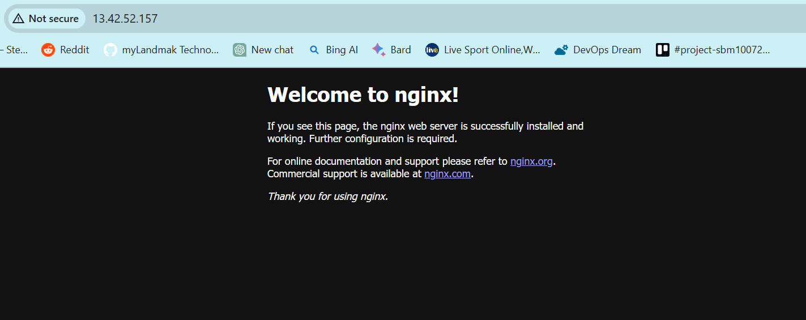
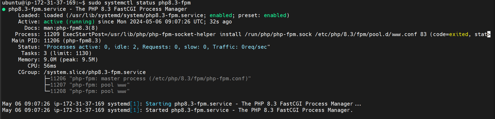
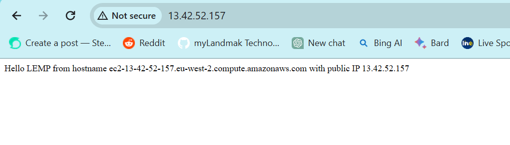
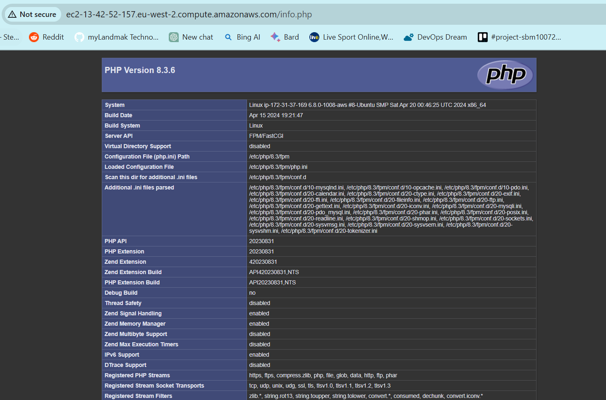
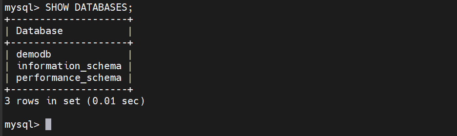
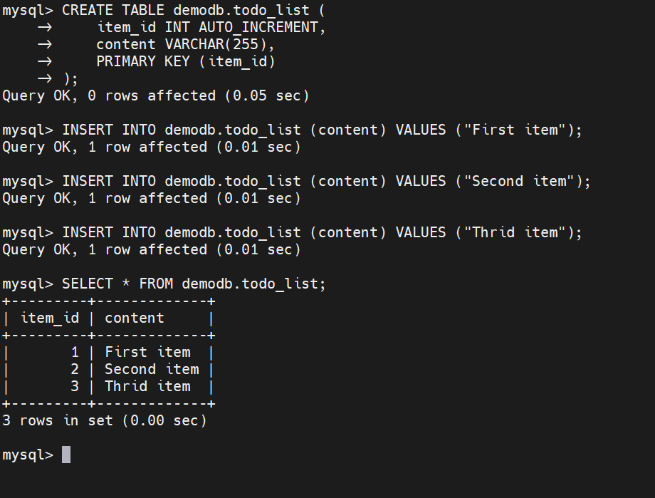
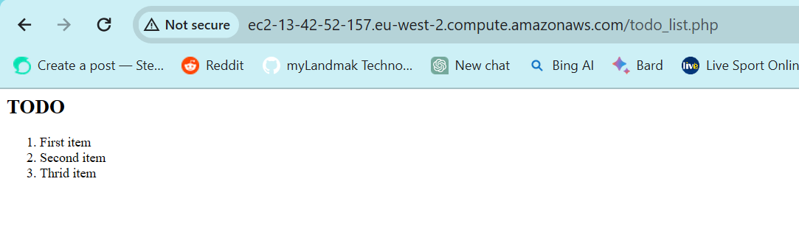

# LEMP Web Stack Project Implementation on AWS Documentation

## Introduction
This documentation outlines the steps to set up a LEMP (Linux, Nginx, MySQL, PHP) stack on an Ubuntu-based system. The LEMP stack is commonly used for hosting dynamic web applications.

**Requirements:**
- An AWS Account
- Ubuntu Linux EC2-Instance
- Git Bash Terminal
- Private Key Pair
- Inbound rules allows traffic on port 22 & 80
- EC2-Instance meta-data option IMDSv2 is set to (Optional)

## Installation
**SSH & Install Nginx**

First of all we need to access the command prompt of the ec2-instance in AWS using the Git Bash terminal. Once it is installed on the local machine, we can then go ahead to run the below commands to SSH into the instance and then install all the required packages using the *apt* package manager:

**SSH into the instance**

```
ssh -i keypair.pem ubuntu@public-ip
```

After successfully connecting to the instance, since its our first time using the *apt* package manager for this project we update and upgrade the package manager before installing the required packages, below are the commands use to achieve this purpose;

```
sudo apt update
```

```
sudo apt upgrade -y
```

```
sudo apt install -y nginx
```

After successfully installing Nginx we run the below command to check if the service is up and running and also accessing it on the browser using the publi-ip;

```
sudo systemctl status nginx
```
> http://server_public-ip





**Install MySQL**

Now that there is a web server up and running we need to install a database management system to store and manage data for our website, to do that we run the following commands;
```
sudo apt install mysql-server -y
```
After successful installation of the relational database on the ec2-instance we login into the MySQL console to set a password for the *'root'* user using the following commands;
```
sudo mysql
```
```
ALTER USER 'root'@'localhost' IDENTIFIED WITH mysql_native_password BY 'custom-psswd';
```

```
exit
```

After exiting the MySQL console, as part of the recommendation and best practice we have to run a security script that comes pre-installed with MySQL to secure the database environment, we then run the command below; 

```
sudo mysql_secure_installation
```

**N.B:** This command will run with different prompt options, so choose the option for each prompt that best fit the project requirements to successfully secure the database environment.

**Install PHP**

Now we can install PHP to process code and generate dynamic content for the web server. Run the following commands to install and verify that PHP has been installed in the Ubuntu server;

```
sudo apt install php-fpm php-mysql -y
```

```
php -v 
```

```
sudo systemctl status php8.3-fpm    # Verify PHP installation
```



## Configuration
**Configure Nginx to use PHP**

When using a Nginx server we create a server block to store configuration details and host more than one domain on a single server, also similar to the Apache virtual hosts.

First we create a root directory for the domain, then we assing ownership permission of the directory to the current system user. Then we create a new configuration file in the Nginx *sites-available* directory using *nano* text editor.

```
sudo mkdir /var/www/custom-dir
```

```
sudo chown -R $USER:$USER /var/www/custom-dir
```
```
sudo nano /etc/nginx/sites-available/custom-file
```

**Add the following configuration to the file:**

```
server {
    listen 80;
    server_name custom-dir www.custom-dir;
    root /var/www/custom-dir;

    index index.html index.htm index.php;

    location / {
        try_files $uri $uri/ =404;
    }

    location ~ \.php$ {
        include snippets/fastcgi-php.conf;
        fastcgi_pass unix:/var/run/php/php8.3-fpm.sock;
    }

    location ~ /\.ht {
        deny all;
    }
}
```

To save an exit a nano editor, Press **Ctrl + X** then press **Y** and **Enter** to approve.

Next, i tested the configuration file to be sure there are no syntax errors before activating the configuration by linking the configuration file from Nginx *sites-available* directory using the commands below;

```
sudo nginx -t
```

```
sudo ln -s /etc/nginx/sites-available/custom-dir /etc/nginx/sites-enabled/
```

After that was done, i disable the default Nginx host that was currently configured to listen port 80 and also restart the Nginx service using the following commands;

```
sudo unlink /etc/nginx/sites-enabled/default
```

```
sudo systemctl restart nginx
```

Since the new web root directory for the domain was empty i save the output of the command below as a new *index.html* file that we can use to test the new server block on the web browser using the public-ip of the server;

```
sudo echo 'Hello LEMP from hostname' $(curl -s http://169.254.169.254/latest/meta-data/public-hostname) 'with public IP' $(curl -s http://169.254.169.254/latest/meta-data/public-ipv4) > /var/www/lemp-project/index.html
```



**Test PHP with Nginx**

Now the LEMP stack is completely installed and operational, but it is important to test to validate that Nginx can hand the *.php* file correctly to the PHP processor.

To achieve this we start by creating a test php script in the root document directory called *info.php* using a test editor like nano,

```
nano /var/www/custom-dir/info.php
```

**Add the following PHP script into the file**

```
<?php
phpinfo();
?>
```

Next i tried to access the page on the web browser using the server domain name like this;

> http://server_domain_name/info.php



It's best to remove the php file since it contains sensitive information about the server and PHP environment, to do so run the command below;

```
sudo rm /var/www/custom-dir/info.php
```
**Retrieve data from MySQL with PHP**

As part of the requirements for this project we were required to create a test/demo Database with simple *'To Do List'* and to configure access it so that Nginx website will be able to query data form the test Database and display it in the web browser.

To achieve this we need to create a Database and the Database user using the *mysql_native_password* authentication method, first i connected to the MySQL console using the root user;

```
sudo mysql -p
```
Next i created a database and a user, then i gave the user permission over the database;

```
CREATE DATABASE db-name;
```
```
CREATE USER 'new_user'@'%' IDENTIFIED WITH mysql_native_password BY 'password';
```
```
GRANT ALL ON db-name.* TO 'username'@'%';
```
```
exit
```

After i logged out of the MySQL console, i logged back in to test the user permission over the database and as well, created a test table named *'todo_list'*;

```
mysql -u username -p
```
```
SHOW DATABASES;
```


To create a test TABLE named (todo_list) run the following statement;

```
CREATE TABLE db-name.todo_list (
    item_id INT AUTO_INCREMENT,
    content VARCHAR(255),
    PRIMARY KEY (item_id)
);
```
To insert a few rows of content in the test TABLE, run the commands below;

```
INSERT INTO db-name.todo_list (content) VALUES ("First item");
```
```
INSERT INTO db-name.todo_list (content) VALUES ("Second item");
```
```
INSERT INTO db-name.todo_list (content) VALUES ("Thrid item");
```
I then confirm the data was saved to the TABLE by running the command below;

```
SELECT * FROM db-name.todo_list;
```


After confirming that i have valid data in the test TABLE, i exited the MySQL console to create a PHP script to query MySQL in the custom web root directory using the *'nano'* text editor;

```
nano /var/www/lemp-project/todo_list.php
```
**Then added the following PHP script**

```
<?php
$user = "username";
$password = "password";
$database = "db-name";
$table = "todo_list";

try {
    $db = new PDO("mysql:host=localhost;dbname=$database", $user, $password);
    echo "<h2>TODO</h2><ol>";
    foreach($db->query("SELECT content FROM $table") as $row) {
        echo "<li>" . $row['content'] . "</li>";
    }
    echo "</ol>";
}   catch (PDOException $e) {
        print "Error!: " . $e->getMessage() . "<br/>";
        die();
}
?>
```

Save and exit the editor.

Then access the page using;

> http://server_domain_name/todo_list.php



**Conclusion**
In this guide we have successfully set up and configured a Web Stack LEMP on AWS. We just hosted a dynamic web applications with Nginx, MySQL, and PHP on an Ubuntu server.

---