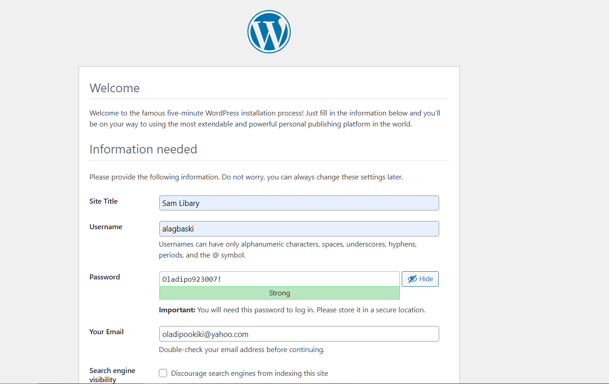

# Project Documentation: Implementing a Basic Web Solution Using WordPress on Red Hat Linux

## Overview

This project involves setting up storage infrastructure on two Linux servers and implementing a basic web solution using WordPress. It consists of two main parts:

1. **Configure Storage Subsystem**: For web and database servers based on Red Hat Linux OS.
2. **Install WordPress and Connect it to a Remote MySQL Database Server**: Deploying a web solution using a three-tier architecture.

### Three-tier Architecture Setup:
1. **Client**: A laptop.
2. **Web Server**: An EC2 instance where WordPress will be installed.
3. **Database Server**: An EC2 instance for the MySQL database.

## Part 1: Configure Storage Subsystem for Web and Database Servers

### Step 1: Prepare the Web Server

- **Launch an EC2 Instance**:
   - Create an EC2 instance that will serve as the web server.
   - Create three 10GiB volumes in the same Availability Zone (AZ) as the web server.
   - Attach the volumes to the web server.
    
    

- **Open the Linux Terminal**:
   - **SSH into the instance**
  
    ```
    ssh -i keypair.pem ec2-user@public-ip
    ```
   - Inspect attached block devices: `lsblk`
   - Check all mounts and free space: `df -h`

- **Create Partitions on Each Disk**:
   - Use `gdisk` to create a single partition on each of the three disks:
     ```sh
     sudo gdisk /dev/xvdf
     sudo gdisk /dev/xvdg
     sudo gdisk /dev/xvdh
     ```
     

    - Inspect attached block devices: `lsblk`

        
    

- **Install and Configure LVM**:
   - Install LVM: `sudo yum install lvm2`
   - Check available partitions: `sudo lvmdiskscan`
    
        

   - Mark disks as physical volumes:
     ```sh
     sudo pvcreate /dev/xvdf1
     sudo pvcreate /dev/xvdg1
     sudo pvcreate /dev/xvdh1
     ```
     

- **Create a Volume Group**:
   - Create a volume group named `webdata-vg`:
     ```sh
     sudo vgcreate webdata-vg /dev/xvdf1 /dev/xvdg1 /dev/xvdh1
     ```
     

- **Create Logical Volumes**:
   - Create `apps-lv` (14G) and `logs-lv` (remaining space) logical volumes:
     ```sh
     sudo lvcreate -n apps-lv -L 14G webdata-vg
     sudo lvcreate -n logs-lv -L 14G webdata-vg
     ```
     

- **Format the Logical Volumes**:
   - Format with ext4 filesystem:
     ```sh
     sudo mkfs -t ext4 /dev/webdata-vg/apps-lv
     sudo mkfs -t ext4 /dev/webdata-vg/logs-lv
     ```
     

- **Create Directories and Mount the Volumes**:
   - Create directories:
     ```sh
     sudo mkdir -p /var/www/html
     sudo mkdir -p /home/recovery/logs
     ```
   - Mount `apps-lv` to `/var/www/html`:
     ```sh
     sudo mount /dev/webdata-vg/apps-lv /var/www/html
     ```

-  **Backup and Mount Logs**:
   - Backup log files:
     ```sh
     sudo rsync -av /var/log/. /home/recovery/logs/
     ```
   - Mount `logs-lv` to `/var/log`:
     ```sh
     sudo mount /dev/webdata-vg/logs-lv /var/log
     ```
   - Restore log files:
     ```sh
     sudo rsync -av /home/recovery/logs/log/. /var/log
     ```

- **Update fstab for Persistence**:
    - Get UUIDs: `sudo blkid`
    

     - The highlighted code in the image above shows the `UUID` we will need to copy in a notepad. 

    - Edit `/etc/fstab`:
      ```sh
      sudo vi /etc/fstab
      ```
    - Add entries for the logical volumes `UUIDs` into the file.
        ```
        UUID=<UUID-of-apps-lv> /var/www/html ext4 defaults 0 0
        UUID=<UUID-of-logs-lv> /var/log ext4 defaults 0 0
        ```

- **Verify the Setup**:
    - Reload daemon and mount configurations:
      ```sh
      sudo mount -a
      sudo systemctl daemon-reload
      ```
      

    - Verify mounts: `df -h`
    

### Step 2: Prepare the Database Server

- **Launch a Second EC2 Instance**:
   - Create an EC2 instance for the `database server`.
   - Repeat the storage configuration steps as the `web server`, but create a `db-lv` logical volume instead of `apps-lv` and mount it to `/db`.

## Part 2: Install WordPress and Connect to Remote MySQL Database

### Step 3: Install WordPress on the Web Server

- **Update the System**:
   - `sudo yum update -y`

- **Install Required Packages**:
   - Install Apache, PHP, and dependencies:
     ```sh
     sudo yum install wget httpd php php-mysqlnd php-fpm php-json -y
     sudo systemctl enable httpd
     sudo systemctl start httpd
     ```

- **Install PHP and Additional Modules**:
   - Enable and install PHP 7.4:
     ```sh
     sudo yum install https://dl.fedoraproject.org/pub/epel/epel-release-latest-8.noarch.rpm
     sudo yum install yum-utils http://rpms.remirepo.net/enterprise/remi-release-8.rpm
     sudo yum module list php
     sudo yum module reset php
     sudo yum module enable php:remi-7.4
     sudo yum install php php-opcache php-gd php-curl php-mysqlnd
     sudo systemctl start php-fpm
     sudo systemctl enable php-fpm
     sudo setsebool -P httpd_execmem 1
     ```

- **Restart Apache**:
   - `sudo systemctl restart httpd`

- **Download and Install WordPress**:
   - Download and extract WordPress:
     ```sh
     mkdir wordpress && cd wordpress
     sudo wget http://wordpress.org/latest.tar.gz
     sudo tar xzvf latest.tar.gz
     sudo rm -rf latest.tar.gz
     sudo cp -R wordpress/wp-config-sample.php wordpress/wp-config.php
     sudo cp -R wordpress /var/www/html/
     ```

- **Configure SELinux Policies**:
   - Set permissions and contexts:
     ```sh
     sudo chown -R apache:apache /var/www/html/wordpress
     sudo chcon -t httpd_sys_rw_content_t /var/www/html/wordpress -R
     sudo setsebool -P httpd_can_network_connect=1
     ```

### Step 4: Install MySQL on the Database Server

- **Install MySQL**:
   - Update the system and install MySQL:
     ```sh
     sudo yum update
     sudo yum install mysql-server
     ```

- **Start MySQL Service**:
   - Verify and enable MySQL service:
     ```sh
     sudo systemctl status mysqld
     sudo systemctl enable mysqld
     sudo systemctl restart mysqld
     ```
     

### Step 5: Configure the Database for WordPress

- **Create Database and User**:
   - Log in to MySQL and create the database and user:
     ```sh
     sudo mysql
     ```
     ```sql
     CREATE DATABASE wordpress;
     CREATE USER `username`@`web-server-private-ip` IDENTIFIED BY 'password';
     GRANT ALL ON wordpress.* TO 'username'@'web-server-private-ip';
     FLUSH PRIVILEGES;
     SHOW DATABASES;
     exit
     ```

### Step 6: Configure WordPress to Connect to Remote Database

- **Open Port 3306**:
   - On the database server, allow access for the web server IP address, in this case we used the web server security group ID.
    

- **Install MySQL Client on Web Server**:
   - Install MySQL client:
     ```sh
     sudo yum install mysql
     sudo mysql -u username -p -h DB-server-private-ip
     ```
     

- **Configure WordPress**:
   - Update `wp-config.php` with database details.
   - Set appropriate permissions and configurations for Apache to use WordPress.
    
    ```sh
    sudo chown -R apache:apache /var/www/html/wordpress
    ```

- **Enable TCP Port 80**:
   - On the web server, open port 80 and allow access from all IPs (`0.0.0.0/0`).
    

- **Access WordPress**:
   - Open a browser and navigate to `http://server-public-ip/wordpress/`.
    
    

    

    


### Conclusion
Congratulations! By following these steps, you should be able to successfully set up the storage infrastructure and deploy a WordPress site with a remote MySQL database on EC2 instances running Red Hat Linux.

---
